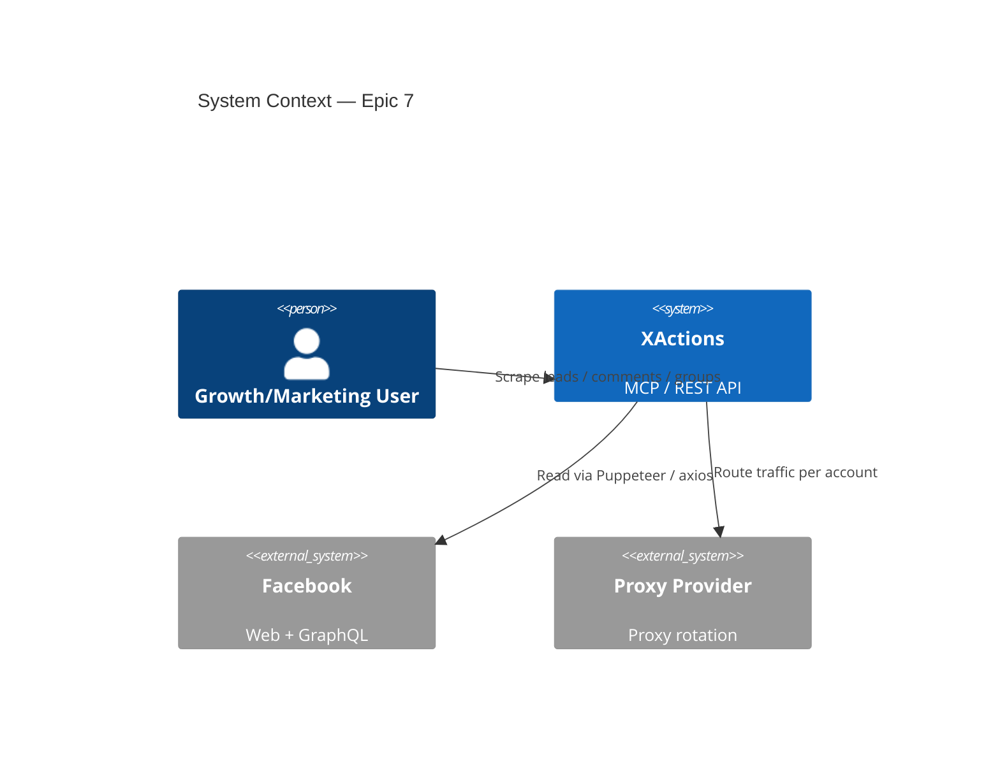
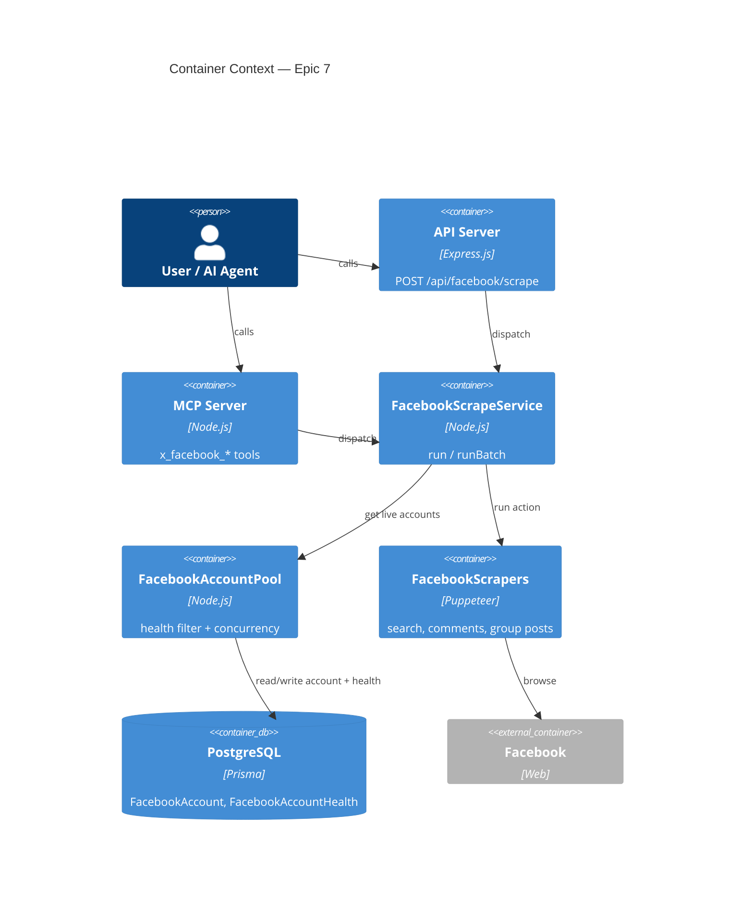
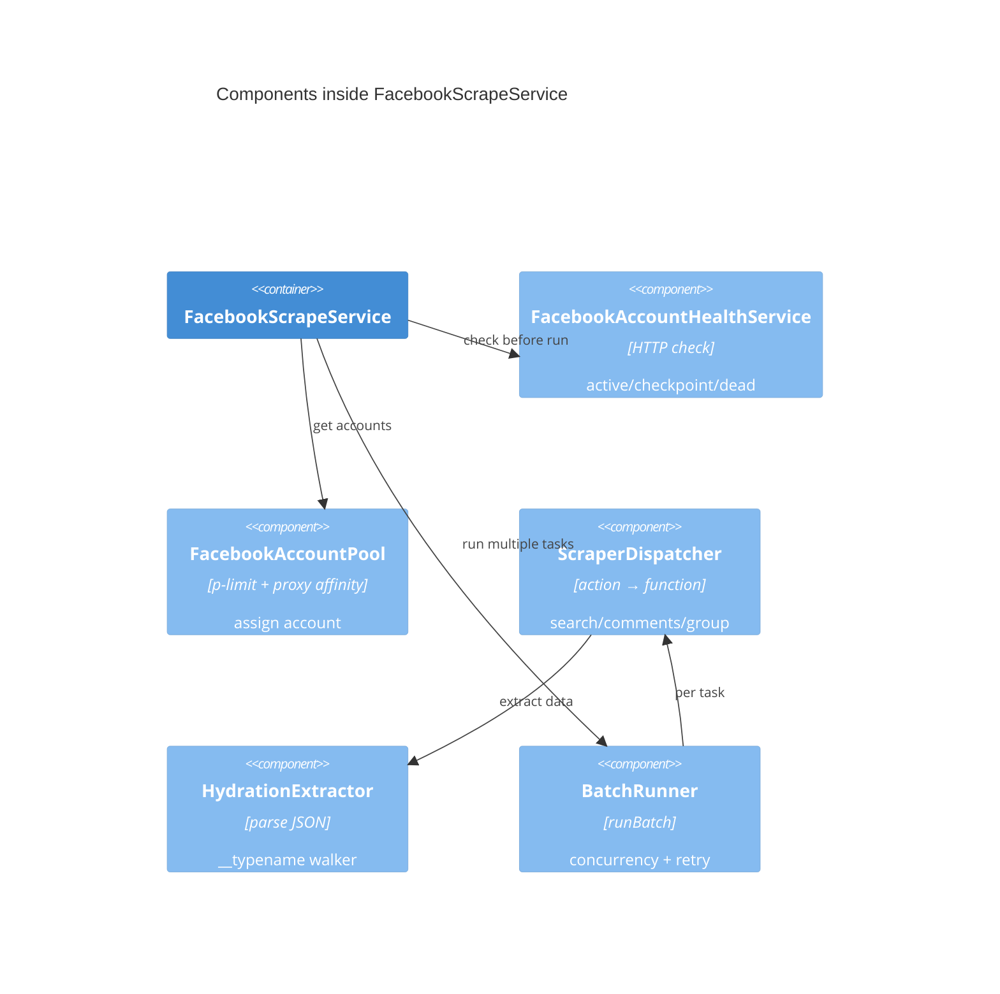
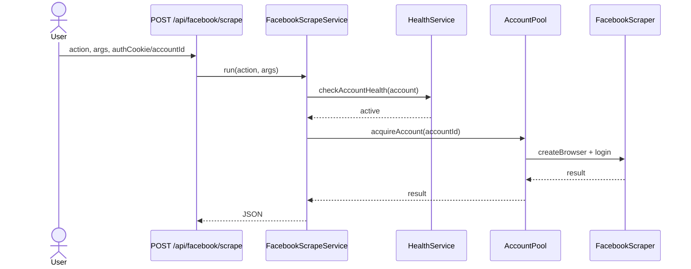
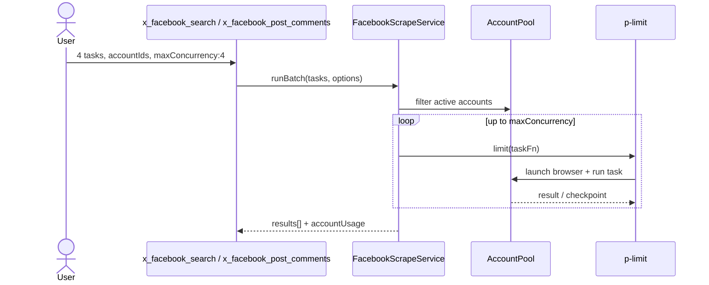

# Architecture Spine — Epic 7: Facebook Advanced Scraping & Multi-Account Parallel Execution

- **Epic:** 7
- **PRD:** `prd-XActions-2026-08-14-epic7`
- **Status:** draft
- **Created:** 2026-08-14

## 1. Context

Epic 7 mở rộng năng lực **đọc** Facebook của XActions để phục vụ lead generation và market research. Hệ thống nhận đầu vào từ API hoặc MCP, chạy trên nhiều tài khoản Facebook đã nuôi, và trả về JSON thuần. Không lưu trữ kết quả scrape trong XActions.

## 2. System Context (C4 L1)



## 3. Container Diagram (C4 L2)



## 4. Component Diagram (C4 L3)



## 5. Component Inventory

| Component | File / Module | Responsibility |
|---|---|---|
| `FacebookAccountHealthService` | `api/services/facebookHealth.js` `[ASSUMPTION]` | HTTP GET `facebook.com/` với cookie, parse `fb_dtsg`, kiểm tra checkpoint, cache vào `FacebookAccountHealth`. |
| `FacebookAccountPool` | `api/services/facebookAccountPool.js` `[ASSUMPTION]` | Lọc live accounts, gán task round-robin/LRU, honor proxy, giới hạn concurrency. |
| `FacebookScrapeService` | `api/services/facebookScrape.js` | `run(action, args)` và `runBatch(tasks, options)`. Single source of truth cho API + MCP. |
| `FacebookAuthResolver` | `api/services/facebookAuth.js` | Resolve `authCookie` (`{ c_user, xs }` hoặc `{ accountId }`) cho cả API và MCP; validate `account.userId === userId` khi `userId` được cung cấp; MCP tools mới truyền `userId` (từ client context) khi dùng `accountId`; không log cookie. |
| `FacebookScraperDispatcher` | inside `FacebookScrapeService` | Map `action` → `scrape('facebook', action, args)`; đảm bảo `src/scrapers/index.js` `actionMap` có `post_comments`, `group_posts`, `group_comments`; `search` mở rộng qua `searchTweets` (Facebook) với `options.type`/`options.location`. Fan-out `type: 'all'` nội bộ. |
| `searchFacebook` | `src/scrapers/facebook/index.js` | Search posts/people/pages/groups hoặc `all`. |
| `scrapeFacebookComments` | `src/scrapers/facebook/index.js` `[ASSUMPTION]` | Scrape comments của post, hỗ trợ replies. |
| `scrapeFacebookGroupPosts` | `src/scrapers/facebook/index.js` `[ASSUMPTION]` | Scrape posts trong group, dùng mobile UA. |
| `extractHydrationJson` | `src/scrapers/facebook/hydration.js` `[ASSUMPTION]` | Trích JSON từ `<script data-content-len>`, walk theo `__typename`. |
| `API route` | `api/routes/facebook.js` | `POST /api/facebook/scrape` mở rộng `VALID_ACTIONS` và gọi `FacebookScrapeService`. |
| `MCP tools` | `src/mcp/server.js` | 5 tools mới gọi `FacebookScrapeService`. |

## 6. Data Flows

### 6.1 Single search / comments / group posts



### 6.2 Multi-account parallel batch



## 7. Schema Changes

```prisma
enum FacebookAccountHealthStatus {
  active
  checkpoint
  dead
}

model FacebookAccount {
  id              String   @id @default(cuid())
  userId          String
  label           String
  encryptedCookie String
  encryptedProxy  String?  // flat proxy string ("host:port" hoặc "host:port:user:pass") đã encrypt; API field vẫn gọi là `proxy`
  createdAt       DateTime @default(now())
  updatedAt       DateTime @updatedAt
  user            User     @relation(fields: [userId], references: [id], onDelete: Cascade)
  health          FacebookAccountHealth?

  @@unique([userId, label])
  @@index([userId])
}

model FacebookAccountHealth {
  id          String   @id @default(cuid())
  accountId   String   @unique
  status      FacebookAccountHealthStatus
  reason      String?
  lastCheckAt DateTime
  createdAt   DateTime @default(now())
  updatedAt   DateTime @updatedAt
  account     FacebookAccount @relation(fields: [accountId], references: [id], onDelete: Cascade)

  @@index([accountId])
}
```

### Migrations

1. `npx prisma migrate dev --name add_facebook_account_fields` — thêm `encryptedProxy` + `updatedAt` vào `FacebookAccount`.
2. `npx prisma migrate dev --name add_facebook_account_health` — tạo bảng `FacebookAccountHealth` với `accountId` unique, enum `FacebookAccountHealthStatus`, và relation ngược.
3. `npx prisma db pull` / `prisma validate` để kiểm tra one-to-one relation.

## 8. Story Map & Implementation Order

| Story | AC | Depends on | Output |
|---|---|---|---|
| 7.1 Account Health Check | FR-55 | — | `checkAccountHealth(account)` |
| 7.2 Account Pool & Parallel Runner | FR-56 | 7.1, `p-limit` | `FacebookScrapeService.runBatch` |
| 7.7 Hydration JSON Extraction | FR-61 | — | `extractHydrationJson(page, typenames)` |
| 7.8 API + MCP Surface Unification | FR-63 | 7.1, 7.2 | `FacebookScrapeService`, API, MCP tools |
| 7.3 Multi-Type Facebook Search | FR-57 | 7.2, 7.7, 7.8 | `searchFacebook` + `x_facebook_search` |
| 7.4 Scrape Post Comments | FR-58 | 7.2, 7.7, 7.8 | `scrapeFacebookComments` + `x_facebook_post_comments` |
| 7.5 Scrape Group Posts | FR-59 | 7.2, 7.7, 7.8 | `scrapeFacebookGroupPosts` + `x_facebook_group_posts` |
| 7.6 Scrape Group Comments | FR-60 | 7.4 | `x_facebook_group_comments` |

## 9. NFR Mapping

| NFR | Implementation |
|---|---|
| NFR-10 Không lưu trữ | Service trả JSON trực tiếp; không tạo `Operation` cho read scrape (hoặc nếu audit cần, chỉ lưu metadata mà không lưu `result`). |
| NFR-11 Health check < 2s | `axios.get` không mở browser; cache Prisma với TTL 5 phút. |
| NFR-12 Concurrency cap | `p-limit` + `maxConcurrency` default 4, max 8. |
| NFR-13 Privacy | Cookie/token values không log; `resolveAccountCookie` đã encrypt. |
| NFR-14 Resilience | `extractHydrationJson` fallback DOM nếu không đủ data. |
| NFR-15 Read velocity | Scroll delay 1-3s, max 50 scrolls/task. |

## 10. Out of Scope / Next Phase

- **FR-62 GraphQL replay** — Phase 3, dùng `axios` trước, `node-libcurl-ja3` nếu cần.
- **Reaction/liker list** — Epic 7b hoặc Phase 3.
- **UI dashboard** — không trong Epic 7.
- **Lưu trữ / analytics** — downstream tự xử lý.

## 11. Assumptions

- `[ASSUMPTION]` Anti-detection từ Epic 6 (fingerprint, proxy, warmup) được tái dùng.
- `[ASSUMPTION]` Mỗi account có thể có `proxy` dạng flat string `"host:port"` hoặc `"host:port:user:pass"`; API nhận plaintext `proxy`, lưu encrypted qua cùng mechanism `encryptedCookie` thành `encryptedProxy`; `FacebookAccountPool` decrypt trước khi parse qua `parseFlatProxy` và gọi `page.authenticate` nếu có auth.
- `[ASSUMPTION]` `p-limit@7.2.0` sẽ được thêm vào `package.json` dưới dạng pin exact.
- `[ASSUMPTION]` Health check không cần mở browser, chỉ cần HTTP GET với cookie; cache TTL 5 phút dựa trên `lastCheckAt`.
