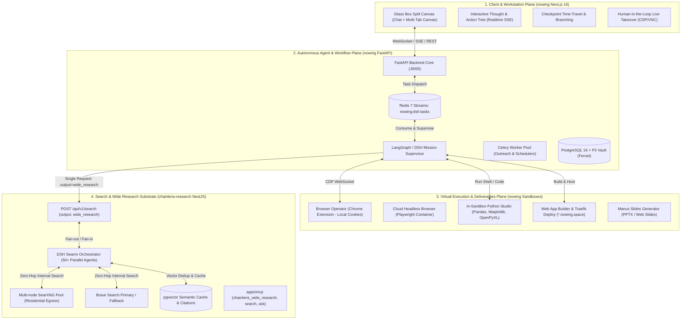

# Architecture Spine — The Manus-Killer Unified Ecosystem

> Canonical architecture contract governing the integration of `chainlens-research` (Stateless DSH Wide Research & Universal Search Substrate) and `nowing` (Autonomous AI Workstation & Deliverables Studio).

---

## 1. Design Paradigm & System Topology

The platform operates as a **Dual-Core Decoupled Swarm Substrate with Autonomous Workstation Plane**:

1. **Client & Workstation Plane (`nowing` Next.js 16 + React 19):** Glass Box Split Canvas, Realtime Reasoning Tree, Time-Travel Checkpoint Rollback, Human Live Takeover, Projects Persistent Knowledge Base.
2. **Autonomous Agent Orchestration Plane (`nowing` Python Core + DSH Worker):** FastAPI backend, Redis Streams (`nowing:dsh:tasks`), Celery async workers, LangGraph mission executors, PII Vault (Fernet encryption).
3. **Execution Sandbox Plane (`nowing` Virtual Machines & Extension):**
   - *Cloud Browser Sandbox:* Headless Chromium via Playwright.
   - *Local Browser Operator:* Chrome Extension with Chrome DevTools Protocol (CDP) WebSocket bridge for authenticated sessions.
   - *Linux & Python Data Science Sandbox:* Docker containers with Pandas, NumPy, OpenPyXL, and Web App build environments.
4. **Universal Search & Wide Research Substrate (`chainlens-research` NestJS + DSH):** Multi-node SearXNG Pool, Brave Search fallback, pgvector Semantic Cache, DSH Multi-Agent Swarm Orchestrator, Citation Verification Engine.

---

## 2. Architectural Invariants (AD-1 to AD-10)

### AD-1 — Cross-Repo Dual-Core Paradigm [ADOPTED]
- **Binds:** `chainlens-research` and `nowing` repositories.
- **Prevents:** Re-implementing Python agent workflows in Node.js, and duplicate search engine infrastructure in Python.
- **Rule:**
  1. `chainlens-research` is strictly a **Stateless Search, Deep Research & Wide Research Substrate**. It owns crawling, SERP scraping, semantic caching, and parallel entity research.
  2. `nowing` is the **End-User Autonomous Workstation**. It owns user authentication, workspaces, CRM, PII encryption, browser operator extensions, in-sandbox code execution, and digital deliverables generation.

### AD-2 — DSH Swarm Multi-Agent Controller in Chainlens [ADOPTED]
- **Binds:** `chainlens-research` `apps/api/src/search/` and `@deepseek-ai/dsh` runtime.
- **Prevents:** High network overhead between swarm agents and search nodes.
- **Rule:**
  1. Chainlens adopts `@deepseek-ai/dsh` / Cordis plugin directly within its NestJS runtime.
  2. When a `wide_research` request arrives, the DSH Swarm decomposes the list of entities (up to 100) and spawns parallel subagents.
  3. Subagents execute search queries against the local SearXNG Pool and Brave provider via in-memory calls with **Zero Network Hop (<5ms)**.

### AD-3 — Cross-Repo API Contract (`POST /api/v1/search`) [ADOPTED]
- **Binds:** `POST /api/v1/search` endpoint and Nowing research client.
- **Prevents:** Protocol mismatch and un-streamed blocking timeouts on long-running research tasks.
- **Rule:**
  1. Wide research is invoked via `POST /api/v1/search` with `{ "output": "wide_research", "prompt": "...", "wide_options": { "max_entities": 50 } }`.
  2. The endpoint streams Server-Sent Events (SSE):
     - `event: swarm_status` (progress, active agents count).
     - `event: entity_result` (completed individual entity schema with citations).
     - `event: final_matrix` (consolidated JSON matrix + markdown summary + citation rate).
  3. Cost is billed at $0 for internal Nowing requests (via Master Service API Key).

### AD-4 — Browser Operator Extension with CDP Bridge [ADOPTED]
- **Binds:** `nowing` Chrome Extension (Manifest V3) and FastAPI agent runner.
- **Prevents:** Session expiry, CAPTCHA blocks, and 2FA failures on gated platforms.
- **Rule:**
  1. The Chrome Extension connects to the local Nowing Agent Bridge via WebSocket using the `chrome.debugger` API.
  2. All actions on authenticated platforms (LinkedIn, Facebook Ads, Shopee, Jira) execute on the user's active tab.
  3. A Human-Takeover popover allows the user to intervene at any moment, pausing agent execution until the user clicks "Resume".

### AD-5 — In-Sandbox Python Data Science & Linux Shell [ADOPTED]
- **Binds:** `nowing` Execution Sandbox container.
- **Prevents:** Arbitrary code execution attacks and zombie Python processes.
- **Rule:**
  1. Sandbox containers run ephemeral Docker instances under non-root permissions with `tini` as PID 1.
  2. Resource limits: 512MB RAM cap, 1 CPU core, and a hard execution timeout of 60 seconds.
  3. Pre-installed libraries include: `pandas`, `numpy`, `scipy`, `matplotlib`, `seaborn`, `openpyxl`, and `camelot-py`.

### AD-6 — Full-Stack Web App Builder & Traefik Instant Hosting [ADOPTED]
- **Binds:** `nowing` Web Builder and Traefik reverse proxy.
- **Prevents:** Complex manual DevOps for generated prototypes.
- **Rule:**
  1. The Agent generates complete Next.js / React apps with Tailwind CSS in `/workspace/web-app`.
  2. Automated 1-click deploy compiles static or Node output and publishes to `https://[app-name].nowing.space`.
  3. Traefik dynamically reloads routing rules and generates automated Let's Encrypt SSL certificates.

### AD-7 — Design View Visual "Mark Tool" Canvas Mutator [ADOPTED]
- **Binds:** Nowing Canvas Web Preview and React code modifier.
- **Prevents:** Imprecise full-page re-prompts for minor visual tweaks.
- **Rule:**
  1. The Web Preview iframe injects a bounding-box overlay.
  2. When the user clicks or boxes an element, the frontend captures its DOM selector, CSS styles, and parent component name.
  3. The Agent uses AST parsing (`@babel/parser` / Python `tree-sitter`) to mutate only the targeted JSX component.

### AD-8 — Inbound Mail Gateway (`task@nowing.ai`) & Scheduled Tasks 2.0 [ADOPTED]
- **Binds:** Inbound email webhook and Celery scheduler.
- **Prevents:** Lost context across recurring runs and un-actioned email workflows.
- **Rule:**
  1. Inbound emails to `task@nowing.ai` trigger asynchronous background missions. Deliverables are returned via outbound SMTP reply with attachments.
  2. Scheduled tasks store previous run outputs in PostgreSQL (`scheduled_run_snapshots`) and perform automated **Delta Analysis** (change detection) before dispatching digests to Telegram / Slack.

### AD-9 — PII Vault & Decree 13 Compliance [ADOPTED]
- **Binds:** `verified_contacts`, `leads`, and DNC records.
- **Prevents:** Unencrypted PII leaks and non-compliance with Decree 13/2023/ND-CP.
- **Rule:**
  1. Phone numbers and emails are encrypted at rest using Fernet encryption (`VerifiedContactEncryption`).
  2. Deduplication uses blind HMAC-SHA256 hashes (`value_hmac`).
  3. Opt-out requests honor deletion within 24h and refund credits up to 15% cap per billing cycle.

### AD-10 — Zero-Search-Cost Unit Economics & B2B MCP Suite [ADOPTED]
- **Binds:** `chainlens-research` billing gateway and `apps/mcp`.
- **Prevents:** Uncontrolled API costs during large-scale research swarms.
- **Rule:**
  1. All internal Nowing search and research requests route through Chainlens SearXNG Multi-node Pool ($0 capex).
  2. External developers access `chainlens_wide_research`, `chainlens_search`, and `chainlens_ask` via `apps/mcp` and B2B API keys with tiered token-bucket rate limits.

---

## 3. Operational & Environmental Envelope

- **Production VPS:** `167.172.66.16` (Dokploy dashboard, Docker Swarm, Traefik).
- **Domains:**
  - `research-api.chainlens.net` (Chainlens API & Swarm Substrate)
  - `research.chainlens.net` (Chainlens Web UI)
  - `nowing.ai` / `app.nowing.ai` (Nowing Workstation SaaS)
  - `*.nowing.space` (Dynamic Subdomain Hosting for Generated Web Apps)
- **Database:** Supabase PostgreSQL 16 with `pgvector` (vector dim: 1536).
