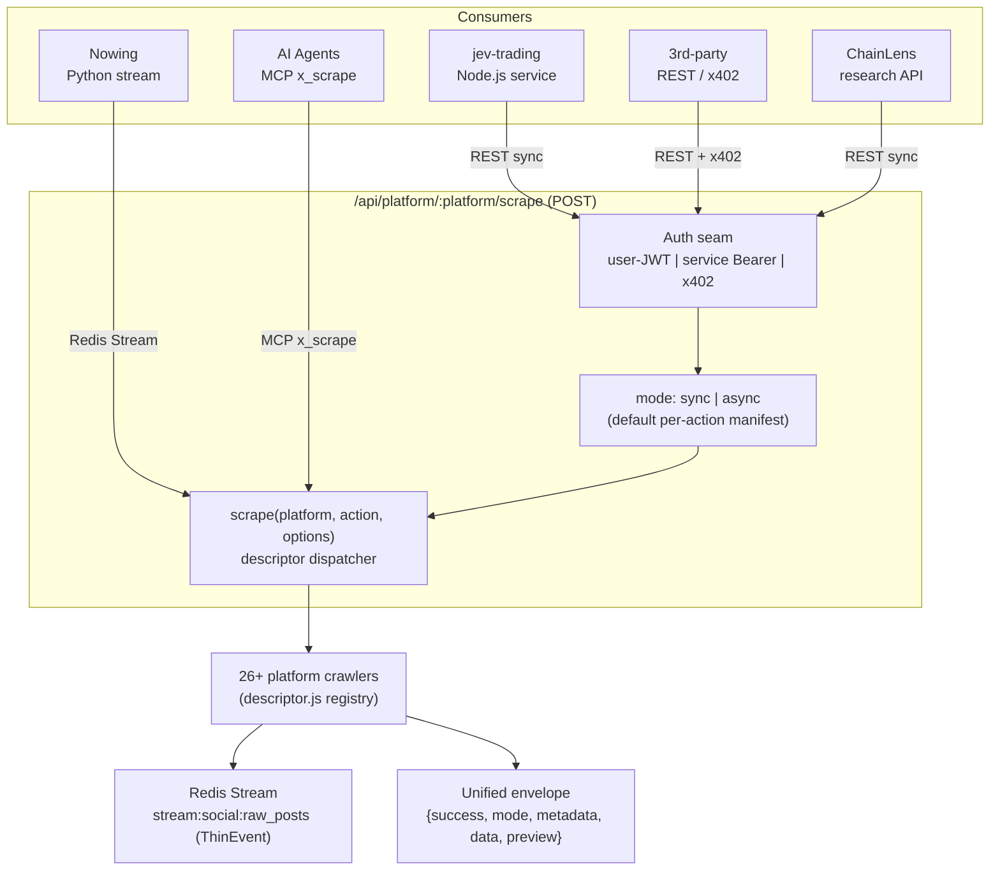

# Architecture Spine — XActions Public Scrape Gateway

## Design Paradigm

**Single-Gateway Facade.** One canonical scrape contract — `POST /api/platform/:platform/scrape` — fronts the existing descriptor dispatcher `scrape(platform, action, options)`. Authentication and sync/async are **cross-cutting seams applied uniformly**, not per-consumer or per-platform branches. Consumers are **identified, not special-cased**: `X-Consumer-Id` carries identity; the contract shape never varies by caller.

The spine exists to stop the failure already observed: jev-trading reimplemented `PumpFunCrawler` in-repo because no callable scrape surface existed for a backend service. The fix is a gateway, not a better crawler.



## Invariants & Rules

### AD-1 — One gateway is the entire public scrape contract [ADOPTED — exists]

- **Binds:** all REST consumers (jev, ChainLens, third-party)
- **Prevents:** per-consumer or per-platform bespoke routes that fragment the standard
- **Rule:** Every platform scrape goes through `POST /api/platform/:platform/scrape` → `scrape(platform, action, options)`. No consumer-named routes (`/api/jev/...`), no one-off search routes (`/api/social/reddit/search`). Adding a capability = registering a descriptor, not a route. `VALID_PLATFORMS` already includes `reddit`, `pumpfun`; new crypto platforms (dexscreener, telegram) register identically.

### AD-2 — Two auth lanes, one seam

- **Binds:** the gateway's auth middleware
- **Prevents:** machine consumers being forced through user-JWT (the actual reason jev can't call the sync route today)
- **Rule:** `authenticate` (user JWT — dashboard) OR `serviceAuth` (Bearer/API-key via existing `identifyConsumer` seam) — mutually exclusive per request, both resolve to a caller identity. **The Bearer credential cryptographically binds the consumer_id** — the gateway derives `consumer_id` server-side from the Bearer token (env-configured map `XACTIONS_MCP_API_KEY`→consumer, or a lookup table); `X-Consumer-Id` header is a *hint only*, never authoritative. This prevents header-spoofing from bypassing AD-7 quota. Third-party/external consumers authenticate via **x402 pay-per-call** (`api/middleware/x402.js` — needs route-config extension to cover `POST /api/platform/:platform/scrape`). No consumer transmits a session cookie — session/proxy resolution is server-side per platform.

### AD-3 — `mode: sync | async` is a dispatch flag, not a different endpoint

- **Binds:** gateway request handling
- **Prevents:** heavyweight queue+poll being forced on sub-second-capable calls (Reddit search, coin-meta) — the latency that drove jev to DIY
- **Rule:** `mode` selects execution path on the same route (optional field; default per-action manifest). `sync` → `scrape()` direct, in-process, target <1.5s, used for lightweight read actions (reddit search, coin metadata, dexscreener lookup). `async` → existing queue+poll (`/api/ai/action/status/:id`), for heavy/batch actions (100-tweet scrape, full follower graph). Default mode is declared per-action in a manifest (`syncCapable: true|false`); caller may override sync→async but never async→sync. Cold anti-bot challenges that exceed the sync latency budget degrade to `async` automatically — **the degrade contract is fixed**: HTTP `202` + `{operationId, retryAfter, mode:'async'}` + `Retry-After` header; never `200+error`, never a silent timeout. Consumers poll `/api/ai/action/status/:id` (the only status endpoint; platform descriptors never expose their own).

### AD-4 — The latency boundary is architectural, not advisory

- **Binds:** what XActions offers vs what consumers self-serve
- **Prevents:** XActions absorbing latency-critical paths it can't serve (and consumers blaming the platform for it)
- **Rule:** XActions serves **seconds-to-minutes** data only — social scraping, auth-gated endpoints, content corpus. Sub-second paths (pumpportal WS mint stream, Solana RPC/Helius/Triton, trade tape, TP triggers) are **consumer-owned and out of scope** — XActions neither proxies nor mirrors them. The gateway's sync budget is documented per action so a consumer can tell at call-time whether an action is fast-lane-eligible.

### AD-5 — Consumer-independent response envelope

- **Binds:** response shape of every gateway call
- **Prevents:** consumer-specific response shapes creating de-facto per-caller contracts
- **Rule:** All calls return the unified Epic-20 envelope `{ success, mode, metadata, stream:{enabled,name,cursor}, preview[≤10], data[] }`. **`preview` is a verbatim slice `data[0..10]`** — never a derived summary; summaries/stats go in `metadata`. A consumer needing a different shape (jev's `Post`/`Corpus`) normalizes in **its own adapter** (`xactionsClient.normalizePost`) — never inside XActions.

### AD-6 — No consumer-specific fields in the shared contract

- **Binds:** ThinEvent + envelope schema
- **Prevents:** crypto/trading fields leaking into a contract Nowing/ChainLens must also parse
- **Rule:** Domain-specific fields (e.g. `dev_paid_order`, `bonding_curve`, `realized_pnl`) live in the `data`/`context` payload — never in the ThinEvent or envelope core. The shared schema is platform-agnostic; `category: 'crypto'` discriminates, payload carries the rest.

### AD-7 — Per-consumer rate-limit isolation

- **Binds:** token-bucket + proxy-pool accounting
- **Prevents:** one consumer's scrape volume starving another's — specifically jev's own direct Dexscreener TP-fallback dying because XActions' dexscreener crawler burned the shared IP budget
- **Rule:** `DistributedTokenBucket` keys are `consumer_id : platform : action`, not platform-global. XActions' upstream-fetched traffic uses the platform proxy pool; a consumer's own direct-fetch IP budget is a separate lane that XActions never touches. Quotas are per-consumer and independently enforced.

## Consistency Conventions

| Concern | Convention |
| --- | --- |
| Consumer identity | Derived server-side from Bearer credential (env map or lookup); `X-Consumer-Id` header is a non-authoritative hint. `nowing`/`chainlens`/`internal` are the metered classes; jev resolves to `internal` via Bearer binding. |
| Service auth | Bearer token vs `XACTIONS_MCP_API_KEY`/`XACTIONS_API_TOKEN`; external paid access via x402. No session-cookie transmission by machine consumers. |
| Response shape | Unified envelope `{success, mode, metadata, stream, preview, data}` — snake_case data fields per ThinEvent, dual-emit camelCase. `preview` = verbatim `data[0..10]` slice; summaries in `metadata`. |
| Action naming | snake_case `verb_noun` (`fetch_coin_meta`, `token_socials`, `search`); descriptor `actionMap` exposes shorthand aliases (`coin_meta`, `socials`). `syncCapable` manifest is the source of truth for mode eligibility. |
| Mode selection | `mode` in request body (optional; default per-action manifest); cold anti-bot auto-degrades sync→async via `202+operationId+Retry-After` only. |
| Async status | Always `GET /api/ai/action/status/:id`; descriptors never expose per-platform status routes. |
| Crypto/domain fields | In `data`/`context` payload only; `category` discriminates. Never in core schema. |
| Errors | 3-layer `ErrorEnvelope` (XACT_4xxx/5xxx); `code` + `message` + `status`; never raw scraper stack. |
| Batch | `platform:'all'|string[]` → `UniversalActionDispatcher` (already exists); same envelope with `results[]` per platform. |
| Request tracing | `X-Request-Id` honored end-to-end (in → auth → dispatcher → crawler → envelope `metadata.request_id`); W3C `traceparent` propagated for OTel-aware consumers. |

## Operational Envelope

- **Runtime:** Node ≥18 ESM; single Express process serves the gateway; Bull workers run as a separate process (`npm run worker`) — sync calls never share the worker event loop with queued jobs.
- **Infra minimums:** Redis ≥6 (Streams + Lua for `DistributedTokenBucket`); PostgreSQL ≥14 (Prisma). No additional infra for the gateway itself — reuses the existing stack.
- **SLO:** `mode:'sync'` p99 < 1.5s end-to-end on a healthy upstream (proxy pool warm, no CF challenge). Breach → `202` degrade contract (AD-3), never silent-hang. `mode:'async'` no SLO — consumer polls.
- **Observability:** every gateway call emits `X-Request-Id` (accepted inbound or generated) and propagates to `metadata.request_id`; OTel `traceparent` respected if present; per-call log line `consumer_id, platform, action, mode, duration_ms, upstream_status` written to Morgan/stdout.
- **Environments:** dev = `NODE_ENV=development` + local Redis/Postgres (`.env.example`); prod = managed Redis + Postgres + `XACTIONS_MCP_API_KEY`/`XACTIONS_API_TOKEN` configured. Staging is a prod clone — no special mode.

## Stack

| Name | Version |
| --- | --- |
| Express gateway | existing `api/routes/platform.js` (`:platform/scrape`, sync) |
| Dispatcher | `src/scrapers/index.js` `scrape(platform, action, options)` — descriptor contract (Story 25.1) |
| Consumer identity | `src/mcp/consumer-context.js` `identifyConsumer` (AsyncLocalStorage) |
| Crypto payments | `@x402/express` middleware (`api/middleware/x402.js`) — **extend `buildRouteConfig`** to cover `POST /api/platform/:platform/scrape` |
| Rate governance | `DistributedTokenBucket` (Redis Lua), `ProxyIpPool` |
| Job queue (async mode) | Bull + Redis (`services/jobQueue.js`) |

## Structural Seed

```text
api/routes/platform.js          # :platform/scrape — ADD mode param + serviceAuth lane
api/middleware/serviceAuth.js   # NEW — Bearer/API-key → derive consumer_id (server-side) → req.consumer
api/middleware/x402.js          # EXTEND — add /api/platform/:platform/scrape routes to buildRouteConfig
src/mcp/consumer-context.js     # REUSE — already implements X-Consumer-Id + Bearer check
src/scrapers/index.js           # scrape() dispatcher — unchanged; mode handled above it
src/scrapers/crypto/dexscreener/# NEW platform (descriptor+client+crawler+normalizer)
src/scrapers/social/telegram/   # NEW platform (descriptor+client+crawler+normalizer)
api/openapi.json                # regenerate — surface x_actions_list for self-discovery
```

## Capability → Architecture Map

| Capability (from research D1–D4) | Lives in | Governed by |
| --- | --- | --- |
| Reddit content search (D1) | `scrape('reddit','search')` via gateway sync | AD-1, AD-3 |
| pump.fun coin metadata (D2) | `PumpFunCrawler.fetch_coin_meta` (NEW action — wraps `client.getCoin` alone, ~300ms; not the heavy `fetch_mint_social`) → gateway sync | AD-1, AD-3, AD-4 |
| Dexscreener platform (D3) | `src/scrapers/crypto/dexscreener/` → gateway | AD-1, AD-7 |
| Telegram channel monitor (D4) | `src/scrapers/social/telegram/` → gateway + stream; MTProto-vs-Bot transport deferred — must resolve in D4 spec before impl | AD-1, AD-5 |
| Batch multi-platform search | `platform:['x','reddit',...]` via dispatcher | AD-1, AD-5 |
| Service/machine auth | `api/middleware/serviceAuth.js` + consumer-context | AD-2 |

## Deferred

| Decision | Why it waits |
| --- | --- |
| Telegram MTProto vs Bot-API transport | Depends on whether target channels allow a bot member; MTProto user-client has different ToS surface — decide in the D4 spec, not here |
| Dexscreener `orders`/`boosts` as continuous signal vs on-demand | Needs a freshness/cadence decision tied to consumer polling patterns; start on-demand, promote to cached feed only if consumers poll hot |
| Whether jev actually migrates its in-repo `PumpFunCrawler` to the gateway | Consumer-side decision (Story 8.3); the gateway only needs to make the sync path *preferable* — adoption is theirs |
| Per-consumer SLA/billing tiers | x402 covers pay-per-call; named-consumer quotas beyond that wait for real usage data |
| `async`→`sync` promotion list | The `syncCapable` manifest is data-driven; which actions qualify is set per-platform as crawlers are built, not globally up-front |

## Resolved Open Questions

These were the spine's open calls; each resolved against the code, not preference.

### OQ-1 — Should `jev` be added to `VALID_CONSUMER_IDS`?

**Resolved: no hardcode — the list stays frozen; consumer identity is env-driven.** `VALID_CONSUMER_IDS = ['nowing','chainlens','internal']` is a **quota-billing boundary**, not a caller whitelist. `internal` already means "unmetered, trusted, bypasses quota gate." jev is a same-trust-domain internal service → it belongs at `internal`/`trusted`, not as a new named billable consumer.

The mechanism to add a *named* consumer, when one is needed for metering, is the env var `XACTIONS_MCP_API_KEY` + `X-Consumer-Id` — the identity seam (`identifyConsumer`) already separates "who is calling" (header, free-form) from "are they authenticated" (Bearer). A new named consumer = config (`VALID_CONSUMER_IDS` sourced from env), not a code change. `internal` remains the unmetered default.

### OQ-2 — Sync timeout for CF-gated calls (pump.fun `/coins/<mint>`)

**Resolved: hard ceiling, auto-degrade to `async` — never a longer sync window.** jev's own `holderConcentration.ts` uses a **2s timeout, non-fatal** — so jev tolerates bounded latency and explicit failure. A longer sync window would re-introduce exactly the hang that made them fork. Sync ceiling is fixed at **1.5s**; on breach the gateway returns `202` + `operationId` + `Retry-After`, and the consumer polls `/api/ai/action/status/:id` (the async path they already use for Twitter). A sync call never silently hangs past its budget.

### OQ-3 — Is x402 always-on for third-party sync mode?

**Resolved: no — tiered, with a free anonymous ceiling.** Forcing payment on first call would block organic adoption; leaving it fully open invites abuse.
- **Named consumers** (`X-Consumer-Id` + Bearer): metered-but-free quota via `DistributedTokenBucket` (`consumer:platform:action` keys, AD-7).
- **Anonymous/unknown callers** (no header/token): get a **tight free tier** — IP-bucketed rate limit, low ceiling — enough to evaluate the API.
- **x402** engages when the anonymous quota is exhausted, or unconditionally for heavy/premium actions (bulk, high-cost). This is the `paidRoute` pattern already in `api/middleware/x402.js`.
