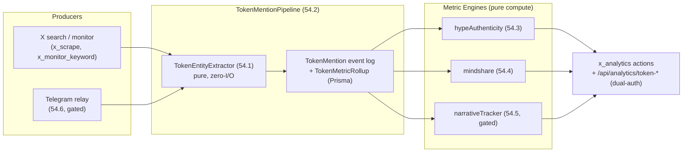

# Architecture Spine — Token Sentiment Intelligence (Epic 54)

## Design Paradigm

**Hexagonal Analytics Layer.** Pure, zero-I/O metric engines (`src/analytics/token*`) compute over ONE canonical token event log persisted in Postgres. Ingestion adapters (X search, monitor, telegram) are interchangeable producers — they write `TokenMention` events through the pipeline and nothing else. Every consumer-facing metric response carries the same degraded/history-state contract.



## Inherited Invariants

| Inherited | From parent | Binds here |
| --- | --- | --- |
| Hexagonal ports; platform impls in `src/scrapers/{domain}/{platform}/`; Prisma namespaced IDs; `stream:social:raw_posts`; governor (Epic 11) | hybrid-scraping-spine (canonical) | 54.2 storage choice, 54.6 telegram adapter, all stream emission |
| AD-1 one gateway contract — new platforms register as descriptors | public-scrape-gateway | 54.6 telegram fills existing Story-50.8 skeleton via `options.transport` seam |
| AD-2 two auth lanes (authenticate \| serviceAuth→consumer_id) | public-scrape-gateway | AD-5 applies the pattern to analytics surfaces |
| AD-3 sync\|async + 202 degrade contract | public-scrape-gateway | async metric recompute paths if ever queued |
| AD-5 unified envelope; AD-6 no consumer fields in core schema; AD-7 per-consumer rate limits | public-scrape-gateway | telegram descriptor calls; token fields live in `data`/`context` payload |
| Epic 52 consolidation — capabilities are dispatcher actions, never new top-level tools | sprint-change 2026-10-01 | AD-6 |

## Invariants & Rules

### AD-1 — Canonical Token Identity grammar

- **Binds:** Story 54.1 extractor, every TokenMention row, all downstream joins
- **Prevents:** two implementers minting different ID shapes (`token:sol:XYZ` vs `solana:XYZ` vs raw `PEPE`) → dedup and joins break silently
- **Rule:** `canonicalId = token:{chain}:{contract}` for contract-bound tokens (`token:sol:…`, `token:evm:0x…`); symbol-only mentions get `token:sym:{SYMBOL}` flagged `ambiguous: true` and **never merge** into contract-bound IDs even when a resolution appears later — re-resolution emits a new mention attribution, history is not rewritten. The alias map + contract↔symbol resolution cache live in a single **TokenRegistry** owned by this epic.

### AD-2 — Token data lives in Prisma/Postgres

- **Binds:** Stories 54.2–54.5 (all readers/writers of token data)
- **Prevents:** historyStore (username-keyed SQLite-era API), ad-hoc Redis keys, and Prisma being chosen independently per story → three incompatible read paths
- **Rule:** New models `Token`, `TokenMention`, `TokenMetricRollup` in `prisma/schema.prisma` (namespaced IDs, `metadata Json?` + GIN index per canonical spine). `TokenMention` = append-only-per-identity event log (see AD-4 upsert rule), source of truth; `TokenMetricRollup` = materialized cache for rolling windows (24h/7d/14d), updated **incrementally at ingest by the pipeline (single writer)**, with a `rebuildRollups()` repair script — never computed on-read, never written by metric engines. `historyStore.js` is username-keyed account analytics — **not reused** for token data.

### AD-3 — Degraded-data contract (one definition, all metrics)

- **Binds:** every response from 54.2, 54.3, 54.4, 54.5
- **Prevents:** one story returning stale data, another returning fabricated zeros, a third computing anyway — consumers can't tell bad data from good
- **Rule:** degraded state = `{data: last-good-snapshot | null, degraded: true, degradedSince: <ISO ts>, consecutiveEmptyBatches: n}`. Metrics **never compute on degraded windows**; baselines (`avg_mentions_14d`, mindshare trailing share) exclude degraded windows explicitly. `insufficientHistory: true` (distinct flag) when the baseline window itself isn't full yet — data is real, just young.

### AD-4 — Source-id namespacing

- **Binds:** TokenMention dedup keys, PostItem ids, all platform producers
- **Prevents:** telegram message id `123` colliding with tweet id `123` once 54.6 lands — retrofitting dedup keys across a live event log is a migration nobody wants
- **Rule:** Dedup key = `(canonicalId, platform, platformId)` composite — scoped per token, so one tweet mentioning $PEPE+$WIF yields two rows (never cross-token dedup). Wire/storage form is prefixed: `x:<tweetId>`, `tg:<channelId>:<msgId>`. `TokenMention.source` carries `{platform, platformId, channelId?}`. **Re-observation rule:** first observation inserts; a later scrape of the same key upserts mutable fields in place (`engagement`, `lastSeenAt`) — the log is append-only *per identity*, never duplicates, never drops engagement updates.

### AD-5 — Token analytics endpoints are machine-consumer surfaces

- **Binds:** REST endpoints in Stories 54.3–54.5
- **Prevents:** hanging routes off `api/routes/analytics.js` as-is (it's `router.use(authenticate)` = user-JWT only) → jev can't call → the exact failure the gateway spine exists to fix
- **Rule:** `/api/analytics/token-*` routes accept `authenticate` **OR** `serviceAuth` (Bearer → server-derived `consumer_id`), same seam as gateway AD-2. Dashboard keeps working; jev/ChainLens call with service credentials. Per-consumer rate limiting applies (AD-7 pattern, keys `consumer_id:analytics:<action>`).

### AD-6 — MCP surface: actions on existing dispatchers only

- **Binds:** MCP exposure in Stories 54.3, 54.4, 54.5, 54.6
- **Prevents:** new top-level `x_token_*`/`x_telegram_*` tools re-inflating the 224-tool surface Epic 52 just collapsed
- **Rule:** Capabilities register as actions on existing domain dispatchers: `x_analytics{token_hype | mindshare | narratives}` for metrics; `x_scrape{telegram_channels | telegram_search}` for telegram — telegram is a *platform* descriptor registering under gateway AD-1 like dexscreener, not a crypto-domain action (`x_crypto` reserved for domain metrics). No new top-level tool names.

### AD-7 — Mindshare denominator is the watchlist corpus

- **Binds:** Story 54.4 formula and response schema
- **Prevents:** `mindsharePct` field-shaped like Cookie Pro's but semantically different (watchlist share vs global CT share) → silent incomparable data on hot-swap — worse than an incompatible schema
- **Rule:** `mindshare_pct = weighted_mentions(token) ÷ weighted_mentions(all watched tokens)`; response carries `scope: 'watchlist'` + `scopeNote` stating it is not comparable to provider global mindshare. `[ASSUMPTION]` — spike 54.0 may prove broader cashtag coverage; if it does, a `scope: 'corpus'` variant can be added, but the watchlist default stands.

### AD-8 — One TokenRegistry, per-consumer views by filter

- **Binds:** Stories 54.1 (alias map), 54.2 (watchlist config), 54.4 (denominator)
- **Prevents:** per-consumer watchlist forks producing different denominators and double ingestion of the same queries
- **Rule:** The watchlist is a single DB-backed TokenRegistry (tokens, contracts, aliases, tier). Consumer-specific views are query-time filters on `consumer_id`, not separate registries. `[ASSUMPTION]` — jev is the sole initial consumer under the `internal` class; revisit if a second consumer needs an isolated watchlist.

### AD-9 — Telegram relay is a separate process behind the descriptor transport seam

- **Binds:** Story 54.6 (gated)
- **Prevents:** conflating the crawler adapter (`src/scrapers/social/telegram/` — Story 50.8 skeleton, already merged) with the stateful MTProto session service → session state leaking into multi-instance scraper processes
- **Rule:** Relay = standalone Node process at `services/telegram-relay/` (new top-level dir for standalone services), internal-only HTTP port. Contract copied from verified mmomarket pattern: GramJS `telegram@2.26.22`, `StringSession` via `TELEGRAM_SESSION` env (password-grade secret), `/liveness` + `/health` (healthy/cooldown/permanently_unhealthy), `FLOOD_WAIT_N`→cooldown+5s buffer, terminal errors→`SESSION_BANNED`, `isBusy` single-flight. The crawler adapter lands the transport impl behind the existing `options.transport` descriptor seam and talks HTTP to the relay. Bot API is rejected (crypto channels don't add bots).

## Consistency Conventions

| Concern | Convention |
| --- | --- |
| canonicalId | `token:{chain}:{contract}` \| `token:sym:{SYMBOL}` (ambiguous, never merges) |
| Source ids | `x:<tweetId>`, `tg:<channelId>:<msgId>`; dedup key `(platform, platformId)` |
| Wire fields | snake_case + dual-emit camelCase (gateway conventions) |
| Analytics envelope | existing `{success, …}` analytics shape + `metadata.request_id`; NOT the gateway scrape envelope |
| Degraded response | `{data, degraded, degradedSince, consecutiveEmptyBatches}` / `insufficientHistory` flag distinct |
| MCP naming | dispatcher actions only: `x_analytics{token_hype\|mindshare\|narratives}` |
| Watchlist | single TokenRegistry (DB); per-consumer = query filter; mutations via REST admin endpoints under dual-auth (DB seed for bootstrap only) |
| TokenMention fields | pipeline computes `sentimentScore` (lexicon) at ingest; `sentimentScoreLLM` separate nullable field, filled only by 54.5 batch — engines never re-score inline |
| `engagement` field | `Json` = `{likes, retweets, replies, quotes}` verbatim from source; normalization (`log10(1+Σ)`) lives inside metric formulas |
| Metric weights | defaults (0.5 mentions / 0.3 authors / 0.2 engagement) in shared config owned by `tokenRegistry`, overridable per call |
| Dual-auth wiring | one composite middleware `anyAuth` (try `authenticate` → fallback `serviceAuth` → set `consumer_id`); never sequential `router.use(authenticate, serviceAuth)` — each lane rejects the other's requests |
| Metric formulas | TheTie `hype_to_liquidity`, Santiment `log₁₀(unique_users)` normalization — fixed in epic text |

## Stack

| Name | Version |
| --- | --- |
| Runtime | Node ≥18 ESM (existing) |
| Storage | PostgreSQL ≥14 + Prisma (canonical spine) |
| Stream | Redis Streams `stream:social:raw_posts` (canonical spine) |
| Telegram transport | `telegram@2.26.22` (GramJS — pinned, mmomarket-verified) |
| Metric engines | pure JS, zero-I/O core; injectable resolvers |
| LLM (54.5) | JevBrain batch classify (Epic 42/45) + deterministic keyword fallback |

## Structural Seed

```text
src/analytics/
  tokenEntityExtractor.js   # 54.1 — pure: text → {canonicalId, symbol, confidence}
  tokenRegistry.js          # AD-1/AD-8 — alias map, contract↔symbol cache, watchlist
  tokenMentionPipeline.js   # 54.2 — ingest → normalize → dedup → persist → degraded flag
  hypeAuthenticity.js       # 54.3 — hype_to_liquidity, unique_sources_pct, hype_score
  mindshare.js              # 54.4 — watchlist-scope share + deltas + top_voices
  narrativeTracker.js       # 54.5 (gated) — clustering, rotation, emerging
src/scrapers/social/telegram/  # EXISTS (Story 50.8 skeleton) — 54.6 lands transport impl
services/
  telegram-relay/           # 54.6 (gated) — NEW standalone MTProto service (mmomarket pattern)
prisma/schema.prisma        # + Token, TokenMention, TokenMetricRollup models
api/routes/analytics.js     # + /token-* routes on dual-auth seam (AD-5)
src/mcp/server.js           # + actions on x_analytics / x_crypto dispatchers (AD-6)
```

## Capability → Architecture Map

| Capability (story) | Lives in | Governed by |
| --- | --- | --- |
| Coverage spike (54.0) | `implementation-artifacts/spike-54-coverage-report.md` | decision fork output → AD-7 revisit condition |
| Token extraction (54.1) | `tokenEntityExtractor.js` + `tokenRegistry.js` | AD-1, AD-8 |
| Mention pipeline (54.2) | `tokenMentionPipeline.js` + Prisma models | AD-2, AD-3, AD-4 |
| Hype metrics (54.3) | `hypeAuthenticity.js` + `/api/analytics/token-hype` | AD-3, AD-5, AD-6 |
| Mindshare (54.4) | `mindshare.js` + `/api/analytics/mindshare` | AD-3, AD-5, AD-6, AD-7 |
| Narratives (54.5, gated) | `narrativeTracker.js` | AD-3, AD-6 |
| Telegram crawler (54.6, gated) | `services/telegram-relay/` + telegram descriptor | AD-4, AD-9 + gateway AD-1 |

## Deferred

| Decision | Why it waits |
| --- | --- |
| `scope:'corpus'` global-share variant of mindshare | Spike 54.0 measures real cashtag coverage first; watchlist default stands meanwhile |
| Relay ops/deploy story (Dockerfile, env wiring, secret management) | Lands with 54.6 implementation planning; mmomarket Dockerfile pattern is the template |
| Per-consumer watchlist isolation | Single consumer today (jev → `internal` class); revisit on second consumer |
| Backfill of historical mentions | Not feasible — X search window is ~7 days; accept `insufficientHistory` ramp |

## Resolved Open Questions

### OQ-1 — Who owns `TELEGRAM_SESSION`?

**Resolved: dedicated Telegram account on a dedicated real SIM/eSIM — an org-owned infra asset, not a person's account.** The relay's own error taxonomy treats sessions as expendable (`SESSION_BANNED` → `permanently_unhealthy` is a designed-in terminal state), so the backing account must be disposable — banning a personal number costs a whole social graph. The account registers as `SocialAccount{platform:'telegram'}` (health tracking free via `SocialAccountHealth`), binds a sticky residential proxy per account-pool convention, and the session string lives in env secrets like `XACTIONS_SESSION_COOKIE` does today. Re-login after a ban is an ops runbook item, not an incident. Virtual/VoIP numbers rejected (flagged fast for crypto-adjacent use).

### OQ-2 — Does 54.2 need its own rate limiter?

**Resolved: no — the governor seam is already wired end-to-end; the pipeline owns cadence, not enforcement.** `x_search_tweets` → twitter client → `base-client` already calls `governor.canConsumerRequest` (AD-20 quota, `internal` bypasses) + `canAccountRequest` (per-account gate) + `recordRateLimit`→hibernation + `recordBotChallenge`. What 54.2 must own is **poll scheduling** (interval per watchlist query) — the governor meters each request, it doesn't schedule them. Spike 54.0's measured ceiling writes back via `setPlatformLimit('twitter', {safeRequestsPerMinute})` — never hardcoded in pipeline constants. **Spike caveat:** the per-account gate only fires when `concreteAccountId` is set; verify whether search runs on the auth session or the guest path.
