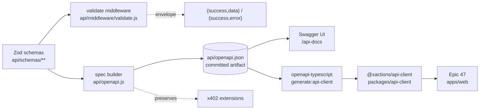

# Architecture Spine — XActions API Contract (Epic 46)

## Design Paradigm

**Contract-first schema pipeline.** Zod schemas là single source of truth: runtime validation, OpenAPI 3.1 document, và generated TypeScript client đều derive từ cùng một nguồn. Không có artifact nào được maintain thủ công song song.



Dependency direction (đây là rule, không chỉ là hình): `routes → schemas`; `openapi.js → schemas`; `api-client → spec artifact`. Không gì trong `api/` phụ thuộc ngược lên client hay UI; `apps/web` chỉ nhìn `packages/api-client`, không nhìn `api/`.

## Inherited Invariants

| Inherited | From parent | Binds here |
| --- | --- | --- |
| AD-14 — domain error envelope `{code,type,message,retryAfter,suggestedAction,accountId?,platform}` + `type`/`suggestedAction` vocab | xactions-hybrid-scraping-spine | Domain errors (`PlatformError`, `src/core/error-envelope.js`) giữ nguyên shape; HTTP layer map qua AD-3, không reshape. Vocab do domain sở hữu — repo hiện đã mở rộng (12 types), API layer copy nguyên không re-enum |
| AD-14 rule 3 + AD-16/AD-19 — operator surfaces | xactions-hybrid-scraping-spine | Parent viết `src/api/**` nhưng thực tế các surface này sống trong `api/routes/` (`/api/governor`, `/api/checkpoints`, `/metrics/stream`) — **thuộc scope Epic 46**: được document trong spec nhưng phải giữ response fields parent đã công bố (governor status shape, checkpoint payloads) |

## Invariants & Rules

### AD-1 — Schema-Driven Single Source of Truth

- **Binds:** `api/routes/**`, `api/schemas/**`, `api/openapi.js`, `packages/api-client`
- **Prevents:** spec và validation drift khỏi nhau (spec nói dối validation); spec thủ công thứ hai cạnh tranh `api/openapi.js` hiện hữu
- **Rule:** Mọi route thuộc scope (AD-4) khai báo Zod schemas cho **request** (body/query/params/headers) và **response payload `T`** — schema mô tả payload, envelope là wrapper của pipeline chứ không nằm trong schema. Khi emit response schemas vào spec, builder wrap `T` trong canonical envelope components (`SuccessResponse<T>`, `ErrorResponse`) — generated client thấy `data: T`, không thấy envelope do middleware sở hữu. Request schemas không dùng `.strict()` — unknown-key policy mặc định (strip) để legacy fields (ví dụ body `sessionCookie` sau khi normalize) không làm validation fail. Spec generate từ schemas qua `@asteasolutions/zod-to-openapi`; `api/openapi.js` refactor thành builder dùng chung; hand-edit `paths` là vi phạm. express-validator chains hiện hữu coexist; route mới/touch lại dùng Zod. **Caveat:** pin `zod@4` làm `src/analytics/viralStatsStore.js` (zod undeclared → transitive 3.x) nhảy major — phải audit file này trong cùng PR thêm dependency.

### AD-2 — HTTP Response Envelope & Single Owner

- **Binds:** mọi JSON endpoint thuộc scope, kể cả lỗi sinh từ middleware
- **Prevents:** ~50 mount groups trả ≥4 error shapes; double-wrap khi handler tự emit envelope mà formatter lại wrap
- **Rule:** Wire shape: success `{ success: true, data: T }`; error `{ success: false, error: { code: string, message: string, type?: string, details?: unknown } }`; pagination `{ success: true, data: T[], page: { cursor: string | null, limit: number, total?: number } }` (cursor là convention duy nhất — offset endpoints map sang). **Single owner:** chỉ `api/middleware/envelope.js` serialize envelope — handler trả payload `T` qua `res.sendData(t)` / throw error; handler không tự `res.json({success:true,...})`. Exempt: streaming/binary/redirect (AD-4) và x402 `402` bodies (protocol-fixed bởi x402 spec).

### AD-3 — Domain → HTTP Error Mapping (AD-14 bridge)

- **Binds:** `api/middleware/envelope.js`, `api/routes/**`, `src/core/error-envelope.js` boundary
- **Prevents:** HTTP layer flatten/rename domain fields → MCP/CLI consumers parse `suggestedAction`/`retryAfterMs`/`isRetryable` vỡ âm thầm
- **Rule:** Khi `PlatformError` thoát ra HTTP: `error.code` = domain `code`; `error.type` = domain `type`; `error.message` = domain `message`; `error.details` = **`toEnvelope()` output nguyên vẹn** (gồm `retryAfter`, `retryAfterMs`, `isRetryable`, `statusCode`, `suggestedAction`, `accountId`, `platform`, `consumerId`, domain `details` — copy verbatim, không allowlist). Non-domain errors: `code` theo API taxonomy (`VALIDATION_FAILED`, `NOT_FOUND`, `RATE_LIMITED`…), `type` omitted (không emit empty string). Flat mapping hiện hữu (`checkpoints.js` emit `suggestedAction` top-level) migrate sang shape này — breaking-change note đi kèm spec `info.version` bump.

### AD-4 — Route Scope & Exclusions

- **Binds:** spec coverage, validation middleware, envelope formatter
- **Prevents:** scope ambiguity ("52 routes" không verify được khi mount table có ~50 groups)
- **Rule:** Scope = Route Inventory (epics.md, Epic 46 Phụ lục A). Exclusions cố định: `POST /webhooks/*` (raw Buffer — Stripe signature); streaming/binary/redirect endpoints (`/api/video/download` stream `video/mp4`); `/api/plugins/*` (runtime mounts — plugin tự đăng ký schema nếu muốn vào spec); `/metrics/stream` (operational surface thuộc parent AD-17 — giữ shape hiện tại, document as-is). Route mới thêm vào `server.js` phải cập nhật inventory trong cùng PR.

### AD-5 — Validation Pipeline Order & Error Interception

- **Binds:** `api/middleware/validate.js`, `api/middleware/auth.js`, `api/middleware/envelope.js`, route mounts trong scope
- **Prevents:** validation 400 leak internals cho unauthenticated callers (hoặc ngược lại); middleware errors (429/404/413) escape envelope
- **Rule:** Order cố định **per-route**: security scheme đã khai báo của route đó (AD-6 — JWT, sessionCookie, x402Payment, hoặc optional) chạy trước → Zod validate (`body` + `query` + `path params` + declared headers) → handler. Không có global JWT gate — `/api/ai/*` authenticate qua `x402Payment`, không phải `auth.js`. Middleware-originated errors funnel vào `envelope.js` qua mechanism có tên: express-rate-limit `handler` option, body-parser error middleware (`err.type === 'entity.*'`), 404 handler, và các error tự emit của `auth.js` (401/403/429 usage-limit) — không cái nào tự `res.json` shape riêng.

### AD-6 — Canonical Security Schemes

- **Binds:** spec `components.securitySchemes`, Swagger `authorize()`, generated client auth injection, auth middleware
- **Prevents:** spec quảng bá auth transport mà route không đọc; generated client inject header trong khi schema đòi body field
- **Rule:** Bốn schemes: `bearerAuth` (JWT, header `Authorization`); `sessionCookie` (apiKey **header `x-session-cookie`** — transport canonical duy nhất; spec không bao giờ khai báo body transport vì OpenAPI apiKey không express được); `x402Payment` (apiKey header `X-PAYMENT`); optional-auth = security `[{}, {scheme}]` union — invalid credentials trên optional-auth route resolve thành anonymous context, không bao giờ 401 (theo `auth.js:109-111` hiện tại). Per-route security mapping nằm trong spec. **Normalize shim scope:** auth middleware chỉ normalize `req.body.sessionCookie` → header-equivalent trên các route khai báo scheme `sessionCookie` (copy rồi delete khỏi body trước khi validate); trên route nơi `sessionCookie` là **payload data** (vd `POST /api/session/save-session` — JWT-authed), nó là body field trong schema và shim không chạm tới.

### AD-7 — Docs Delivery & x402 Contract Preservation

- **Binds:** `api/server.js` mount order, `api/openapi.js` extensions, `/.well-known/x402`
- **Prevents:** UI 404 do mount order/global 404 handler; x402scan mất pricing/discovery — revenue regression
- **Rule:** Swagger UI self-hosted qua `swagger-ui-express` (CSP chỉ cho self/jsdelivr) tại **`/api-docs`** — path riêng tránh hẳn namespace `/docs/:slug`; register trước global 404 handler (`server.js:712`). Spec giữ nguyên các x402 **extensions**: `x-payment-info`, `x-bazaar`, top-level `x-x402`, `securitySchemes.x402Payment`, endpoint `/.well-known/x402` — semantics preserved; `$ref` trong extensions được re-point sang canonical components mới (không byte-freeze component names — x402scan đọc extension fields, không đọc tên component). Spec khai báo `servers` (localhost + production). `/api/ai/*` merge vào cùng một document — x402scan discovery contract là `/.well-known/x402` (artifact riêng, `generateWellKnown()` → `{resources: ALL_PAID_RESOURCES}`) cộng per-operation extensions; cả hai đều intact trong superset doc, không cần spec tách. Try-it-out: baseline `supportedSubmitMethods: ['get']` trong swaggerOptions (chỉ GET execute); per-operation granularity nếu cần thì implement qua swagger-ui plugin `allowTryItOutFor` đọc vendor extension `x-tryitout: false` trên operation — `x-tryitout` là marker của ta trong spec, plugin là enforcement.

### AD-8 — Client Codegen & Spec Artifact Pipeline

- **Binds:** `package.json` gốc (scripts + workspaces), `packages/api-client`, `apps/web` (Epic 47), CI
- **Prevents:** generated client rơi chỗ không import được; codegen phụ thuộc live server; spec artifact không rõ owner/freshness
- **Rule:** Artifact contract: `api/openapi.json` là committed file, sinh bởi `npm run build:openapi` (import builder, không qua HTTP); `GET /openapi.json` serve artifact đó; CI regenerate + diff — fail khi code/spec drift. `npm run generate:api-client` ở `package.json` gốc đọc artifact đó, output duy nhất `packages/api-client/` resolve thành `@xactions/api-client` qua root `workspaces` — **enabling workspaces trên repo này rewire node_modules resolution: bắt buộc install-audit step** (verify `packages/xactions-mcp` + phantom deps trước khi commit lockfile). Types qua `openapi-typescript`: một export per schema (e.g. `ViralStats`, `PostItem`, `CRMContact`, `OptimizeTweetRequest`) + `PaginatedResponse<T>`; generated types namespace/dedupe khỏi `Error`/`SuccessResponse`/`PaymentRequired` components. Fetch wrapper mỏng viết tay: inject auth (Bearer hoặc `x-session-cookie`), trả typed error union discriminated theo status — `ApiError` (envelope chuẩn) cho `400 | 401 | 429 | 500`; `402` typed là x402 `PaymentRequired` payload (protocol shape, không phải envelope).

### AD-9 — Contract Honesty

- **Binds:** spec generator, CI, mọi operation trong spec
- **Prevents:** spec rot — document nói một đằng runtime làm một nẻo; codegen vỡ vì duplicate paths/operationIds
- **Rule:** Mọi operation có `operationId` duy nhất (`{group}_{action}` camelCase). Shared mounts dedupe paths: hai router trên `/api/analytics` không emit trùng path; chỉ `/api/governor` được document (`/governor` legacy mount không vào spec). CI: spec lint (`@redocly/cli`) + contract test (vitest + supertest — repo đã pin `^6`) tối thiểu 1 endpoint mỗi inventory group, fail khi response thật lệch schema; regenerate-diff check của AD-8.

## Consistency Conventions

| Concern | Convention |
| --- | --- |
| operationId | `{group}_{action}` camelCase, duy nhất toàn spec |
| Error codes | API layer: `SCREAMING_SNAKE` (`VALIDATION_FAILED`…); domain: `FB_*`/`XACT_*` nguyên trạng qua `error.code` |
| `error.type` | Domain `type` verbatim (vocab do domain sở hữu, không re-enum trong spec); optional trên non-domain errors |
| Dates/ids trong schema | ISO 8601 strings; pagination cursor = opaque string |
| Spec artifact | `api/openapi.json` committed, regenerate bằng `build:openapi` — không hand-edit |
| Session transport | `x-session-cookie` header canonical; `req.body.sessionCookie` legacy được normalize bởi middleware |

## Stack

| Name | Version |
| --- | --- |
| zod | 4.6.5 |
| @asteasolutions/zod-to-openapi | 9.1.0 (peer `zod@^4` — verified) |
| swagger-ui-express | 5.0.1 |
| openapi-typescript | 7.13.0 |
| @redocly/cli (spec lint) | 2.54.2 |
| supertest (contract test) | ^6.3.4 (repo-pinned; 7.x là option, không bắt buộc) |

## Structural Seed

```text
api/
  schemas/        # Zod request/response schemas — single source of truth (payload T)
  middleware/
    validate.js   # schema validation step (sau auth, trước handler)
    envelope.js   # SOLE owner của wire envelope + AD-3 domain mapping
  openapi.js      # spec builder (refactored, giữ x402 extensions)
  openapi.json    # committed artifact — build:openapi regenerate
packages/
  api-client/     # @xactions/api-client — generated types + thin wrapper
```

## Capability → Architecture Map

| Capability / Area | Lives in | Governed by |
| --- | --- | --- |
| Story 46.1 — Swagger UI & `/openapi.json` | `api/server.js`, `api/openapi.js`, `api/openapi.json` | AD-1, AD-7, AD-8, AD-9 |
| Story 46.2 — Zod validation & envelopes | `api/schemas/**`, `api/middleware/validate.js`, `envelope.js` | AD-1, AD-2, AD-3, AD-4, AD-5, AD-6 |
| Story 46.3 — generated client | `packages/api-client`, root `package.json`, CI | AD-8, AD-9 |

## Deferred

- **Per-deployment spec cho `serverless.js`** — hiện serve cùng document; AC yêu cầu `info.description` ghi caveat 503-on-serverless (state mới, chưa tồn tại). Spec rút gọn theo deployment chờ khi có nhu cầu thật.
- **Plugin schema registration mechanism** — `/api/plugins/*` đăng ký schemas vào spec: chờ plugin system epic, hiện excluded.
- **Spec versioning & deprecation policy** ngoài `info.version` bump khi breaking — cần khi có breaking change đầu tiên.
- **Error-code taxonomy registry location** — codes sống trong schemas/Zod errors; một registry doc riêng chờ khi taxonomy > ~20 codes.
- **Migration sequencing ~810 legacy error call-sites** — implementation detail của Story 46.2; spine chỉ fix target shape + ownership.
- **Dashboard/legacy fetch migration** sang `@xactions/api-client` — Epic 47 scope.
- **express@4 + @types/express@5 skew** — pre-existing, không phải epic này giải.
- **Dual lockfiles** (`package-lock.json` + `pnpm-lock.yaml` cùng tồn tại) — chọn một package manager canonical khi enable workspaces; install-audit step của AD-8 quyết luôn.

## Open Questions

— (đã resolve: `/api/ai/*` merge vào unified `openapi.json` — x402scan contract sống ở `/.well-known/x402` + extensions, không phụ thuộc spec tách; AD-7)
