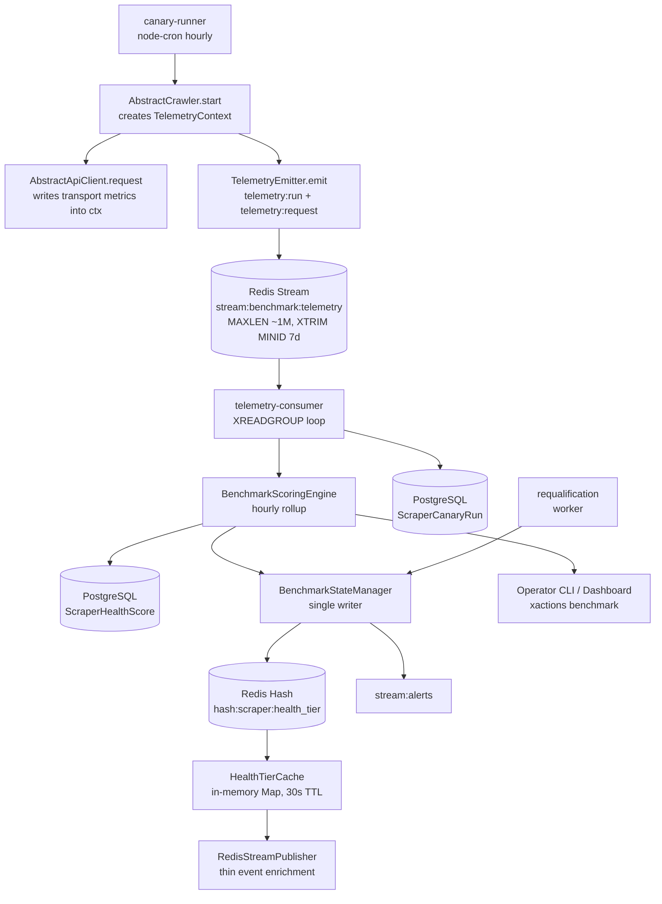

# Architecture Spine — Epic 34: Scraper Benchmark & Reliability Suite

## Design Paradigm

**Hexagonal + Two-Tier Telemetry Pipeline + Single-Writer Tier State Machine** — raw telemetry streams to Redis (Tier 1: hot, rolling 7-day retention via `XTRIM MINID`) and aggregated scores persist to PostgreSQL (Tier 2: cold, 90-day retention). All instrumentation is centralized in `AbstractCrawler`/`AbstractApiClient` base classes; platform crawlers remain untouched. A single `BenchmarkStateManager` owns every tier mutation — hourly rollups and re-qualification never write `hash:scraper:health_tier` independently.



## Inherited Invariants

| Inherited | From parent | Binds here |
| --- | --- | --- |
| AD-2 (Unified Base Scraper & Client Interfaces) | `ARCHITECTURE-SPINE.md` (hybrid-scraping-spine) | Telemetry hooks reside in `AbstractCrawler` (`src/core/base-crawler.js`) / `AbstractApiClient` (`src/core/base-client.js`), not platform subclasses |
| AD-7 (Dual-Channel Protocol: HTTP/SSE + Redis Stream) | `ARCHITECTURE-SPINE.md` | Benchmark uses same Redis Stream infrastructure and `MAXLEN ~ 1000000` sizing convention; no new transport introduced |
| AD-9 (Anti-Bot Payload Validation) | `ARCHITECTURE-SPINE.md` | False-200 detection extends `AbstractPlatformResponseValidator` (`src/core/platform-validator.js`) |
| AD-13 (Adaptive Rate Governor) | `ARCHITECTURE-SPINE.md` | Telemetry emission must not trigger governor throttling or account burn; canary probes bypass velocity quotas via `isCanary` flag (AD-33) |
| AD-18 (Metadata Schema Contract) | `ARCHITECTURE-SPINE.md` | `MetadataSchemaRegistry` governs `Post.metadata` only — it is **not** the thin-event extension point. Thin events extend via `ThinEvent` typedef in `src/core/types.js` + `RedisStreamPublisher.formatPayload()` (AD-27) |
| AD-20 (Dual-Pool Resource Isolation) | `ARCHITECTURE-SPINE.md` | Canary probes must not consume production Realtime/Bulk proxy quota — see AD-33 |

## Invariants & Rules

### AD-23 — Two-Tier Benchmark Architecture & Stream Retention Contract

- **Binds:** CAP-1, CAP-2, CAP-3, CAP-4, CAP-5, FR-98–FR-103, NFR-19, NFR-20, NFR-21
- **Prevents:** Database write amplification, latency spikes on scrape path, unbounded storage growth, premature telemetry eviction, invalid Redis operations
- **Rule:**
  1. Raw telemetry events are fire-and-forget `XADD` to `stream:benchmark:telemetry` with `MAXLEN ~ 1000000` (consistent with parent AD-7 `stream:social:raw_posts` sizing; ~1.5M events/week across 15+ platforms requires ≥1M).
  2. **Redis Streams have no per-entry TTL.** Rolling 7-day retention is enforced exclusively by `telemetry-consumer` executing `XTRIM stream:benchmark:telemetry MINID ~ <now - 7*86400*1000>` on each consume cycle. `EXPIRE` is **forbidden** on the stream key — it would purge the entire stream.
  3. Only aggregated hourly/daily rollups are written to `ScraperHealthScore` in PostgreSQL (`90-day` retention per AD-36, cleaned via `api/services/benchmark/retention-cleaner.js`). `ScraperCanaryRun` stores synthetic probe results only (`30-day` retention per AD-36), never production scrape telemetry.
  4. `telemetry-consumer.js` is a **native Redis Stream consumer-group reader** (`XREADGROUP` + `XACK`, group `benchmark_telemetry_workers`) — NOT a Bull processor. Bull 4.x operates on Redis Lists/Sorted Sets and cannot consume Streams. Scheduled triggers (hourly scoring, hourly canary) use `node-cron` with PostgreSQL advisory locks per the existing `retentionScheduler.js`/`facebookScheduler.js` convention; Bull may enqueue discrete jobs only.

### AD-24 — Non-Blocking Telemetry Emission

- **Binds:** CAP-2, FR-98, NFR-19
- **Prevents:** Telemetry overhead degrading scraper throughput, event-loop starvation, cascading failures
- **Rule:**
  1. `TelemetryEmitter.emit()` executes via `setImmediate` **exclusively** — `queueMicrotask` is forbidden because microtasks drain before the event loop's I/O poll phase and starve network handling under high scraper concurrency (violating NFR-19).
  2. Emission is never awaited in `AbstractCrawler.start()` or `AbstractApiClient.request()`. If emission throws, it is caught and logged to `stderr` with `[TELEMETRY]` prefix; it must not propagate to caller.
  3. A circuit breaker drops telemetry when the in-memory buffer exceeds 1,000 items. Emitted events are flat `Record<string, string>` — nested objects are `JSON.stringify`-ed before `XADD` (see AD-29 wire contract).

### AD-25 — Centralized Instrumentation with Shared TelemetryContext

- **Binds:** CAP-2, FR-98, Story 34.2
- **Prevents:** 15+ platform crawler subclasses each re-implementing telemetry logic; fragmented telemetry where the crawler sees run shape but not transport metrics
- **Rule:**
  1. All telemetry capture lives in `AbstractCrawler.start()` and `AbstractApiClient.request()` (`src/core/base-client.js` — the file is `base-client.js`, not `base-api-client.js`). Platform crawlers do NOT override or extend telemetry methods.
  2. `AbstractCrawler.start()` creates a scoped `TelemetryContext` (`{ runId, scraperId, platform, category, action, startedAt, requests: [] }`) and attaches it to the session passed to handlers: `session.telemetry`. `AbstractApiClient.request()` records each transport attempt (`latencyMs`, `httpStatus`, `proxyBytes`, `retries`, `isFalse200`, `isCheckpoint`, `proxyQuarantined`) into `options.session?.telemetry` (or `options.telemetryContext`) when present — never by reaching back into the crawler.
  3. On completion (in `start()`'s `finally`), the crawler emits one `telemetry:run` event plus one `telemetry:request` event per recorded transport attempt, all sharing `runId` (AD-29).
  4. Platform-specific mandatory fields are declared in `metrics-catalog.md` and evaluated by `FieldFillRateCalculator` at scoring time, not at emission time.

### AD-26 — Hard Knock-Out Gates (Non-Compensatory Scoring)

- **Binds:** CAP-3, FR-99, Story 34.4
- **Prevents:** A scraper with fatal flaws masking under a high composite score; gate conditions reading fields that don't exist in telemetry
- **Rule:** `BenchmarkScoringEngine` evaluates hard gates BEFORE weighted composite. If any gate triggers, `tier` is forced to `"C"` regardless of `healthScore`. Gate inputs read **canonical catalog metric names** produced by AD-29/AD-30 events — `false_200_rate` reads `noise.false_200` (boolean per request → rate), `true_success_rate` reads `stability.true_success`, `schema_integrity_rate` reads `quality.schema_valid`, `field_fill_rate` reads `quality.field_fill_rate`. Gate names in `scoring-engine.js` map 1:1 to catalog metric paths — no independent naming.
  - `True Success Rate < 80%`
  - `Essential Field Fill Rate < 85%`
  - `False 200 Rate > 15%`
  - `Schema Integrity Rate < 90%`
  Gates are defined in `metrics-catalog.md` and evaluated in `scoring-engine.js` before the 0.35/0.30/0.20/0.15 weighting.

### AD-27 — Alert-Only Tier C & Thin-Event Extension Points (Human-in-the-Loop)

- **Binds:** CAP-4, FR-101, Story 34.6
- **Prevents:** Automatic ingestion cutoff silently starving Nowing; engineers wiring enrichment into the wrong extension point (`MetadataSchemaRegistry` or `prisma-store.js`); sync contract violation in `formatPayload()`
- **Rule:**
  1. Tier C scrapers emit `benchmark_health: "C"` and `benchmark_alert: true` on thin events to `stream:social:raw_posts`, plus an alert event to `stream:alerts`. Nowing ingestion continues; the flag is informational for operator review. No automatic gating is implemented in XActions.
  2. **Extension points:** `benchmark_health` + `benchmark_alert` are added to the `ThinEvent` typedef in `src/core/types.js` and emitted by `RedisStreamPublisher` — never via `MetadataSchemaRegistry` (which validates `Post.metadata` JSON in PostgreSQL, not stream payloads) and never in `prisma-store.js` (which contains no Redis publish logic; publishing lives in `store-with-redis.js` + per-crawler pipelines).
  3. `RedisStreamPublisher.formatPayload()` remains **synchronous**. Tier enrichment happens inside `publish()` (async) by merging `healthTierCache.get(scraperId)` into the payload before `XADD` — or the caller passes the tier on the item. `formatPayload` only maps fields already present on the item.
  4. `ThinEvent` gains optional `scraperId` — crawlers pass `this.scraperId` so `hash:scraper:health_tier` lookup uses the scraper key, not `platform` (a platform may run multiple variants).
  5. Re-qualification requires operator action or N consecutive clean canary runs (state machine in AD-31).

### AD-28 — Category-Aware Metric Applicability & Canonical Category Map

- **Binds:** CAP-3, FR-99, Story 34.4
- **Prevents:** Unfair penalty on non-social platforms; scoring engine reading a category vocabulary that doesn't exist in `CATEGORY_VALUES`
- **Rule:**
  1. `ScraperHealthScore` calculation uses `metrics-catalog.md` category profiles. Metrics marked N/A for a platform's category are excluded from the denominator, and remaining metric weights are re-normalized to sum to the pillar weight.
  2. **Canonical category vocabulary** is `CATEGORY_VALUES` in `src/core/types.js`: `social | ecom | realestate | recruitment | b2b | automotive | fnb_merchant | healthcare | legal`. Catalog profile names map to code categories as follows — the scoring engine uses the code value, not the profile label:
     | Catalog profile | Code category (`CATEGORY_VALUES`) |
     | --- | --- |
     | `social` | `social` |
     | `ecommerce` | `ecom` |
     | `directory` | `realestate`, `recruitment`, `automotive` |
     | `registry` | `b2b` |
     | `fnb` | `fnb_merchant` |
     | `healthcare` | `healthcare` |
     | `legal` | `legal` |
  3. `category` is a **required field on every emitted telemetry event** (populated from `this.category` via AD-34) — the scoring engine never derives category by database lookup.

### AD-29 — Two-Phase Correlated Telemetry Envelope & Wire Contract

- **Binds:** CAP-2, FR-98, Stories 34.1, 34.2
- **Prevents:** `AbstractCrawler.start()` emitting only run-shape fields while transport metrics stay invisible; Redis `XADD` storing `"[object Object]"` for nested payloads; schema drift between catalog and code
- **Rule:**
  1. Two event types share `stream:benchmark:telemetry`, correlated by `runId` (UUID minted per `start()` call):
     - `telemetry:request` — emitted per transport attempt by `AbstractApiClient.request()` via `TelemetryContext`: `{ type: "telemetry:request", runId, scraperId, platform, ts, latencyMs, httpStatus, proxyBytes, retries, isFalse200, isCheckpoint, proxyQuarantined }`
     - `telemetry:run` — emitted once per `start()` by `AbstractCrawler`: `{ type: "telemetry:run", runId, scraperId, platform, category, action, source: "production" | "canary", durationMs, itemCount, isSuccess, errorName }`
  2. **Wire contract:** every stream entry is a flat `Record<string, string>`; nested values are `JSON.stringify`-ed before `XADD`. The consumer parses with `JSON.parse` on fields suffixed `_json` if batching is ever needed — MVP emits flat fields only.
  3. Store-side metrics (`field_fill_rate`, `schema_valid`, `duplicate` count) are captured in `PrismaStore.storeBatch()` when `session.telemetry` is threaded through — `duplicate` is derived from `createMany({ skipDuplicates: true })` returned count delta, never a separate `SELECT`.

### AD-30 — Validator-to-Telemetry Diagnostic Bridge

- **Binds:** CAP-2, CAP-3, FR-98, FR-99, Stories 34.3, 34.4
- **Prevents:** False-200 flags detected in `responseValidator` never reaching telemetry → `false_200_rate` always 0 → knock-out gate dead code
- **Rule:**
  1. `AbstractPlatformResponseValidator` gains a composite `validateResponse(response)` returning `{ isValid, isFalse200, isCheckpoint, isRateLimit, isAuthExpired, reason? }` built on the existing `isValidPayload`/`isBotChallenge`/`isRateLimit`/`isLoginWall`/`isAuthExpired` methods. Per-platform False-200 signature modules feed `isFalse200`.
  2. `AbstractApiClient.request()` calls `validateResponse()` once per attempt and writes `isFalse200`/`isCheckpoint` into the shared `TelemetryContext` (AD-25). `AbstractCrawler.start()` never touches the validator directly — it reads flags the client recorded.
  3. `ScraperCanaryRun.false200Detected` / `checkpointDetected` (Prisma columns) map from the same `isFalse200`/`isCheckpoint` fields — one vocabulary end-to-end: code field = catalog path `noise.false_200`, `stability.checkpoint_triggered`.

### AD-31 — Single-Writer Tier State Machine & Re-qualification Epoch

- **Binds:** CAP-3, CAP-4, FR-99, FR-103, Stories 34.4, 34.8
- **Prevents:** Hourly rollup and re-qualification racing to write `hash:scraper:health_tier` → infinite C↔B demote/promote oscillation
- **Rule:**
  1. `BenchmarkStateManager` is the **only** component that mutates `hash:scraper:health_tier` and scraper tier state. `scoring-engine` proposes a tier; `requalification` proposes a tier; the state manager applies transitions.
  2. Tier state is persisted in PostgreSQL: `ScraperHealthScore` gains `consecutiveCleanRuns Int @default(0)` and `requalifiedAt DateTime?`; the latest row per `scraperId` is authoritative state, `hash:scraper:health_tier` is a derived cache.
  3. Re-qualification promotes C → B only after **5 consecutive** `ScraperCanaryRun` rows with `isSuccess = true AND false200Detected = false AND checkpointDetected = false`; it sets `requalifiedAt = now()`.
  4. The hourly rollup's 24-hour knock-out window **excludes telemetry older than `requalifiedAt`** — pre-requalification failures cannot demote a re-qualified scraper. Without a `requalifiedAt` epoch, the rolling window would immediately re-apply the old failures.

### AD-32 — Health Tier Cache: Warmup, Sync Lookup, Safe Fallback

- **Binds:** CAP-4, FR-100, FR-101, NFR-19, Stories 34.4, 34.6
- **Prevents:** Cold-start masking (empty Redis hash → all scrapers read as healthy while a Tier C poison feed continues); async Redis calls injected into the synchronous `formatPayload()`; per-event `HGET` network overhead violating NFR-19
- **Rule:**
  1. `HealthTierCache` (`src/benchmark/health-tier-cache.js`) is an in-memory `Map<scraperId, tier>` refreshed by `HGETALL hash:scraper:health_tier` every 30s — the thin-event path reads memory only, O(1) synchronous, zero network calls per event.
  2. On process startup, `warmupHealthTierCache()` loads the latest `tier` per `scraperId` from PostgreSQL `ScraperHealthScore` into both the Map and `hash:scraper:health_tier` — a Redis flush/restart never resets a known Tier C to healthy.
  3. Fallback: no cache entry **and** a Tier C record in PostgreSQL within 24h → `"C"` (fail-safe). No record at all → `"UNKNOWN"` (not `"B"` — `"B"` would mask un-monitored scrapers). Nowing treats `UNKNOWN` as non-alerting; operators see it as un-benchmarked.

### AD-33 — Item-Count Resolution & Canary Governor Bypass

- **Binds:** CAP-1, CAP-2, CAP-3, FR-98, FR-102, Stories 34.2, 34.7
- **Prevents:** `Array.isArray(result)` collapsing `{ posts: [...], cursor }` returns to `itemCount: 1` → `proxy_bytes_per_1k` inflated ×50,000 → Cost pillar collapses; canary probes consuming production account velocity and tripping AD-13 hibernation
- **Rule:**
  1. `AbstractCrawler` implements `extractItemCount(result)`: `Array.isArray → length`; else scan `items|posts|data|records|results` array properties; else `typeof result.count === 'number' → count`; else `result ? 1 : 0`.
  2. Canary probes call `start({ action, args, session: { isCanary: true } })`. The governor checks `session.isCanary` before `recordRequest`/velocity accounting — canary traffic never consumes production account quota and never triggers hibernation. On auth-required platforms, canary runs use **dedicated probe accounts** isolated from production `AccountPool` entries; probe accounts are tagged `probe: true`, routed with `consumerId = "internal"` and `pool: "bulk"`, and are never reassigned to production commands (AD-35).

### AD-34 — Scraper Identity & Category Binding on AbstractCrawler

- **Binds:** CAP-2, CAP-3, Stories 34.2, 34.4, 34.6
- **Prevents:** Telemetry lacking `scraperId`/`category` → thin-event enrichment can't key `hash:scraper:health_tier`, scoring engine can't apply AD-28 profiles without hardcoded lookups
- **Rule:** Every crawler declares `readonly scraperId` (format `<platform>-<variant>`, e.g. `twitter-hybrid`, `pasgo-merchant`) and `readonly category` (one of `CATEGORY_VALUES`). `AbstractCrawler.start()` stamps both onto `TelemetryContext` and every emitted telemetry event; crawlers pass `this.scraperId` when calling `publisher.publish()` so thin events carry it (AD-27 rule 4).

## Consistency Conventions

| Concern | Convention |
| --- | --- |
| Naming | `scraper_id` format: `<platform>-<variant>` (e.g., `twitter-hybrid`, `pasgo-merchant`); `benchmark_health` values: `"A"`, `"B"`, `"C"`, `"UNKNOWN"` — missing tier resolves to `"UNKNOWN"` (AD-32), never silently `"B"` |
| Data & formats | `healthScore` is `Float` 0–100; `metricsSnapshot` is `Json` storing raw pillar metrics (GIN index deferred to Phase 2 if JSON-field queries needed); `tier` is `String` enum; stream entries are flat `Record<string, string>` per AD-29 |
| State & cross-cutting | Telemetry is append-only; never update existing `ScraperHealthScore` rows — new row per evaluation window; `evaluatedAt` is `DateTime` UTC; tier mutations only via `BenchmarkStateManager` (AD-31); `ScraperHealthScore` retention is 90 days, `ScraperCanaryRun` retention is 30 days (AD-36) |

## Stack

| Name | Version |
| --- | --- |
| Node.js | >= 20.18.1 (per `package.json` engines; Node 18 is EOL) |
| Redis server | 7.x (Stream `XADD`, `XREADGROUP`, `XACK`, `XTRIM MINID`) |
| node-redis | 4.x (`redis@^4.6.11` — `xAdd`/`xReadGroup`/`xTrim` APIs) |
| PostgreSQL | 15+ (Prisma ORM 5.x) |
| node-cron | 4.x (scheduled hourly scoring/canary — existing `retentionScheduler.js` pattern) |
| Bull | 4.x (discrete job enqueueing only — NOT a Redis Stream consumer) |
| Vitest | 4.x (NFR-19/20 micro-benchmarks) |

## Structural Seed

```text
src/
  core/
    telemetry-context.js      # RunTelemetryContext shared crawler↔client↔store (AD-25)
    telemetry-emitter.js      # Fire-and-forget dispatch, setImmediate + circuit breaker (AD-24)
    platform-validator.js     # validateResponse() composite + False-200 signatures (AD-30)
    base-crawler.js           # TelemetryContext creation, extractItemCount, scraperId/category (AD-25/33/34)
    base-client.js            # Records transport metrics into session.telemetry (AD-25/30)
    types.js                  # ThinEvent + scraperId, benchmark_health, benchmark_alert (AD-27)
  benchmark/
    health-tier-cache.js      # In-memory tier Map, 30s refresh, PG warmup (AD-32)
    state-manager.js          # Single writer for tier transitions + requalifiedAt (AD-31)
    scoring-engine.js         # 4-pillar aggregation + knock-out gates + category profiles (AD-26/28)
    field-fill-rate.js        # FieldFillRateCalculator against metrics-catalog mandatory fields (AD-25)
  utils/
    redis-stream-publisher.js # Thin event enrichment via HealthTierCache in publish() (AD-27/32)
api/
  services/
    benchmark/
      telemetry-consumer.js   # XREADGROUP loop → rollup → PG; XTRIM MINID retention (AD-23)
      canary-runner.js        # node-cron hourly probes, isCanary sessions (AD-33)
      requalification.js      # 5-clean-runs promotion proposals → StateManager (AD-31)
      alerting.js             # stream:alerts + webhook push (Story 34.8)
      retention-cleaner.js    # node-cron daily cleanup for ScraperHealthScore/ScraperCanaryRun (AD-36)
src/cli/commands/
    benchmark.js              # xactions benchmark registerBenchmarkCommand (AD convention)
dashboard/
    benchmark/index.html      # Health matrix view (Story 34.5)
tests/
  benchmark/
    scoring-engine.test.js    # Math, edge cases, knock-out gates
    platform-validators.test.js # False-200 fixtures per platform
    telemetry-pipeline.test.js  # Redis Stream → consumer → Prisma integration
    nfr-performance.test.js     # NFR-19 overhead, NFR-20 query SLA
    nowing-integration.test.js  # Thin event contract + alert flag
prisma/
  schema.prisma               # ScraperHealthScore (+consecutiveCleanRuns, +requalifiedAt), ScraperCanaryRun
```

## Capability → Architecture Map

| Capability / Area | Lives in | Governed by |
| --- | --- | --- |
| CAP-1 (Canary Probes) | `api/services/benchmark/canary-runner.js` | AD-23, AD-33 |
| CAP-2 (Production Telemetry) | `src/core/telemetry-context.js` + `telemetry-emitter.js` + `base-crawler.js` + `base-client.js` | AD-24, AD-25, AD-29, AD-30, AD-34 |
| CAP-3 (Scoring Engine) | `src/benchmark/scoring-engine.js` + `state-manager.js` | AD-26, AD-28, AD-31 |
| CAP-4 (Scorecard & Nowing Guard) | `src/cli/commands/benchmark.js` + `src/benchmark/health-tier-cache.js` + `src/utils/redis-stream-publisher.js` | AD-27, AD-32 |
| CAP-5 (Dedup & Contact Accuracy) | `src/benchmark/scoring-engine.js` (Noise pillar) + `prisma-store.js` batch delta | AD-28, AD-29 |

## Deferred

- **Deployment topology** — benchmark consumer runs as part of existing `npm run worker` process; no separate service needed yet.
- **Alerting transport** — Slack/Telegram webhook URLs are config, not architecture; `stream:alerts` payload shape is fixed.
- **Re-qualification automation scope** — state machine rules fixed by AD-31; operator-facing UX beyond `benchmark_alert` deferred to Story 34.8.
- **Nowing-side consumption** — XActions emits `benchmark_health`; Nowing implements filtering/alerting on its side.
- **Per-item vs. per-run sampling** — NFR-21: MVP satisfies it via one `telemetry:run` + bounded `telemetry:request` events per batch (not per item); probabilistic per-item sampling deferred to Phase 2.
- **`metricsSnapshot` GIN indexing** — Phase 2, only if queries filter inside the JSON column.
- **Canary credential isolation** — dedicated probe accounts/proxies chosen per platform in Story 34.7; the governor bypass contract (`isCanary`) is fixed by AD-33.

## Resolved

- **AD-35 — Canary auth strategy** — Canary probes on auth-required platforms use **dedicated probe accounts** registered in `AccountPool`, not public-only endpoints. Public endpoints would bypass the same `requiresAuth`/`isAuthExpired`/`isLoginWall` paths the production scraper uses, so a canary that restricted to public URLs could not detect auth-side checkpoint/ban drift. Probe accounts are isolated from customer accounts: they are tagged `probe: true` in `AccountPool`, are never assigned to production `CrawlerCommand`, and are pre-allocated for canary `consumerId = "internal"` traffic. When a probe account is unavailable, the canary logs `isSuccess: false` and does not fall back to production accounts. `session.isCanary = true` plus `consumerId = "internal"` ensures `AdaptiveRateGovernor` skips velocity accounting; proxy selection uses `pool: "bulk"` so canary does not consume the AD-20 realtime partition.
- **AD-36 — `ScraperHealthScore`/`ScraperCanaryRun` long-term retention** — `ScraperHealthScore` rows roll off after **90 days**, matching `CrawlCheckpoint` retention and preserving enough history for operator trend analysis and re-qualification audits. `ScraperCanaryRun` rows roll off after **30 days**, matching raw crawl data retention; long-term canary trends are aggregated into `ScraperHealthScore.metricsSnapshot`. Cleanup is chunked and runs daily from `api/services/benchmark/retention-cleaner.js` using the same `node-cron` + PostgreSQL advisory lock pattern as `api/services/retentionScheduler.js`.

---

*Generated by bmad-architecture for Epic 34. Post-review updates incorporated (Reviewer Gate 2026-09-08: rubric + tech-currency + adversarial lenses; AD-29–AD-34 added, AD-23–AD-28 amended).*
