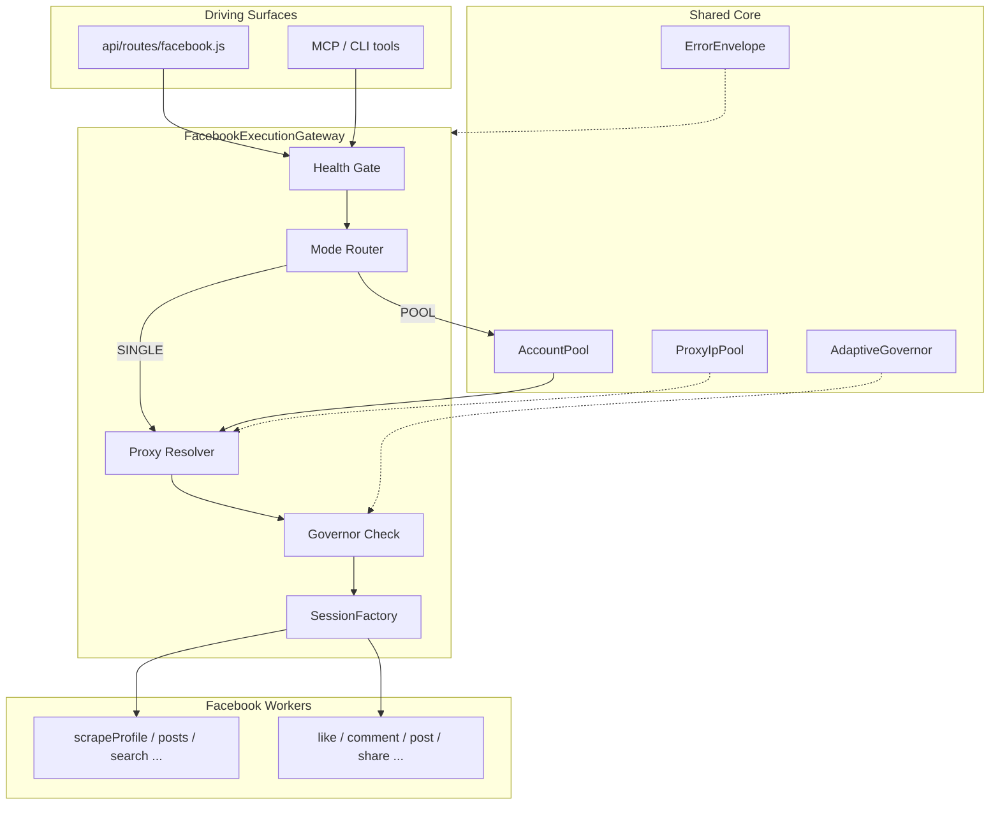
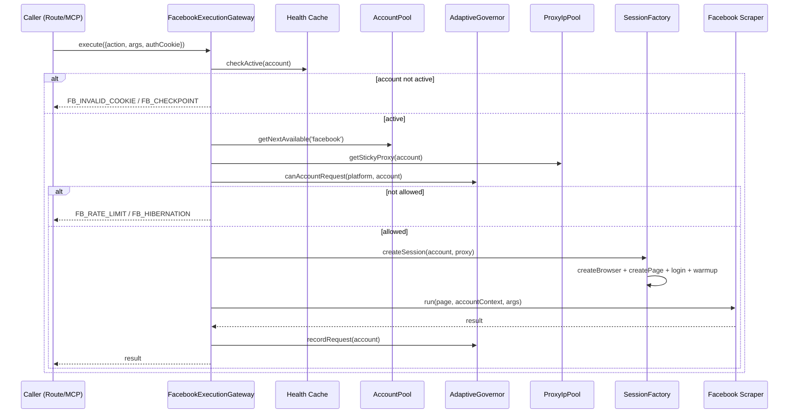

# Architecture Spine — XActions Unified Facebook Execution Gateway

## 1. Design Paradigm

Kiến trúc áp dụng mô hình **Gateway + Session Factory + Account Pool + Adaptive Governor**.

- **Gateway** là cửa ngõ duy nhất cho mọi thao tác Facebook. Nó quyết định chạy ở **SINGLE mode** (một account, một browser) hay **POOL mode** (nhiều account song song), kiểm tra sức khỏe account, gắn proxy, gọi governor, và dispatch đến scraper/automation.
- **Session Factory** sở hữu duy nhất toàn bộ logic tạo browser (`createBrowser`), page (`createPage`), đăng nhập cookie (`loginWithCookie`), và làm nóng session (`warmSession`). Không module nào khác được phép tự launch Puppeteer cho Facebook.
- **Account Pool** (`src/core/account-pool.js`) quản lý danh sách account, round-robin, hibernation, và gắn proxy cố định.
- **Adaptive Governor** (`src/core/adaptive-governor.js`) giới hạn velocity từng account, quản lý hibernation, điều chỉnh throughput theo proxy khỏe và Redis lag.



## 2. Inherited Invariants

| Inherited | From parent | Binds here |
| --- | --- | --- |
| AD-3 — Sticky IP per account, proxy auto-quarantine 5m, no direct fallback | `xactions-hybrid-scraping-spine` | Proxy resolution before session creation. |
| AD-5 — Sticky IP, AbstractLogin contract, SessionManager owns state | `xactions-hybrid-scraping-spine` | SessionFactory keeps account state; gateway passes cookies/tokens. |
| AD-9 — PlatformResponseValidator detects bot challenge/rate-limit, auth platforms hibernate 15-30m | `xactions-hybrid-scraping-spine` | Error handling and account state transitions. |
| AD-13 — Adaptive governor by healthy proxy, account velocity, Redis lag; account rotation | `xactions-hybrid-scraping-spine` | Pre/post operation governor calls. |
| AD-14 — Standard error envelope `{code,type,message,retryAfter,suggestedAction,accountId?,platform}` | `xactions-hybrid-scraping-spine` | All Facebook errors. |
| AD-20 — Dual-Pool Resource Isolation: realtime 30%, bulk 70%; consumer quota | `xactions-hybrid-scraping-spine` | POOL mode bulk vs MCP on-demand scheduling. |

## 3. Invariants & Rules

### AD-FB-1 — Single Facebook Execution Gateway

- **Binds:** `api/routes/facebook.js`, `api/services/facebookScrape.js`, `api/services/facebookAutomation.js`, `src/scrapers/facebook/**`
- **Prevents:** Mỗi route/service tự phát minh lại cách launch browser, login, proxy, retry.
- **Rule:** Mọi thao tác Facebook scrape/automate **PHẢI** đi qua `FacebookExecutionGateway`. Các route/service không được gọi trực tiếp `createBrowser`, `createPage`, `loginWithCookie`, hay `warmSession`.

### AD-FB-2 — Two Gateway Modes

- **Binds:** `FacebookExecutionGateway`, `src/core/account-pool.js`
- **Prevents:** Ép multi-account pool vào các tác vụ chỉ cần một account, hoặc mất khả năng fan-out khi cần.
- **Rule:** Gateway hỗ trợ:
  1. **SINGLE mode**: một account, một browser, một task — dùng cho profile/posts/automate.
  2. **POOL mode**: fan-out qua `AccountPool` khi caller truyền `accountIds[]` hoặc `parallel=true` (chủ yếu cho `search` type=all).

### AD-FB-3 — Pre-flight Health Gate

- **Binds:** `FacebookExecutionGateway`, `api/services/facebookHealth.js`, `prisma.facebookAccountHealth`
- **Prevents:** Launch browser với account đã die hoặc checkpoint, lãng phí proxy/concurrency.
- **Rule:** Trước khi launch browser, gateway kiểm tra health cache. Chỉ account `status='active'` được chạy. Các trạng thái `checkpoint`, `hibernating`, `unknown` bị từ chối với error envelope `FB_INVALID_COOKIE`/`FB_CHECKPOINT` và kích hoạt admin alert nếu không còn account active nào.

### AD-FB-4 — Session Factory Sole Ownership

- **Binds:** `src/scrapers/facebook/index.js`, `src/scrapers/facebook/core.js`, `src/scrapers/facebook/auth.js`, `src/scrapers/facebook/warmup.js`
- **Prevents:** Anti-bot không đồng nhất và code tạo session bị trùng lặp.
- **Rule:** `SessionFactory` là chủ sở hữu duy nhất của `createBrowser`, `createPage`, `loginWithCookie`, `warmSession`. Nó áp dụng fingerprint, viewport, proxy, `userDataDir` persistent, và cờ chống phát hiện. Gateway delegate cho `SessionFactory`; không module nào khác launch browser cho Facebook.

### AD-FB-5 — Facebook Account Lifecycle State Machine

- **Binds:** `prisma.facebookAccount`, `prisma.facebookAccountHealth`, `src/core/account-pool.js`
- **Prevents:** Trạng thái account mơ hồ và việc tái sử dụng account bị ban.
- **Rule:** Các trạng thái lifecycle: `active`, `hibernating` (cooldown rate-limit/bot-challenge), `quarantined` (checkpoint/manual), `dead` (permanent). Chỉ `AccountPool` + `AdaptiveGovernor` được chuyển trạng thái. Mọi chuyển trạng thái persisted vào `facebookAccountHealth` và emit event.

### AD-FB-6 — Governor Integration for Every Operation

- **Binds:** `FacebookExecutionGateway`, `src/core/adaptive-governor.js`
- **Prevents:** Gateway bypass governor, dẫn đến đập rate limit và cháy account.
- **Rule:** Mỗi thao tác Facebook gọi `globalAdaptiveRateGovernor.canAccountRequest(accountId, 'facebook')` trước và `recordRequest` sau. Nếu account đang hibernating hoặc vượt `safeRequestsPerMinute`, gateway hoặc chờ, hoặc rotate trong POOL mode, hoặc trả về `rate_limit` error envelope.

### AD-FB-7 — Read vs Write Risk Profiles

- **Binds:** `FacebookExecutionGateway`, `api/services/facebookAutomation.js`
- **Prevents:** Write actions dùng cùng concurrency/rotation với read, gây ban hàng loạt.
- **Rule:**
  - **READ** (scrape/search/comments/groups): được dùng POOL mode với concurrency và account rotation.
  - **WRITE** (like/comment/post/share/friend/join): chỉ SINGLE mode, delay floor giống người thật, mặc định `dryRun=true`, không rotate account giữa task.

### AD-FB-8 — Unified Error Envelope

- **Binds:** `FacebookExecutionGateway`, `src/core/error-envelope.js`, `api/routes/facebook.js`
- **Prevents:** Route/service trả về error shape không đồng nhất, mất tín hiệu retry/rotate.
- **Rule:** Mọi lỗi Facebook bọc trong error envelope `{code,type,message,retryAfter,suggestedAction,accountId?,platform}` (theo parent AD-14). Code bắt đầu `FB_`. `suggestedAction` thuộc: `retry_after_delay`, `rotate_proxy`, `rotate_account`, `hibernate_account`, `relogin`, `wait`, `reduce_rate`.

### AD-FB-9 — Admin Notification on Account Death

- **Binds:** `FacebookExecutionGateway`, `dashboard/**`, `api/routes/admin/**`
- **Prevents:** Operator chỉ biết account chết khi scrape thất bại.
- **Rule:** Khi account chuyển sang `dead`, `checkpoint`, hoặc tất cả account của user/platform đều `hibernating`, gateway emit event (Socket.io / webhook / admin alert). Dashboard admin hiển thị trạng thái account, countdown hibernation, và suggested action.

### AD-FB-10 — Incremental Migration

- **Binds:** `api/services/facebookAccountPool.js`, `src/core/account-pool.js`, `api/services/facebookScrape.js`
- **Prevents:** Big-bang rewrite phá vỡ route/test hiện có.
- **Rule:** Di chuyển từ từ:
  1. **Phase 1**: xây gateway song song `FacebookAccountPool`; route mới opt-in.
  2. **Phase 2**: chuyển `runSearchAllParallel` sang gateway POOL mode.
  3. **Phase 3**: deprecate `FacebookAccountPool` khi toàn bộ action cũ đã dùng gateway và test pass.

### AD-FB-11 — Sticky Proxy per Account

- **Binds:** `FacebookExecutionGateway`, `src/proxy/proxy-pool.js`
- **Prevents:** Vi phạm sticky IP và rò rỉ IP.
- **Rule:** Gateway resolve proxy cố định cho account trước khi tạo session và truyền vào `SessionFactory`. Facebook (auth-required) giữ cùng một IP trong suốt session theo parent AD-3/AD-5. Chỉ đổi proxy khi proxy fail/quarantine, không đổi theo request.

### AD-FB-12 — Scraper Entry Points Receive Prepared Page

- **Binds:** `FacebookExecutionGateway`, `src/scrapers/facebook/index.js`
- **Prevents:** Scraper platform-specific tự launch browser.
- **Rule:** Các entry point Facebook (`scrapeProfile`, `scrapePosts`, `search`, ...) nhận `Page` và `AccountContext` đã chuẩn bị từ gateway. Chúng được dùng `page.evaluate`/`page.goto` nhưng **không được** gọi `createBrowser`.

## 4. Consistency Conventions

| Concern | Convention |
| --- | --- |
| **File / module location** | `api/services/facebookExecution.js` (gateway), `src/scrapers/facebook/session-factory.js` (session), `src/scrapers/facebook/index.js` (scraper registry). |
| **Account ID key** | Dùng `facebook:<c_user>` trong `AccountPool` và `AdaptiveGovernor`. |
| **Error codes** | `FB_INVALID_COOKIE`, `FB_CHECKPOINT`, `FB_ONBOARDING_WALL`, `FB_RATE_LIMIT`, `FB_BOT_CHALLENGE`, `FB_PROXY_EXHAUSTED`, `FB_HIBERNATION`. |
| **Delay floors** | READ: 1–3s; WRITE: 3–7s giữa các hành động; messenger: 5–15s. |
| **Cookie handling** | Decrypt từ DB hoặc raw `{c_user, xs}`; không log value; không persist plain text. |
| **Operation record** | Gateway tạo `Operation` record với config loại bỏ `authCookie`; status `running`/`completed`/`failed`. |
| **State mutation** | Chỉ `AccountPool.markUnavailable`/`markAvailable` và `AdaptiveGovernor.hibernateAccount`/`wakeAccount` được chuyển trạng thái account. |

## 5. Stack

| Name | Version / note |
| --- | --- |
| Node.js | >= 18 ESM |
| Puppeteer + puppeteer-extra-plugin-stealth | hiện tại trong `package.json` |
| Prisma | 5.x |
| PostgreSQL | >= 14 |
| Redis | cho Bull + Streams |
| Express | 4.x |
| `src/core/adaptive-governor.js` | reuse, extend `PlatformRateLimit` cho `facebook` |
| `src/core/account-pool.js` | reuse, register `facebook:<c_user>` |
| `src/core/error-envelope.js` | reuse |
| `src/proxy/proxy-pool.js` | reuse, sticky proxy |

## 6. Structural Seed

```text
api/
  services/
    facebookExecution.js        # FacebookExecutionGateway
    facebookScrape.js           # route logic -> gateway
    facebookAutomation.js       # route logic -> gateway
    facebookAccountPool.js      # deprecated after migration
    facebookHealth.js           # health checks, consumed by gateway
src/
  scrapers/
    facebook/
      index.js                  # public scrape(), delegates to action handlers
      session-factory.js        # createBrowser/createPage/login/warmup
      core.js                   # anti-bot flags, constants, helpers
      auth.js                   # cookie login
      warmup.js                 # session warming
      profile.js                # action handlers (receive page)
      posts.js
      search.js
      actions.js                # like/comment/post/share handlers
src/
  core/
    adaptive-governor.js        # global governor
    account-pool.js             # global account pool
    error-envelope.js           # error shape
    status-api.js               # governor status
src/
  proxy/
    proxy-pool.js               # sticky / rotating proxy
```



## 7. Capability → Architecture Map

| Capability / Area | Lives in | Governed by |
| --- | --- | --- |
| Single scrape (profile, posts, comments) | `FacebookExecutionGateway` SINGLE mode | AD-FB-1, AD-FB-2, AD-FB-3, AD-FB-4, AD-FB-6, AD-FB-8, AD-FB-12 |
| Parallel search (type=all) | `FacebookExecutionGateway` POOL mode | AD-FB-2, AD-FB-6, AD-FB-7, AD-FB-10, AD-FB-20 |
| Automation (like/comment/post/share) | `FacebookExecutionGateway` SINGLE mode | AD-FB-1, AD-FB-4, AD-FB-7, AD-FB-8, AD-FB-9 |
| Account health / lifecycle | `facebookHealth` + `AccountPool` + `AdaptiveGovernor` | AD-FB-3, AD-FB-5, AD-FB-9 |
| Proxy & IP | `ProxyIpPool` + `SessionFactory` | AD-FB-4, AD-FB-11, parent AD-3 |
| Rate limiting | `AdaptiveGovernor` | AD-FB-6, parent AD-13 |
| Error handling | `ErrorEnvelope` | AD-FB-8, parent AD-14 |

## 8. Deferred

| Decision | Why deferred | Revisit condition |
| --- | --- | --- |
| Method signatures, TypeScript types, event schemas của gateway | Thuộc implementation story và `bmad-spec` companion. | Khi `bmad-spec` được kích hoạt cho epic này. |
| Dashboard admin UI cho account status, hibernation, alerts | Thuộc parent AD-19 (Operator Dashboard). Spine này chỉ định nghĩa event contract. | Khi implement AD-19 views cho Facebook accounts. |
| Concrete `PlatformRateLimit` values cho Facebook (safe RPM, burst, base RPS/proxy) | Cần benchmark và real-cookie probe. | Sau khi chạy real-cookie E2E với ít nhất 2 account trong 1 tuần. |
| State persistence của in-flight gateway (stateful class vs stateless function) | Là open question cần thử nghiệm với long-running campaigns. | Trước Phase 2 migration. |
