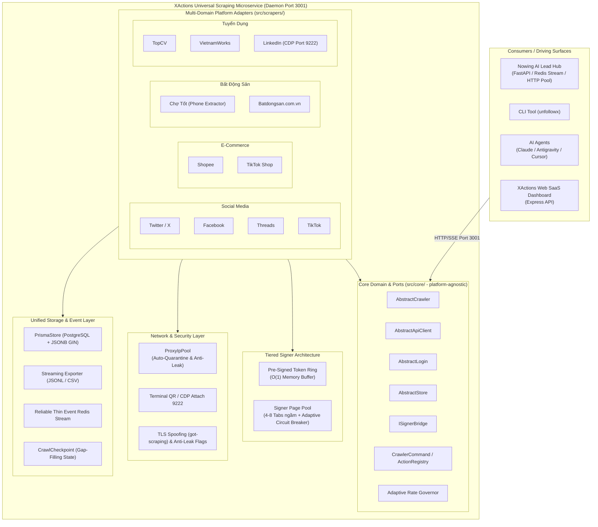

# Architecture Spine — XActions Universal Hybrid Scraping & Multi-Platform Architecture

## 1. Design Paradigm & Strategic Role

XActions là **Universal Scraping & Automation Microservice Platform** (Động cơ Cào Dữ liệu Toàn năng), hoạt động độc lập như một SaaS / CLI / AI MCP Server và đóng vai trò là **Scraping Engine chuyên trách cho hệ sinh thái Nowing (AI Lead & Research Hub)**.

Kiến trúc kết hợp 5 mô hình nền tảng:
1. **Hexagonal Architecture (Ports and Adapters):** Lõi `src/core/` chứa platform-agnostic contracts (`AbstractCrawler`, `AbstractApiClient`, `AbstractStore`, `AbstractLogin`) và không chứa platform-specific selectors hoặc framework logic. Mọi platform-specific implementation sống trong `src/scrapers/{domain}/{platform}/`. `src/client/` là legacy Twitter client được giữ lại cho backward compatibility; abstraction mới nằm trong `src/core/base-client.js`.
2. **Tiered Hybrid Signer Engine:** Kết hợp **Pre-Signed Token Ring Buffer** (cấp phát O(1) cho session tokens như `lsd`, `fb_dtsg`, `msToken`) và **Signer Worker Page Pool** (4–8 tabs ngầm cho chữ ký động `a_bogus`, `x-client-transaction-id` với `Promise.race` timeout 3s, adaptive lên 8s cho lần warmup đầu). Toàn bộ tác vụ fetch dữ liệu chạy bằng Async HTTP Client duy nhất được chốt runtime (xem AD-3).
3. **Dual-Channel High-Speed Microservice Communication:**
   * *Kênh Đồng Bộ (Realtime / On-Demand <2ms):* Chạy XActions dưới dạng **Daemon Microservice** với giao thức **MCP over HTTP/SSE Transport** (Port 3001) sử dụng Persistent Connection Pool (Keep-Alive), loại bỏ 100% độ trễ khởi động tiến trình.
   * *Kênh Bất Đồng Bộ (Bulk Ingestion):* Phát sự kiện qua **Redis Streams (`stream:social:raw_posts`)** với Consumer Group `nowing_nlp_workers`.
4. **Adaptive Infrastructure-Aware Dynamic Rate Limiting:** Tự động điều chỉnh tốc độ cào toàn hệ thống dựa trên tỷ lệ Proxy sống (`Healthy Proxy Ratio`), hạn mức tài khoản (Account Velocity) và độ dài hàng đợi Redis để giảm rủi ro die account hàng loạt (xem AD-13).
5. **Unified PostgreSQL Storage & JSONB GIN Indexing:** 100% dữ liệu được lưu trữ nhất quán vào PostgreSQL qua Prisma ORM với quy tắc định danh Namespaced ID và cột `metadata Json?` có GIN Index (tạo qua raw migration) để query siêu tốc.



---

## 2. Invariants & Rules (Architectural Decisions)

### AD-1 — Tiered Hybrid Signer Architecture [ADOPTED]
* **Binds:** `src/scrapers/**`, `src/core/base-client.js`, `src/core/signer-pool.js`
* **Prevents:** Nghẽn cổ chai đơn luồng trong Chromium IPC khi có hàng trăm request cần ký đồng thời, và tình trạng treo vĩnh viễn khi context browser bị crash.
* **Rule:**
  1. *Tier 1 (Pre-Signed Token Ring):* Các token phiên (`lsd`, `fb_dtsg`, `msToken`) được sinh trước vào mảng đệm (50 tokens) và cấp phát O(1) trong <0.1ms cho HTTP Fetcher.
  2. *Tier 2 (Signer Worker Pool):* Duy trì pool 4–8 background pages idle cho các chữ ký động (`a_bogus`, `x-client-transaction-id`). Phân phối theo thuật toán Least-Connections.
  3. *Circuit Breaker:* Mọi lệnh `page.evaluate()` bọc cứng trong `Promise.race()` timeout 3,000ms mặc định, 8,000ms cho lần warmup đầu. Nếu timeout hoặc crash, đánh dấu tab `DEAD`, tự động spawn tab mới và retry trên tab khác.
  4. *HTTP Client Selection:* Một runtime chọn duy nhất giữa `got-scraping` (mặc định, TLS/JA4 spoofing, yêu cầu package trong `package.json`) hoặc built-in `undici` với `ProxyAgent`; không trộn lẫn hai client trong cùng một request pipeline.

### AD-2 — Unified Base Scraper & Client Interfaces [ADOPTED]
* **Binds:** `src/core/base-crawler.js`, `src/core/base-client.js`, `src/core/base-login.js`, `src/core/base-store.js`
* **Prevents:** Phân mảnh cấu trúc code giữa các nền tảng, khiến mỗi scraper có một API format, logic xử lý lỗi và cách cấu hình khác nhau.
* **Rule:**
  1. Mọi module nền tảng mới bắt buộc phải kế thừa `AbstractCrawler` (`start()`, `search()`, `getPostDetail()`, `getComments()`, `cleanup()`) và `AbstractApiClient` (`request()`, `sign()`, `updateCookies()`).
  2. `start()` nhận một `CrawlerCommand` object `{ action, args, session }` và điều phối tới `ActionRegistry` của platform; `ActionRegistry` ánh xạ `action` string sang phương thức thực thi. CLI/MCP chỉ gọi `crawler.start(command)` và không gọi trực tiếp `getGroupPosts`, `searchProducts`, v.v.
  3. `src/client/` là legacy Twitter client giữ lại cho backward compatibility; mọi abstraction mới phải nằm trong `src/core/**`. Không import platform logic từ `src/client/**` vào `src/core/**`.

### AD-3 — Centralized Proxy IP Pool with Auto-Quarantine & Anti-Leak [ADOPTED]
* **Binds:** `src/proxy/**`, toàn bộ Network Interceptors
* **Prevents:** Rò rỉ IP thật qua WebRTC/DNS, và sập toàn bộ pipeline khi proxy bị rate-limit (429) hoặc chặn (403).
* **Rule:**
  1. Mọi browser session bắt buộc kích hoạt cờ chống rò rỉ: `--force-webrtc-ip-handling-policy=disable_non_proxied_udp` và cấu hình `remote DNS resolution`.
  2. Khi gặp lỗi 429/403, proxy bị cách ly 5 phút, tự động đổi sang proxy mới và retry tối đa 3 lần với exponential backoff.
  3. Nếu 100% proxy trong pool bị cách ly ➔ Tự động chuyển sang trạng thái Standby Backoff (chờ 30s) và kích hoạt cảnh báo, không loop vô tận.
  4. *Proxy Agent:* SOCKS5 proxy yêu cầu `socks-proxy-agent` hoặc `undici` SOCKS agent được cấu hình rõ ràng; HTTP client không được fallback về direct connection khi proxy agent fail.

### AD-4 — Namespaced PostgreSQL Storage via Prisma & JSONB GIN Indexing [ADOPTED]
* **Binds:** `src/store/**`, `src/core/base-store.js`, `prisma/schema.prisma`
* **Prevents:** Xung đột khóa chính giữa các nền tảng (Cross-Platform ID Collision) và lỗi Full Table Scan khi Nowing query lọc dữ liệu đa ngành.
* **Rule:**
  1. Khóa chính `Post.id` tuân theo định dạng Namespaced: `${platform}:${externalId}` kèm ràng buộc `@@unique([platform, externalId])`. Khóa chính `Comment.id` tuân theo `${platform}:${postExternalId}:${commentExternalId}` kèm ràng buộc `@@unique([platform, externalId, postId])` để tránh collision giữa các post.
  2. `Comment` phải có trường `depth Int @default(0)` để AD-6 thực hiện topological sort theo cấp độ sâu.
  3. Cột `metadata Json?` yêu cầu **GIN Index** (`CREATE INDEX USING gin (metadata)`) và Expression Index cho các trường lọc trọng điểm (`price`, `phone`, `salary`). Vì Prisma 5.x không hỗ trợ `USING gin` natively, index phải được tạo qua raw migration SQL và theo dõi trong `prisma/migrations/`.
  4. Mọi thao tác ghi hàng loạt chunk theo lô 500 records. Chiến lược mặc định là `createMany` + `skipDuplicates` kèm `updateMany` cho conflict; `prisma.$transaction()` 500 lệnh `upsert` chỉ dùng khi benchmark xác nhận đạt >5,000 records/s.
  5. `Post.mediaUrls` là `String[]` (PostgreSQL native array) hoặc `Json?` nếu cần object metadata; không dùng JSON-stringified `String`.

### AD-5 — Non-Invasive Authentication via Terminal QR & CDP Attach [ADOPTED]
* **Binds:** `src/core/base-login.js`, `src/utils/qrcode.js`, `src/core/session-manager.js`
* **Prevents:** Tình trạng checkpoint, khóa tài khoản do login từ IP/thiết bị lạ, hoặc trải nghiệm kém khi phải copy-paste cookie thủ công.
* **Rule:**
  1. *Terminal QR Login:* Render mã QR ASCII tỷ lệ 1:1 chuẩn (`small: true`), có countdown timer 60s, timeout 120s và fallback URL. Yêu cầu package `qrcode-terminal` trong `package.json`.
  2. *CDP Attach Mode:* Kết nối vào Chrome thật qua cổng 9222; Chrome phải được launch với `--remote-debugging-port=9222` và `--user-data-dir=<dedicated>` để tránh xung đột profile. Áp dụng độ trễ phân phối ngẫu nhiên Gaussian Jitter (3–7s) khi cào LinkedIn/TopCV để tránh bị phát hiện.
  3. *AbstractLogin Contract:* Mọi implementation QR/CDP/cookie phải trả về cùng shape `{ accountId, cookies, tokens, expiresAt }`. Một `SessionManager` duy nhất giữ trạng thái và cung cấp cho `AbstractApiClient` và MCP tools.

### AD-6 — Hierarchical Comment Tree Normalization & Topological Insertion [ADOPTED]
* **Binds:** `src/store/**`, Entity Models, `prisma/schema.prisma`
* **Prevents:** Lỗi Deadlock CSDL (`40P01`) hoặc vi phạm khóa ngoại (`Foreign Key Violation`) khi lưu cây bình luận lồng nhau.
* **Rule:**
  1. Mọi cây bình luận cào về phải thực hiện **Topological Sort**: Lưu toàn bộ `RootComments` (`parentCommentId = null`, `depth = 0`) trước, sau đó lưu các `SubComments` tuần tự theo cấp độ sâu (`depth`) tăng dần.
  2. Chặn đệ quy vô hạn: Giới hạn `maxDepth: 3`, `maxComments: 500` và kiểm tra chống tham chiếu vòng (`parentCommentId !== id` và `parentCommentId` không nằm trong tổ tiên).

### AD-7 — Dual-Channel Microservice Protocol for Nowing [ADOPTED - ENHANCED]
* **Binds:** `src/mcp/**`, `src/api/**`, `nowing_backend/app/proprietary/platforms/xactions/adapter.py`
* **Prevents:** Tràn bộ nhớ RAM Redis (OOM) khi lưu raw JSON quá nặng, mất dữ liệu khi Nowing consumer chậm, độ trễ cao khi spawn stdio, và thiếu kênh realtime cho on-demand queries.
* **Rule:**
  1. *Daemon MCP over HTTP/SSE Transport:* XActions chạy thường trực trên cổng `http://xactions:3001/mcp` (configurable qua `PORT`). Nowing giao tiếp qua HTTP/1.1 hoặc HTTP/2 Keep-Alive Connection Pool. Mặc định `MCP_TRANSPORT=http` được set cho daemon; CLI/Claude Desktop có thể dùng `stdio`.
  2. *Integration Contract:* URL gốc là `/mcp`, session id do `StreamableHTTPServerTransport` sinh, health check tại `GET /health`, auth qua header `Authorization: Bearer <token>` hoặc mTLS. Nowing client giữ session id trong cache và reconnect SSE khi disconnect.
  3. *Redis Stream Bulk Ingest:* XActions phát Thin Event Pointers (`{ id, platform, externalId, category, authorId, crawledAt, storageRef }`) vào `stream:social:raw_posts`. Kích thước stream theo `MINID` hoặc `MAXLEN ~ 1000000` (configurable) thay vì 20,000; tốc độ bulk ingestion phụ thuộc vào consumer capacity và được kiểm soát bởi AD-13.
  4. *Durability:* Mọi event phát đi phải được ghi vào `CrawlCheckpoint` trước. Nowing đọc qua Consumer Group (`nowing_nlp_workers`) và xác nhận qua `XACK`.

### AD-8 — Multi-Domain Expansion Blueprint [ADOPTED]
* **Binds:** `src/scrapers/**`
* **Prevents:** Mọi platform thêm mới đặt sai vị trí hoặc team implement các domain ngoài phạm vi Epic.
* **Rule:** Tổ chức module theo Domain rõ ràng, giới hạn trong phạm vi Epics 10–18:
  - `src/scrapers/social/`: Twitter, Facebook, Threads, TikTok.
  - `src/scrapers/ecom/`: Shopee, TikTok Shop.
  - `src/scrapers/realestate/`: Chợ Tốt, Batdongsan.com.vn.
  - `src/scrapers/recruitment/`: TopCV, VietnamWorks, LinkedIn.

### AD-9 — Anti-Bot Payload Validation & Data Sanitization Defense [ADOPTED]
* **Binds:** `src/scrapers/**`, `src/utils/exporter.js`
* **Prevents:** Lưu dữ liệu rác khi WAF trả về HTTP 200 kèm error code, ô nhiễm CRM do SĐT masked (`***`), hoặc vỡ định dạng JSONL do ký tự xuống dòng.
* **Rule:**
  1. Mọi crawler phải đăng ký một `PlatformResponseValidator` gồm `isValidPayload(response)`, `isBotChallenge(response)`, `isRateLimit(response)`. Nếu validator trả về challenge/rate-limit, throw `RateLimitError` để xoay IP ngay cả khi HTTP status là 200.
  2. Chợ Tốt SĐT: Bỏ qua các số chứa `*` và validate regex số điện thoại Việt Nam hợp lệ.
  3. JSONL Exporter: Tự động sanitize ký tự xuống dòng (`\r\n`) trong `content` trước khi ghi stream.

### AD-10 — 3-Tier Incremental Gap-Filling & Retention Policy [ADOPTED]
* **Binds:** `src/store/**`, `src/mcp/**`, `src/scrapers/**`
* **Prevents:** Cào trùng lặp dữ liệu gây lãng phí proxy và phình to ổ cứng CSDL sau thời gian dài.
* **Rule:**
  1. *Incremental Gap-Filling Protocol:* Mọi request cào theo keyword/target phải hỗ trợ tham số `since_id` / `since_time`. Trước khi phát Thin Event, cập nhật `CrawlCheckpoint` với `lastCursor` / `lastTimestamp` cho target. Hai instance crawler có thể resume từ checkpoint.
  2. *Data Retention Lifecycle:* Dữ liệu thô trong bảng `Post` và `Comment` của XActions áp dụng chính sách lưu trữ 30 ngày. Retention được enforce bằng partition by range `crawledAt` hoặc background cleanup job chạy hàng ngày. Nowing chịu trách nhiệm lưu trữ vĩnh viễn các Enriched Leads, Verified Contacts và Vector Embeddings.

### AD-11 — CrawlerCommand & ActionRegistry [ADOPTED]
* **Binds:** `src/core/base-crawler.js`, `src/scrapers/**`
* **Prevents:** Hai platform team tự định nghĩa phương thức public khác nhau (`getGroupPosts` vs `searchProducts`) khiến CLI/MCP không thể gọi thống nhất.
* **Rule:** Mỗi platform crawler khai báo `ActionRegistry: Map<string, (args: any) => Promise<PostItem[] | Comment[]>>` trong constructor. `AbstractCrawler.start({ action, args })` lookup registry và trả về kết quả chuẩn hóa. Tên `action` phải là snake_case: `search`, `post_detail`, `comments`, `timeline`, `group_posts`, `page_posts`, `search_products`, `search_jobs`, v.v.

### AD-12 — CrawlCheckpoint State for Idempotent Resume [ADOPTED]
* **Binds:** `src/store/**`, `prisma/schema.prisma`, `src/scrapers/**`
* **Prevents:** Cào trùng/sót khi container restart, nhiều instance chạy song song, hoặc Nowing yêu cầu dữ liệu cũ hơn last crawled.
* **Rule:** Tồn tại model `CrawlCheckpoint { id, platform, targetType, targetKey, lastCursor, lastTimestamp, createdAt, updatedAt }` với `@@unique([platform, targetType, targetKey])`. Mọi request cào đọc checkpoint trước, cào delta, ghi checkpoint, rồi mới phát Redis event.

### AD-13 — Adaptive Infrastructure-Aware Dynamic Rate Limiting & Account Protection Governor [ADOPTED - NEW]
* **Binds:** `src/core/adaptive-governor.js`, `src/proxy/proxy-pool.js`, `src/scrapers/**`
* **Prevents:** Cháy sạch Proxy Pool và bị khóa/die tài khoản hàng loạt khi năng lực hạ tầng không đáp ứng kịp hoặc bị nền tảng siết bảo vệ.
* **Rule:**
  1. **Inputs:** `AdaptiveRateGovernor` đọc `healthyProxyCount`, `totalProxyCount`, `accountVelocity` (req/min per account), `redisConsumerLag` (số messages pending) và `PlatformRateLimit` config (mỗi nền tảng khai báo `safeRequestsPerMinute` và `burstWindow`).
  2. **Dynamic Capacity Throttling:** Max throughput được tính toán động: `maxReqPerSecond = healthyProxyCount × platform.baseReqPerSecondPerProxy × platform.throttleFactor`. Khi healthy proxy < 50%, giảm 50% throughput. Khi healthy proxy < 10% (< 5 IPs), pause bulk scrapes và ưu tiên on-demand queries.
  3. **Account-Level Velocity Limiting & Hibernation:** Mỗi tài khoản có token bucket theo `platform.safeRequestsPerMinute`. Nếu gặp challenge/Captcha/WAF, đưa tài khoản vào hibernation 15–30 phút và rotate proxy. Hibernation không đảm bảo 100% tránh ban nhưng giảm xác suất xuống mức chấp nhận được.
  4. **Consumer Lag Backpressure:** Khi Redis Stream pending > 10,000 messages, giảm nhịp cào bulk xuống 25% cho tới khi lag < 5,000.
  5. **No Direct IP Leak:** Mọi request phải qua `ProxyIpPool`; governor không bao giờ cho phép fallback direct connection.

---

## 3. Inherited Invariants (from Nowing Parent Spine)

Spine này kế thừa các AD-SOC từ <code>../nowing/_bmad-output/planning-artifacts/architecture/architecture-xactions-social-integration-2026-08-15/ARCHITECTURE-SPINE.md</code> và tuân thủ như ràng buộc read-only:

* **AD-SOC-1:** Universal scraping delegation qua MCP/Redis — không reinvent scraper trong Nowing.
* **AD-SOC-2:** Stealth anti-detection & fingerprint (TLS/JA4, signer bridge, cookie warmup) được ủy quyền cho XActions.
* **AD-SOC-3:** Proxy pool tập trung với auto-quarantine 5 phút.
* **AD-SOC-4:** Decoupled Redis Stream event buffer — thin pointers.
* **AD-SOC-5:** Intent classification & entity normalization — *mở câu hỏi: XActions có tính `intent_tag` hay để Nowing làm?* (xem Open Questions).
* **AD-SOC-6:** Idempotent storage `(platform, external_post_id)`.
* **AD-SOC-7:** Realtime alert & CRM lead creation thuộc Nowing.
* **AD-SOC-8:** 3-Tier Gap-Filling (L1 Nowing DB, L2 XActions DB, L3 live scraping) — đáp ứng bởi AD-10 + AD-12.
* **AD-SOC-9:** Multi-domain scraping + legacy Nowing scraper decommission.
* **AD-SOC-10:** Data partitioning & retention — XActions raw 30 ngày, Nowing leads vĩnh viễn.

---

## 4. Core Entity Schemas (PostgreSQL & Prisma)

```prisma
model Post {
  id              String    @id // Format: "shopee:123" hoặc "twitter:456"
  platform        String    // 'twitter' | 'facebook' | 'threads' | 'tiktok' | 'shopee' | 'chotot' | 'topcv' | 'linkedin'
  externalId      String    // ID gốc của nền tảng
  category        String    // 'social' | 'ecom' | 'realestate' | 'recruitment' | 'b2b'
  authorId        String
  authorName      String
  authorAvatar    String?
  authorUrl       String?
  postUrl         String?
  content         String    @db.Text
  mediaUrls       String[]  // PostgreSQL native array of image/video URLs

  // Metrics chung
  likesCount      Int       @default(0)
  repostsCount    Int       @default(0)
  repliesCount    Int       @default(0)
  viewsCount      Int       @default(0)

  // Dynamic Structured Metadata cho từng ngành (BĐS, Ecom, HR)
  metadata        Json?     // Chứa: price, salary, phone, rating, soldCount, skills...

  publishedAt     DateTime?
  crawledAt       DateTime  @default(now())
  comments        Comment[]

  @@unique([platform, externalId])
  @@index([platform, crawledAt(sort: Desc)])
  @@index([category, crawledAt(sort: Desc)])
  @@index([authorId])
}

model Comment {
  id                String    @id // Format: "facebook:post123:comment456"
  platform          String
  externalId        String    // ID gốc của comment trên nền tảng
  postId            String
  parentCommentId   String?   // null nếu là comment gốc, chứa id nếu là sub-reply
  depth             Int       @default(0) // Cần cho topological sort
  authorId          String
  authorName        String
  authorAvatar      String?
  content           String    @db.Text
  likesCount        Int       @default(0)
  subCommentsCount  Int       @default(0)
  metadata          Json?     // Lưu thêm sentiment, phone bóc tách trong comment...

  publishedAt       DateTime?
  crawledAt         DateTime  @default(now())

  post              Post      @relation(fields: [postId], references: [id], onDelete: Cascade)
  parentComment     Comment?  @relation("CommentReplies", fields: [parentCommentId], references: [id], onDelete: Cascade)
  subReplies        Comment[] @relation("CommentReplies")

  @@unique([platform, externalId, postId])
  @@index([postId, parentCommentId])
  @@index([authorId])
}

model CrawlCheckpoint {
  id              String    @id @default(cuid())
  platform        String
  targetType      String    // 'keyword' | 'group' | 'page' | 'user' | 'category' | 'search'
  targetKey       String    // Query string, groupId, username, category slug
  lastCursor      String?
  lastTimestamp   DateTime?
  createdAt       DateTime  @default(now())
  updatedAt       DateTime  @updatedAt

  @@unique([platform, targetType, targetKey])
  @@index([platform, updatedAt])
}
```

### Raw migration bổ sung (Prisma không tạo được natively)

```sql
-- prisma/migrations/YYYYMMDDHHMMSS_add_post_comment_gin_indexes/migration.sql
CREATE INDEX IF NOT EXISTS idx_post_metadata_gin ON "Post" USING gin (metadata);
CREATE INDEX IF NOT EXISTS idx_comment_metadata_gin ON "Comment" USING gin (metadata);
CREATE INDEX IF NOT EXISTS idx_post_metadata_price ON "Post" USING btree ((metadata->>'price'));
CREATE INDEX IF NOT EXISTS idx_post_metadata_phone ON "Post" USING btree ((metadata->>'phone'));
CREATE INDEX IF NOT EXISTS idx_post_metadata_salary ON "Post" USING btree ((metadata->>'salary'));
```

---

## 5. Deferred & Out-of-Scope

* **Instagram, Amazon, Muaban.net, ITviec, B2B (Mua Sắm Công, Mã Số Thuế):** Không thuộc Epics 10–18. Giữ lại trong roadmap nhưng không được tạo thư mục `src/scrapers/` cho tới khi có epic cụ thể.
* **Context bóc tách SĐT từ comment:** Thuộc Nowing NLP/Lead pipeline; XActions lưu raw `metadata` và gửi Thin Event. Nếu XActions cần extract SĐT thì phải thêm AD mới, không ngầm định.
* **Adaptive timeout signer 8s:** Cấu hình được phép, nhưng 3s là mặc định. Đo benchmark sau 100 lần gọi đầu tiên.

---

## 6. Open Questions

1. **Intent tagging (AD-SOC-5):** Nowing hay XActions chịu trách nhiệm gán `intent_tag` (`sell`, `buy`, `hiring`, `seeking`)? Nếu XActions gán, cần thêm model/field `Post.intentTag` và AD mới. Nếu Nowing gán, cần ghi rõ trong integration contract.
2. **MCP over HTTP/SSE Auth:** Xác thực giữa Nowing và XActions daemon dùng Bearer token, mTLS, hay network-isolation only? Cần quyết định trước khi deploy.
3. **Per-Platform Rate Limits:** Các giá trị `safeRequestsPerMinute` và `baseReqPerSecondPerProxy` cho Facebook, Shopee, LinkedIn, v.v. cần được đo thực tế; ban đầu có thể dùng giá trị bảo thủ và tune sau.

---

## 7. Decision Changelog (from 2026-08-18 r1 → r3)

* Design Paradigm: Thêm Dual-Channel (AD-7) và Adaptive Rate Governor (AD-13).
* AD-1: Giữ HTTP Client Selection, thêm adaptive timeout warmup.
* AD-2: Khôi phục CrawlerCommand / ActionRegistry, làm rõ `src/client/` legacy.
* AD-3: Khôi phục SOCKS5 proxy agent rule.
* AD-4: Khôi phục `Comment.id` namespaced với `postExternalId`, `Comment.depth`, `mediaUrls String[]`, GIN raw migration, batch strategy.
* AD-5: Khôi phục `AbstractLogin` contract + `SessionManager`, yêu cầu `qrcode-terminal` package.
* AD-6: Giữ depth topological sort.
* AD-7: Nâng cấp thành Dual-Channel (HTTP/SSE daemon + Redis Stream), sửa `MAXLEN`/`MINID`, thêm integration contract.
* AD-8: Giới hạn scope về các platform của Epics 10–18.
* AD-9: Khôi phục `PlatformResponseValidator`.
* AD-10: Khôi phục `CrawlCheckpoint` và retention enforcement.
* AD-11: CrawlerCommand & ActionRegistry.
* AD-12: CrawlCheckpoint State.
* AD-13: Adaptive Infrastructure-Aware Rate Limiting & Account Protection Governor.
* Thêm section Inherited Invariants, Deferred, Open Questions.
