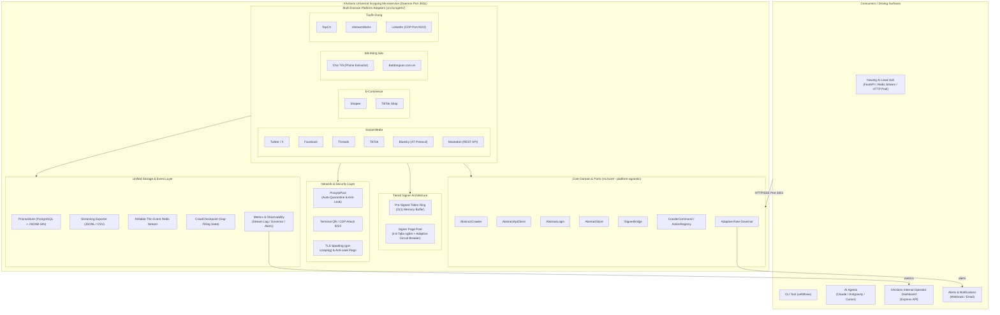

# Architecture Spine — XActions Universal Hybrid Scraping & Multi-Platform Architecture

## 1. Design Paradigm & Strategic Role

XActions là **Universal Scraping & Automation Microservice Platform** (Động cơ Cào Dữ liệu Toàn năng), hoạt động độc lập như một SaaS / CLI / AI MCP Server và đóng vai trò là **Scraping Engine chuyên trách cho hệ sinh thái Nowing (AI Lead & Research Hub)**.

Kiến trúc kết hợp 5 mô hình nền tảng:
1. **Hexagonal Architecture (Ports and Adapters):** Lõi `src/core/` chứa platform-agnostic contracts (`AbstractCrawler`, `AbstractApiClient`, `AbstractStore`, `AbstractLogin`) và không chứa platform-specific selectors hoặc framework logic. Mọi platform-specific implementation sống trong `src/scrapers/{domain}/{platform}/`. `src/client/` là legacy Twitter client được giữ lại cho backward compatibility; abstraction mới nằm trong `src/core/base-client.js`.
2. **Tiered Hybrid Signer Engine:** Kết hợp **Pre-Signed Token Ring Buffer** (cấp phát O(1) cho session tokens như `lsd`, `fb_dtsg`, `msToken`) và **Signer Worker Page Pool** (4–8 tabs ngầm cho chữ ký động `a_bogus`, `x-client-transaction-id` với `Promise.race` timeout 3s, adaptive lên 8s cho lần warmup đầu). Toàn bộ tác vụ fetch dữ liệu chạy bằng Async HTTP Client duy nhất được chốt runtime (xem AD-3).
3. **Dual-Channel High-Speed Microservice Communication:**
   * *Kênh Đồng Bộ (Realtime / On-Demand <2ms):* Chạy XActions dưới dạng **Daemon Microservice** với giao thức **MCP over HTTP/SSE Transport** (Port 3001) sử dụng Persistent Connection Pool (Keep-Alive), loại bỏ 100% độ trễ khởi động tiến trình.
   * *Kênh Bất Đồng Bộ (Bulk Ingestion):* Phát sự kiện qua **Redis Streams (`stream:social:raw_posts`)** với Consumer Group `nowing_nlp_workers`.
4. **Adaptive Infrastructure-Aware Dynamic Rate Limiting:** Tự động điều chỉnh tốc độ cào toàn hệ thống dựa trên tỷ lệ Proxy sống (`Healthy Proxy Ratio`), hạn mức tài khoản (Account Velocity) và độ dài hàng đợi Redis để giảm rủi ro die account hàng loạt (xem AD-13).
5. **Unified PostgreSQL Storage & JSONB GIN Indexing:** 100% dữ liệu được lưu trữ nhất quán vào PostgreSQL qua Prisma ORM với quy tắc định danh Namespaced ID và cột `metadata Json?` có GIN Index (tạo qua raw migration) để query siêu tốc.



---

## 2. Invariants & Rules (Architectural Decisions)

### AD-1 — Tiered Hybrid Signer Architecture [ADOPTED]
* **Binds:** `src/scrapers/**`, `src/core/base-client.js`, `src/core/signer-pool.js`
* **Prevents:** Nghẽn cổ chai đơn luồng trong Chromium IPC khi có hàng trăm request cần ký đồng thời, và tình trạng treo vĩnh viễn khi context browser bị crash.
* **Rule:**
  1. *Tier 1 (Pre-Signed Token Ring):* Các token phiên (`lsd`, `fb_dtsg`, `msToken`) được sinh trước vào mảng đệm (50 tokens) và cấp phát O(1) trong <0.1ms cho HTTP Fetcher.
  2. *Tier 2 (Signer Worker Pool):* Duy trì pool 4–8 background pages idle cho các chữ ký động (`a_bogus`, `x-client-transaction-id`). Phân phối theo thuật toán Least-Connections.
  3. *Circuit Breaker:* Mọi lệnh `page.evaluate()` bọc cứng trong `Promise.race()` timeout 3,000ms mặc định, 8,000ms cho lần warmup đầu. Nếu timeout hoặc crash, đánh dấu tab `DEAD`, tự động spawn tab mới và retry trên tab khác.
  4. *HTTP Client Selection:* Một runtime chọn duy nhất giữa `got-scraping` (mặc định, TLS/JA4 spoofing, yêu cầu package trong `package.json`) hoặc built-in `undici` với `ProxyAgent`; không trộn lẫn hai client trong cùng một request pipeline.

### AD-2 — Unified Base Scraper & Client Interfaces [ADOPTED]
* **Binds:** `src/core/base-crawler.js`, `src/core/base-client.js`, `src/core/base-login.js`, `src/core/base-store.js`
* **Prevents:** Phân mảnh cấu trúc code giữa các nền tảng, khiến mỗi scraper có một API format, logic xử lý lỗi và cách cấu hình khác nhau.
* **Rule:**
  1. Mọi module nền tảng mới bắt buộc phải kế thừa `AbstractCrawler` (`start()`, `search()`, `getPostDetail()`, `getComments()`, `cleanup()`) và `AbstractApiClient` (`request()`, `sign()`, `updateCookies()`). `sign()` có thể là no-op đối với HTTP-only public platforms (Bluesky, Mastodon); `updateCookies()` chỉ cần thiết khi có optional auth.
  2. `start()` nhận một `CrawlerCommand` object `{ action, args, session }` và điều phối tới `ActionRegistry` của platform; `ActionRegistry` ánh xạ `action` string sang phương thức thực thi. CLI/MCP chỉ gọi `crawler.start(command)` và không gọi trực tiếp `getGroupPosts`, `searchProducts`, v.v.
  3. `src/client/` là legacy Twitter client giữ lại cho backward compatibility; mọi abstraction mới phải nằm trong `src/core/**`. Không import platform logic từ `src/client/**` vào `src/core/**`.

### AD-3 — Centralized Proxy IP Pool with Auto-Quarantine, Anti-Leak & Proxy Strategy by Auth Mode (Platform + Action Level) [ADOPTED]
* **Binds:** `src/proxy/**`, toàn bộ Network Interceptors
* **Prevents:** Rò rỉ IP thật qua WebRTC/DNS, tài khoản bị ban do IP nhảy liên tục, và sập toàn bộ pipeline khi proxy bị rate-limit (429) hoặc chặn (403).
* **Rule:**
  1. Mọi browser session bắt buộc kích hoạt cờ chống rò rỉ: `--force-webrtc-ip-handling-policy=disable_non_proxied_udp` và cấu hình `remote DNS resolution`.
  2. **Ba chế độ proxy** (chế độ được quyết định theo `requiresAuth` **hiệu dụng của action** — mặc định theo platform, xem rule 3b):
     - **Auth-Required** (mặc định: Facebook, TikTok, Shopee, X, Threads, LinkedIn, TopCV, VietnamWorks): một tài khoản **gắn với một proxy duy nhất** (sticky IP) trong suốt session. Chỉ đổi proxy khi proxy bị quarantine. Điều này tránh trigger "suspicious login" do IP nhảy liên tục.
     - **Optional-Auth** (Bluesky, Mastodon): public data endpoints không yêu cầu auth; proxy xoay per-request/per-batch. Nếu dùng optional auth (`identifier`/`password` hoặc `accessToken`), crawler chuyển sang sticky IP cho session đó.
     - **No-Auth** (Batdongsan.com.vn, Chotot.vn, v.v.): proxy có thể **xoay per-request/per-batch** (round-robin / residential rotation) để tránh IP bị ban.
  3. `ProxyIpPool` hỗ trợ `getStickyProxy(accountId)` cho chế độ sticky và `getNext()` cho chế độ round-robin. Chế độ được chọn theo `requiresAuth` **hiệu dụng của action** (rule 3b), mặc định là cờ `requiresAuth` của platform crawler. Đối với optional-auth (Bluesky, Mastodon), `requiresAuth = false` khi chạy public, và `requiresAuth = true` khi session có `accountId` (sticky IP được gán theo session).
  3b. **Action-Level Auth Granularity:** `ActionDescriptor` cho phép khai báo `requiresAuth?: boolean` override cờ cấp platform:
      - *Precedence:* `actionRequiresAuth = descriptor.requiresAuth ?? crawler.requiresAuth`.
      - *`actionRequiresAuth === true`:* bắt buộc resolve `accountId` từ `AccountPool` (hoặc từ caller); gắn **Sticky Residential Proxy** qua `proxyPool.getStickyProxy(accountId)` trong suốt session; chịu account velocity limit của governor (AD-13).
      - *`actionRequiresAuth === false`:* không rút `AccountPool`; nếu caller không truyền `accountId` thì `accountId = null`, bỏ qua `governor.canAccountRequest`; API client truyền `accountId: null` khiến `DynamicTunnelProvider` sinh session ngẫu nhiên và **xoay IP dân cư trên từng request (`rotatePerRequest`)**. Guest tokens (anonymous `lsd`/`jazoest`) lấy từ Pre-Signed Token Ring. Caller truyền `accountId` rõ ràng vẫn được tôn trọng (opt-in auth, sticky theo accountId).
      - *Opt-in auth vẫn chịu governor:* caller truyền `accountId` rõ ràng trên action `requiresAuth: false` vẫn phải qua `governor.canAccountRequest(accountId)` và account velocity limit (AD-13); vi phạm ➔ error envelope `XACT_4291` (`hibernation`, `suggestedAction: 'rotate_account'`).
      - *Token affinity theo auth mode:* Pre-Signed Token Ring (AD-1 Tier 1) **phân vùng theo auth mode** — anonymous guest token (`lsd`/`jazoest`) tách khỏi account-bound token (`fb_dtsg`/`c_user`); account-bound token chỉ được phát cho request đi qua sticky proxy của đúng `accountId`, không bao giờ phát cho request xoay IP per-request.
      - *Phân bổ Dual-Pool (AD-20):* no-auth rotating request mặc định thuộc **Bulk Pool**; chỉ được rút từ Realtime Pool khi đến từ MCP on-demand query của consumer (Nowing/ChainLens).
      - *Invariant điều phối Sticky ↔ Rotating:* một request thuộc đúng MỘT chế độ; tài khoản đã đăng nhập không bao giờ bị gán IP xoay per-request; request công khai không giữ sticky session; không trộn proxy mode trong cùng một `CrawlerCommand`.
  4. Khi gặp lỗi 429/403, proxy bị cách ly 5 phút, tự động đổi sang proxy mới và retry tối đa 3 lần với exponential backoff.
  5. Nếu 100% proxy trong pool bị cách ly ➔ Tự động chuyển sang trạng thái Standby Backoff (chờ 30s) và kích hoạt cảnh báo, không loop vô tận.
  6. *Proxy Agent:* SOCKS5 proxy yêu cầu `socks-proxy-agent` hoặc `undici` SOCKS agent được cấu hình rõ ràng; HTTP client không được fallback về direct connection khi proxy agent fail.

### AD-4 — Namespaced PostgreSQL Storage via Prisma & JSONB GIN Indexing [ADOPTED]
* **Binds:** `src/store/**`, `src/core/base-store.js`, `prisma/schema.prisma`
* **Prevents:** Xung đột khóa chính giữa các nền tảng (Cross-Platform ID Collision) và lỗi Full Table Scan khi Nowing query lọc dữ liệu đa ngành.
* **Rule:**
  1. Khóa chính `Post.id` tuân theo định dạng Namespaced: `${platform}:${externalId}` kèm ràng buộc `@@unique([platform, externalId])`. Khóa chính `Comment.id` tuân theo `${platform}:${postExternalId}:${commentExternalId}` kèm ràng buộc `@@unique([platform, externalId, postId])` để tránh collision giữa các post.
  2. `Comment` phải có trường `depth Int @default(0)` để AD-6 thực hiện topological sort theo cấp độ sâu.
  3. Cột `metadata Json?` yêu cầu **GIN Index** (`CREATE INDEX USING gin (metadata)`) và Expression Index cho các trường lọc trọng điểm (`price`, `phone`, `salary`). Vì Prisma 5.x không hỗ trợ `USING gin` natively, index phải được tạo qua raw migration SQL và theo dõi trong `prisma/migrations/`.
  4. Mọi thao tác ghi hàng loạt chunk theo lô 500 records. Chiến lược mặc định là `createMany` + `skipDuplicates` kèm `updateMany` cho conflict; `prisma.$transaction()` 500 lệnh `upsert` chỉ dùng khi benchmark xác nhận đạt >5,000 records/s.
  5. `Post.mediaUrls` là `String[]` (PostgreSQL native array) hoặc `Json?` nếu cần object metadata; không dùng JSON-stringified `String`.
  6. *Metadata Schema Contract:* Mỗi `platform`/`category` phải publish JSON Schema hoặc TypeScript type cho `metadata`. Consumer có thể lấy schema qua `GET /schemas/:platform/:category`, MCP `x_schema_get`, hoặc CLI `xactions schema get`. `PrismaStore` validate `metadata` against schema khi ghi; mismatch trả `invalid_args`.

### AD-5 — Non-Invasive Authentication via Terminal QR & CDP Attach [ADOPTED]
* **Binds:** `src/core/base-login.js`, `src/utils/qrcode.js`, `src/core/session-manager.js`
* **Prevents:** Tình trạng checkpoint, khóa tài khoản do login từ IP/thiết bị lạ, hoặc trải nghiệm kém khi phải copy-paste cookie thủ công.
* **Rule:**
  1. *Terminal QR Login:* Render mã QR ASCII tỷ lệ 1:1 chuẩn (`small: true`), có countdown timer 60s, timeout 120s và fallback URL. Phát hiện `process.stdout.isTTY`; nếu non-TTY (headless server/Docker/CI), in URL + short code kèm hướng dẫn quét trên thiết bị khác hoặc gửi push/webhook. Yêu cầu package `qrcode-terminal` trong `package.json`.
  2. *CDP Attach Mode:* Kết nối vào Chrome thật qua cổng 9222; Chrome phải được launch với `--remote-debugging-port=9222` và `--user-data-dir=<dedicated>` để tránh xung đột profile. Áp dụng độ trễ phân phối ngẫu nhiên Gaussian Jitter (3–7s) khi cào LinkedIn/TopCV để tránh bị phát hiện.
  3. *AbstractLogin Contract:* Mọi implementation QR/CDP/cookie phải trả về cùng shape `{ accountId, cookies, tokens, expiresAt }`. Một `SessionManager` duy nhất giữ trạng thái và cung cấp cho `AbstractApiClient` và MCP tools.
  4. *Sticky IP per Account:* Auth-required requests — theo mặc định platform (Facebook, TikTok, Shopee, X, Threads, LinkedIn, TopCV, VietnamWorks) hoặc action-level override `requiresAuth: true` (AD-3 rule 3b) — và optional-auth platforms khi có account (Bluesky, Mastodon) buộc một tài khoản gắn với một proxy cố định trong suốt session. `SessionManager` lưu `accountId`; `ProxyIpPool.getStickyProxy(accountId)` trả về proxy được gán. Không được tự động xoay IP mỗi request cho tài khoản đã đăng nhập.

### AD-6 — Hierarchical Comment Tree Normalization & Topological Insertion [ADOPTED]
* **Binds:** `src/store/**`, Entity Models, `prisma/schema.prisma`
* **Prevents:** Lỗi Deadlock CSDL (`40P01`) hoặc vi phạm khóa ngoại (`Foreign Key Violation`) khi lưu cây bình luận lồng nhau.
* **Rule:**
  1. Mọi cây bình luận cào về phải thực hiện **Topological Sort**: Lưu toàn bộ `RootComments` (`parentCommentId = null`, `depth = 0`) trước, sau đó lưu các `SubComments` tuần tự theo cấp độ sâu (`depth`) tăng dần.
  2. Chặn đệ quy vô hạn: Giới hạn `maxDepth: 3`, `maxComments: 500` và kiểm tra chống tham chiếu vòng (`parentCommentId !== id` và `parentCommentId` không nằm trong tổ tiên).

### AD-7 — Dual-Channel Microservice Protocol for Nowing [ADOPTED - ENHANCED]
* **Binds:** `src/mcp/**`, `src/api/**`, `nowing_backend/app/proprietary/platforms/xactions/adapter.py`
* **Prevents:** Tràn bộ nhớ RAM Redis (OOM) khi lưu raw JSON quá nặng, mất dữ liệu khi Nowing consumer chậm, độ trễ cao khi spawn stdio, và thiếu kênh realtime cho on-demand queries.
* **Rule:**
  1. *Daemon MCP over HTTP/SSE Transport:* XActions chạy thường trực trên cổng `http://xactions:3001/mcp` (configurable qua `PORT`). Nowing giao tiếp qua HTTP/1.1 hoặc HTTP/2 Keep-Alive Connection Pool. Mặc định `MCP_TRANSPORT=http` được set cho daemon; CLI/Claude Desktop có thể dùng `stdio`.
  2. *Integration Contract:* URL gốc là `/mcp`, session id do `StreamableHTTPServerTransport` sinh, health check tại `GET /health`, auth qua header `Authorization: Bearer <token>` hoặc mTLS. Nowing client giữ session id trong cache và reconnect SSE khi disconnect.
  3. *Redis Stream Bulk Ingest:* XActions phát Thin Event Pointers (`{ id, platform, externalId, category, authorId, crawledAt, storageRef }`) vào `stream:social:raw_posts`. Kích thước stream theo `MINID` hoặc `MAXLEN ~ 1000000` (configurable) thay vì 20,000; tốc độ bulk ingestion phụ thuộc vào consumer capacity và được kiểm soát bởi AD-13.
  4. *Durability:* Mọi event phát đi phải được ghi vào `CrawlCheckpoint` trước. Nowing đọc qua Consumer Group (`nowing_nlp_workers`) và xác nhận qua `XACK`.
  5. *Startup & Operational UX:* MCP Daemon phải cung cấp CLI commands `xactions daemon start/status/stop` và dashboard tile hiển thị daemon state (running/stopped/error). Startup script `mcp:daemon` phải in log rõ ràng với URL `http://localhost:3001/mcp` và `GET /health`.

### AD-8 — Multi-Domain Expansion Blueprint [ADOPTED]
* **Binds:** `src/scrapers/**`
* **Prevents:** Mọi platform thêm mới đặt sai vị trí hoặc team implement các domain ngoài phạm vi Epic.
* **Rule:** Tổ chức module theo Domain rõ ràng, mở rộng phạm vi sang Epics 23–26. Mỗi crawler khai báo `requiresAuth` **mặc định ở cấp platform**; từng action có thể override qua `ActionDescriptor.requiresAuth` (xem AD-3 rule 3b, AD-11 rule 3) để hệ thống chọn sticky IP + account rotation hay rotating residential IP:
  - `src/scrapers/social/twitter/` (requires auth): Twitter / X.
  - `src/scrapers/social/facebook/` (requires auth): Facebook.
  - `src/scrapers/social/threads/` (requires auth): Threads.
  - `src/scrapers/social/tiktok/` (requires auth): TikTok.
  - `src/scrapers/social/bluesky/` (optional auth): Bluesky (public `https://public.api.bsky.app` AT Protocol).
  - `src/scrapers/social/mastodon/` (optional auth): Mastodon (public REST API trên bất kỳ instance nào).
  - `src/scrapers/ecom/` (requires auth): Shopee, TikTok Shop.
  - `src/scrapers/realestate/` (no auth): Chợ Tốt, Batdongsan.com.vn.
  - `src/scrapers/recruitment/` (mixed; LinkedIn requires auth for full profile, job listings may be no auth): TopCV, VietnamWorks, LinkedIn.

### AD-9 — Anti-Bot Payload Validation & Data Sanitization Defense [ADOPTED]
* **Binds:** `src/scrapers/**`, `src/utils/exporter.js`
* **Prevents:** Lưu dữ liệu rác khi WAF trả về HTTP 200 kèm error code, ô nhiễm CRM do SĐT masked (`***`), hoặc vỡ định dạng JSONL do ký tự xuống dòng.
* **Rule:**
  1. Mọi crawler phải đăng ký một `PlatformResponseValidator` gồm `isValidPayload(response)`, `isBotChallenge(response)`, `isRateLimit(response)`. Nếu validator trả về challenge/rate-limit:
     - *No-auth requests (platform no-auth hoặc action `requiresAuth: false` — AD-3 rule 3b; ví dụ Bluesky/Mastodon public, Batdongsan, Chợ Tốt, Facebook `marketplace`/`search`/`page_posts`/`profile`):* throw `RateLimitError` để xoay IP (rotate proxy) ngay cả khi HTTP status là 200; không hibernate account.
     - *Optional-auth requests (Bluesky/Mastodon khi có auth):* nếu lỗi liên quan đến auth → chuyển `AccountPool`; nếu lỗi rate-limit từ public IP → xoay proxy.
     - *Auth-required requests (action `requiresAuth: true` hoặc opt-in accountId):* throw `BotChallengeError`/`RateLimitError`, quarantine proxy, hibernate tài khoản 15–30 phút, và chuyển `AccountPool` sang tài khoản tiếp theo. Không xoay IP liên tục cho cùng một tài khoản.
  2. Chợ Tốt SĐT: Bỏ qua các số chứa `*` và validate regex số điện thoại Việt Nam hợp lệ.
  3. JSONL Exporter: Tự động sanitize ký tự xuống dòng (`\r\n`) trong `content` trước khi ghi stream.

### AD-10 — 3-Tier Incremental Gap-Filling & Retention Policy [ADOPTED]
* **Binds:** `src/store/**`, `src/mcp/**`, `src/scrapers/**`
* **Prevents:** Cào trùng lặp dữ liệu gây lãng phí proxy và phình to ổ cứng CSDL sau thời gian dài.
* **Rule:**
  1. *Incremental Gap-Filling Protocol:* Mọi request cào theo keyword/target phải hỗ trợ tham số `since_id` / `since_time`. Trước khi phát Thin Event, cập nhật `CrawlCheckpoint` với `lastCursor` / `lastTimestamp` cho target. Hai instance crawler có thể resume từ checkpoint.
  2. *Data Retention Lifecycle:* Dữ liệu thô trong bảng `Post` và `Comment` của XActions áp dụng chính sách lưu trữ 30 ngày. Retention được enforce bằng partition by range `crawledAt` hoặc background cleanup job chạy hàng ngày. Nowing chịu trách nhiệm lưu trữ vĩnh viễn các Enriched Leads, Verified Contacts và Vector Embeddings.

### AD-11 — CrawlerCommand & ActionRegistry [ADOPTED]
* **Binds:** `src/core/base-crawler.js`, `src/scrapers/**`
* **Prevents:** Hai platform team tự định nghĩa phương thức public khác nhau (`getGroupPosts` vs `searchProducts`) khiến CLI/MCP không thể gọi thống nhất.
* **Rule:**
  1. Mỗi platform crawler khai báo `ActionRegistry: Map<string, (args: any) => Promise<PostItem[] | Comment[]>>` trong constructor. `AbstractCrawler.start({ action, args })` lookup registry và trả về kết quả chuẩn hóa. Tên `action` phải là snake_case: `search`, `post_detail`, `comments`, `timeline`, `group_posts`, `page_posts`, `search_products`, `search_jobs`, `profile`, `followers`, `following`, `get_user_feed`, `hashtag`, `trending`, v.v.
  2. `AbstractCrawler.listActions()` trả về `ActionDescriptor[]` với shape cố định: `{ action: string, description: string, requiredArgs: string[], optionalArgs: string[], example: object, outputType: string, requiresAuth: boolean }` — trong đó `requiresAuth` là giá trị **đã phân giải** (`descriptor.requiresAuth ?? crawler.requiresAuth`). Không cho phép trường tên `args`, `params`, hoặc `inputs`; consumer (CLI/MCP/AI agent) parse theo `requiredArgs` và `example`.
  3. **Action-Level Auth Resolution trong `start()`:** `AbstractCrawler.start(command)` tính `actionRequiresAuth = entry.descriptor.requiresAuth ?? this.requiresAuth` và dùng giá trị này cho toàn bộ account resolution:
     - `actionRequiresAuth === false` và caller không truyền `accountId` ➔ chạy với `accountId = null`, bỏ qua `AccountPool` và governor account check; proxy xoay per-request (Rotating Residential, xem AD-3 rule 3b).
     - Caller truyền `accountId` rõ ràng trên action `requiresAuth: false` (opt-in auth) ➔ vẫn chịu `governor.canAccountRequest` và gán Sticky Residential Proxy theo accountId (xem AD-3 rule 3b).
     - `actionRequiresAuth === true` ➔ resolve `accountId` từ `AccountPool`; thiếu account ➔ error envelope `XACT_4010` (`auth_expired`, `suggestedAction: 'relogin'`); Sticky Residential Proxy theo accountId.
     - Action không khai báo `requiresAuth` ➔ fallback crawler-level (backward compatibility 100% cho các platform chưa phân loại action).

### AD-12 — CrawlCheckpoint State for Idempotent Resume [ADOPTED]
* **Binds:** `src/store/**`, `prisma/schema.prisma`, `src/scrapers/**`
* **Prevents:** Cào trùng/sót khi container restart, nhiều instance chạy song song, hoặc Nowing yêu cầu dữ liệu cũ hơn last crawled.
* **Rule:** Tồn tại model `CrawlCheckpoint { id, platform, targetType, targetKey, lastCursor, lastTimestamp, createdAt, updatedAt }` với `@@unique([platform, targetType, targetKey])`. Mọi request cào đọc checkpoint trước, cào delta, ghi checkpoint, rồi mới phát Redis event.

### AD-13 — Adaptive Infrastructure-Aware Dynamic Rate Limiting & Account Protection Governor [ADOPTED - NEW]
* **Binds:** `src/core/adaptive-governor.js`, `src/core/account-pool.js`, `src/proxy/proxy-pool.js`, `src/scrapers/**`
* **Prevents:** Cháy sạch Proxy Pool và bị khóa/die tài khoản hàng loạt khi năng lực hạ tầng không đáp ứng kịp hoặc bị nền tảng siết bảo vệ.
* **Rule:**
  1. **Inputs:** `AdaptiveRateGovernor` đọc `healthyProxyCount`, `totalProxyCount`, `accountVelocity` (req/min per account), `redisConsumerLag` (số messages pending) và `PlatformRateLimit` config (mỗi nền tảng khai báo `safeRequestsPerMinute` và `burstWindow`).
  2. **Dynamic Capacity Throttling:** Max throughput được tính toán động: `maxReqPerSecond = healthyProxyCount × platform.baseReqPerSecondPerProxy × platform.throttleFactor`. Khi healthy proxy < 50%, giảm 50% throughput. Khi healthy proxy < 10% (< 5 IPs), pause bulk scrapes và ưu tiên on-demand queries.
  3. **Account-Level Velocity Limiting & Hibernation:** Mỗi tài khoản có token bucket theo `platform.safeRequestsPerMinute`. Nếu gặp challenge/Captcha/WAF, đưa tài khoản vào hibernation 15–30 phút và rotate proxy. Hibernation không đảm bảo 100% tránh ban nhưng giảm xác suất xuống mức chấp nhận được.
  4. **Account Rotation for Auth Platforms:** `AccountPool` quản lý nhiều tài khoản cho cùng một nền tảng. Khi tài khoản hiện tại đạt `safeRequestsPerMinute` hoặc bị hibernation, `AccountPool.getNextAvailable(platform)` tự động chuyển sang tài khoản tiếp theo khỏe. Nếu tất cả tài khoản đền hibernation, pipeline standby.
  5. **Consumer Lag Backpressure:** Khi Redis Stream pending > 10,000 messages, giảm nhịp cào bulk xuống 25% cho tới khi lag < 5,000.
  6. **No Direct IP Leak:** Mọi request phải qua `ProxyIpPool`; governor không bao giờ cho phép fallback direct connection.

### AD-20 — Dual-Pool Resource Isolation & Multi-Consumer Quota [ADOPTED - NEW]
* **Binds:** `src/core/adaptive-governor.js`, `src/mcp/**`, `src/proxy/proxy-pool.js`
* **Prevents:** On-demand MCP queries (từ Nowing hoặc ChainLens-Research) bị starved bởi bulk crawl workers chạy nền.
* **Ref:** `PRD-ECOSYSTEM-TRINITY-ALIGNMENT.md` TRINITY-9
* **Rule:**
  1. **Realtime Pool (30% proxy capacity):** Dành cho MCP on-demand queries từ Nowing và ChainLens. Ưu tiên cao, timeout 5s. Khi cạn, tạm yield proxy từ Bulk Pool.
  2. **Bulk Pool (70% proxy capacity):** Dành cho background crawl. Có thể bị throttle khi Realtime Pool áp lực.
  3. **Consumer Quota:** Mỗi consumer (Nowing, ChainLens) được cấp quota riêng biệt trong Rate Governor. ChainLens: 10 RPM dedicated. Nowing: theo workspace plan.
  4. **Consumer Identification:** Service Bearer Token (`XACTIONS_MCP_API_KEY`) phân biệt consumer qua header `X-Consumer-Id: nowing | chainlens`.
  5. **ChainLens-Research Consumer (Luồng A — Live Domain Grounding):** ChainLens-Research gọi XActions MCP tools (`x_facebook_group_posts`, `x_search_tweets`, `x_shopee_search`) qua HTTP Keep-Alive tới `http://xactions:3001/mcp` khi Deep/Wide Research cần dữ liệu thực địa từ MXH. Đây là best-effort enhancement — nếu XActions offline, ChainLens tiếp tục pipeline bình thường.

### AD-22 — Vietnam Geo-Consistent Proxy & Locale Binding [ADOPTED - NEW]
* **Binds:** `src/proxy/proxy-pool.js`, `src/core/adaptive-governor.js`, `src/agents/antiDetection.js`, `src/scrapers/**`
* **Prevents:** VN platforms (Zalo, VN e-commerce, VN government sites) geo-block hoặc trả nội dung khác cho non-VN IPs; locale/timezone mismatch giữa proxy region và browser fingerprint là tín hiệu bot dễ detect.
* **Rule:**
  1. **VN Proxy Region:** `ProxyIpPool.getNext({ region: 'VN' })` lọc proxy được tag `region: 'VN'`. Tất cả request đến `*.vn` domains, `zalo.me`, `chotot.com`, `batdongsan.com.vn`, `masothue.com`, `pasgo.vn`, `foody.vn`, `muasamcong.mpi.gov.vn` phải route qua VN proxy.
  2. **Locale/Timezone Consistency:** `FingerprintManager` (Epic 27.1) phải bind `timezone: 'Asia/Ho_Chi_Minh'` và `locale: 'vi-VN'` khi proxy region là VN. Mismatch → flag `geo_mismatch` trong governor status.
  3. **Zalo OA Auth:** Zalo OA API (`openapi.zalo.me`) requires `accessToken` từ Zalo Business. Stored trong `AccountPool` với key `zalo:oa:<oaId>`. Không dùng `authCookie` pattern.
  4. **YouTube API Key:** `YOUTUBE_API_KEY` env var cho YouTube Data API v3. `regionCode: 'VN'` cho VN-specific results. HTML fallback (`yt-dlp`/`invidious`) khi quota exhausted.
  5. **VN Platform Mobile APIs:** PasGo, Foody, Chotot sử dụng TLS fingerprint spoofing (reuse Shopee `got-scraping` pattern từ Story 16.1).
* **Applies to:** Epic 21 (B2B registry + automotive), Epic 22 (F&B + healthcare + legal), Epic 33 (Zalo + YouTube VN), và mọi VN platform tương lai.

### AD-14 — Operational Status & Error Envelope for Consumers [ADOPTED - NEW]
* **Binds:** `src/mcp/**`, `src/api/**`, `src/cli/**`, `src/core/error-envelope.js`, `src/core/status-api.js`
* **Prevents:** AI agents, CLI users, và operators nhận lỗi không đồng nhất hoặc bị "silent stall" khi hệ thống tự điều tiết; hai surface khác nhau (MCP, HTTP, CLI) trả về status/error shape khác nhau.
* **Rule:**
  1. **Error Envelope chuẩn:** Mọi lỗi trả về qua MCP/HTTP/CLI phải dùng shape `{ code, type, message, retryAfter, suggestedAction, accountId?, platform }`.
     - `type` là một trong: `rate_limit`, `bot_challenge`, `auth_expired`, `proxy_exhausted`, `hibernation`, `invalid_args`, `internal`.
     - `suggestedAction` là một trong: `retry_after_delay`, `rotate_proxy`, `rotate_account`, `hibernate_account`, `relogin`, `wait`, `reduce_rate`, `contact_support`.
     - Auth-required example: `{ code: 42901, type: 'bot_challenge', message: 'Facebook returned WAF challenge for acct fb:123', retryAfter: 1200, suggestedAction: 'hibernate_account', accountId: 'fb:123', platform: 'facebook' }`.
     - No-auth example: `{ code: 42902, type: 'rate_limit', message: 'Chotot returned 429 on IP 1.2.3.4', retryAfter: 300, suggestedAction: 'rotate_proxy', platform: 'chotot' }`.
  2. **Action Discovery Contract:** Mỗi platform crawler phải implement `listActions(): ActionDescriptor[]` trả về `{ action, description, requiredArgs, optionalArgs, example, outputType, requiresAuth }` (requiresAuth đã phân giải theo AD-11 rule 3). MCP cung cấp tool `x_actions_list` và CLI cung cấp `xactions actions --platform <platform>`.
  3. **Governor Status API:** `GET /governor/status` và CLI `xactions status` trả về `{ healthyProxyCount, totalProxyCount, healthyProxyRatio, currentReqPerSecond, redisConsumerLag, hibernatingAccounts[], throttleLevel }`.
  4. **Legacy CLI Mapping:** Các lệnh cũ của `unfollowx` (`x_get_followers`, `x_unfollow_non_followers`, v.v.) được map vào `CrawlerCommand` với `{ action: '<mapped>', platform: 'twitter' }`. Nếu lệnh cũ không còn hỗ trợ, trả về error envelope với `suggestedAction: 'use_x_actions_list'`.

### AD-15 — Terminal QR Login with Non-TTY Fallback & Clear Auth Feedback [ADOPTED - NEW]
* **Binds:** `src/core/base-login.js`, `src/utils/qrcode.js`, `src/cli/login.js`
* **Prevents:** User bị kẹt ở headless server, Docker, CI, hoặc terminal nhỏ; đăng nhập thất bại mà không có actionable message.
* **Rule:**
  1. **TTY Detection:** Trước khi render QR ASCII, kiểm tra `process.stdout.isTTY`. Nếu không phải TTY, in URL dạng text kèm short code và hướng dẫn mở trên thiết bị khác.
  2. **Non-TTY Fallbacks:** Hỗ trợ `xactions login --qr-url` (chỉ in URL), `xactions login --push` (gửi push qua webhook/notification nếu user đã cấu hình), và `xactions login --cdp` (bỏ qua QR).
  3. **Error Messages:** Nếu timeout 120s, in `[QR EXPIRED] Run again with 'xactions login --qr' or use '--cdp' if you have a running Chrome.` Nếu checkpoint, in `[ACCOUNT CHECKPOINTED] Open browser at <url> or use CDP to solve manually.` (Use plain text with clear prefix, no emoji).
  4. **Terminal Size Adaptation:** QR ASCII tự động nhỏ lại (`small: true`) khi terminal width < 80 cols.

### AD-16 — CrawlCheckpoint Operational API [ADOPTED - NEW]
* **Binds:** `src/store/**`, `src/api/**`, `src/cli/**`, `prisma/schema.prisma`
* **Prevents:** Operator/AI không thấy tiến độ crawl, không resume/pause/retry target, và không debug gap-filling.
* **Rule:**
  1. **Checkpoint API:** `GET /checkpoints` trả về list với filter `{ platform, targetType, targetKey, status }`; `GET /checkpoints/:id` chi tiết; `POST /checkpoints/:id/resume`; `POST /checkpoints/:id/pause`; `POST /checkpoints/:id/retry`.
  2. **CLI Surface:** `xactions checkpoints list`, `xactions checkpoints show <id>`, `xactions checkpoints resume <id>`, `xactions checkpoints pause <id>`.
  3. **Status Values:** `running`, `paused`, `failed`, `completed`, `stalled`. Mỗi checkpoint hiển thị `lastCrawledAt`, `lastCursor`, `lastTimestamp`, `nextScheduledAt`, `errorCount`.

### AD-17 — Redis Stream Metrics & Backpressure Observability [ADOPTED - NEW]
* **Binds:** `src/mcp/**`, `src/api/**`, `src/store/**`, `src/utils/metrics.js`
* **Prevents:** Operator không biết stream đang drop event hoặc Nowing consumer đang lag; hệ thống chạy blind khi bulk throughput thay đổi.
* **Rule:**
  1. **Metrics Endpoint:** `GET /metrics/stream` trả về `{ eventsPerSecond, pendingMessages, consumerLag, droppedEvents, lastAckTime, maxLen, minId }`.
  2. **CLI/Dashboard:** `xactions stream metrics` và dashboard tile "Redis Stream Health".
  3. **Alert Thresholds:** Cảnh báo khi `pendingMessages > 50,000` hoặc `lastAckTime > 60s`. Alert channel cấu hình qua `ALERT_WEBHOOK` hoặc `ALERT_EMAIL`.
  4. **Backpressure Visibility:** Khi governor kích hoạt backpressure, ghi log/metric `throttle_reason: redis_lag` với `reduced_to_percent`.

### AD-18 — Metadata Schema Contract for Consumers [ADOPTED - NEW]
* **Binds:** `src/scrapers/**`, `src/store/**`, `src/mcp/**`, `src/api/**`
* **Prevents:** Nowing consumer không biết field nào có trong `Post.metadata` cho từng platform/category; hai platform tự định nghĩa field trùng tên khác kiểu.
* **Rule:**
  1. **Schema Registry:** Mỗi platform/category phải publish JSON Schema cho `metadata` tại `schemas/<platform>/<category>.json` hoặc TypeScript type file.
  2. **Discovery API:** `GET /schemas` liệt kê tất cả; `GET /schemas/:platform/:category` trả schema. MCP tool `x_schema_get` và CLI `xactions schema get <platform> <category>`.
  3. **Validation:** `PrismaStore` và exporter validate `metadata` against schema khi ghi; lỗi validation trả về `invalid_args` error envelope với `field` và `expectedType`.
  4. **Reserved Fields:** Các field `price`, `salary`, `phone`, `rating`, `soldCount`, `skills`, `location` phải dùng kiểu dữ liệu chuẩn hóa trong schema (ví dụ `price: number`, `phone: string`, `location: { region, district }`).

### AD-19 — Internal Operator Dashboard, Admin CLI & MCP Surface [ADOPTED - NEW]
* **Binds:** `dashboard/**`, `src/api/**`, `src/core/**`, `src/cli/**`, `src/mcp/**`
* **Prevents:** Operator thiếu single pane of glass để vận hành; CLI, dashboard, và MCP diverge về trạng thái hiển thị.
* **Rule:**
  1. **Scope:** Operator surface dùng **nội bộ** cho team vận hành XActions, không phải multi-tenant SaaS dashboard cho khách hàng. Auth bằng internal admin API key hoặc A2A token.
  2. **Required Views:** Dashboard MVP phải có 5 views: **Jobs**, **Proxies**, **Accounts**, **Checkpoints**, **Stream Metrics**.
  3. **Data Sources:** Mỗi view lấy dữ liệu từ API tương ứng (`/admin/proxies`, `/admin/accounts`, `/admin/checkpoints`, `/admin/stream/metrics`, `/governor/status`). Không truy cập DB trực tiếp từ dashboard.
  4. **Real-Time Updates:** Các view Jobs, Stream Metrics, Proxies cập nhật mỗi 5s qua SSE hoặc polling. Accounts và Checkpoints cập nhật mỗi 30s.
  5. **Actions:** Từ dashboard có thể `pause/resume/retry` checkpoints, `quarantine/release` proxies, `wake/hibernate` accounts (manual override).
  6. **Admin CLI:** Cung cấp lệnh `xactions admin`, `xactions checkpoints`, `xactions stream` để xem status và thực hiện operational actions từ terminal. CLI gọi cùng `/admin/*` API.
  7. **Admin MCP:** Cung cấp tools `x_admin_*` cho AI agents nội bộ để query status và thực hiện manual override.

---

## 3. Inherited Invariants (from Nowing Parent Spine)

Spine này kế thừa các AD-SOC từ <code>../nowing/_bmad-output/planning-artifacts/architecture/architecture-xactions-social-integration-2026-08-15/ARCHITECTURE-SPINE.md</code> và tuân thủ như ràng buộc read-only:

* **AD-SOC-1:** Universal scraping delegation qua MCP/Redis — không reinvent scraper trong Nowing.
* **AD-SOC-2:** Stealth anti-detection & fingerprint (TLS/JA4, signer bridge, cookie warmup) được ủy quyền cho XActions.
* **AD-SOC-3:** Proxy pool tập trung với auto-quarantine 5 phút.
* **AD-SOC-4:** Decoupled Redis Stream event buffer — thin pointers.
* **AD-SOC-5:** Intent classification & entity normalization — *mở câu hỏi: XActions có tính `intent_tag` hay để Nowing làm?* (xem Open Questions).
* **AD-SOC-6:** Idempotent storage `(platform, external_post_id)`.
* **AD-SOC-7:** Realtime alert & CRM lead creation thuộc Nowing.
* **AD-SOC-8:** 3-Tier Gap-Filling (L1 Nowing DB, L2 XActions DB, L3 live scraping) — đáp ứng bởi AD-10 + AD-12.
* **AD-SOC-9:** Multi-domain scraping + legacy Nowing scraper decommission.
* **AD-SOC-10:** Data partitioning & retention — XActions raw 30 ngày, Nowing leads vĩnh viễn.

---

## 4. Core Entity Schemas (PostgreSQL & Prisma)

```prisma
model Post {
  id              String    @id // Format: "shopee:123" hoặc "twitter:456"
  platform        String    // 'twitter' | 'facebook' | 'threads' | 'tiktok' | 'shopee' | 'chotot' | 'topcv' | 'linkedin'
  externalId      String    // ID gốc của nền tảng
  category        String    // 'social' | 'ecom' | 'realestate' | 'recruitment' | 'b2b'
  authorId        String
  authorName      String
  authorAvatar    String?
  authorUrl       String?
  postUrl         String?
  content         String    @db.Text
  mediaUrls       String[]  // PostgreSQL native array of image/video URLs

  // Metrics chung
  likesCount      Int       @default(0)
  repostsCount    Int       @default(0)
  repliesCount    Int       @default(0)
  viewsCount      Int       @default(0)

  // Dynamic Structured Metadata cho từng ngành (BĐS, Ecom, HR)
  metadata        Json?     // Chứa: price, salary, phone, rating, soldCount, skills...

  publishedAt     DateTime?
  crawledAt       DateTime  @default(now())
  comments        Comment[]

  @@unique([platform, externalId])
  @@index([platform, crawledAt(sort: Desc)])
  @@index([category, crawledAt(sort: Desc)])
  @@index([authorId])
}

model Comment {
  id                String    @id // Format: "facebook:post123:comment456"
  platform          String
  externalId        String    // ID gốc của comment trên nền tảng
  postId            String
  parentCommentId   String?   // null nếu là comment gốc, chứa id nếu là sub-reply
  depth             Int       @default(0) // Cần cho topological sort
  authorId          String
  authorName        String
  authorAvatar      String?
  content           String    @db.Text
  likesCount        Int       @default(0)
  subCommentsCount  Int       @default(0)
  metadata          Json?     // Lưu thêm sentiment, phone bóc tách trong comment...

  publishedAt       DateTime?
  crawledAt         DateTime  @default(now())

  post              Post      @relation(fields: [postId], references: [id], onDelete: Cascade)
  parentComment     Comment?  @relation("CommentReplies", fields: [parentCommentId], references: [id], onDelete: Cascade)
  subReplies        Comment[] @relation("CommentReplies")

  @@unique([platform, externalId, postId])
  @@index([postId, parentCommentId])
  @@index([authorId])
}

model CrawlCheckpoint {
  id              String    @id @default(cuid())
  platform        String
  targetType      String    // 'keyword' | 'group' | 'page' | 'user' | 'category' | 'search'
  targetKey       String    // Query string, groupId, username, category slug
  lastCursor      String?
  lastTimestamp   DateTime?
  createdAt       DateTime  @default(now())
  updatedAt       DateTime  @updatedAt

  @@unique([platform, targetType, targetKey])
  @@index([platform, updatedAt])
}
```

### Raw migration bổ sung (Prisma không tạo được natively)

```sql
-- prisma/migrations/YYYYMMDDHHMMSS_add_post_comment_gin_indexes/migration.sql
CREATE INDEX IF NOT EXISTS idx_post_metadata_gin ON "Post" USING gin (metadata);
CREATE INDEX IF NOT EXISTS idx_comment_metadata_gin ON "Comment" USING gin (metadata);
CREATE INDEX IF NOT EXISTS idx_post_metadata_price ON "Post" USING btree ((metadata->>'price'));
CREATE INDEX IF NOT EXISTS idx_post_metadata_phone ON "Post" USING btree ((metadata->>'phone'));
CREATE INDEX IF NOT EXISTS idx_post_metadata_salary ON "Post" USING btree ((metadata->>'salary'));
```

### AD-21 — HTTP-Only Public API Platform Pattern (Bluesky & Mastodon) [ADOPTED]
* **Binds:** `src/scrapers/social/bluesky/`, `src/scrapers/social/mastodon/`, `src/core/base-client.js`
* **Prevents:** Implement riêng lẻ HTTP client, pagination, và ID namespacing cho Bluesky/Mastodon gây phân mảnh mã.
* **Rule:**
  1. `BlueskyClient` và `MastodonClient` kế thừa `AbstractApiClient`, không cần `sign()`. Default `service = 'https://public.api.bsky.app'` (Bluesky) hoặc `instance = 'https://mastodon.social'` (Mastodon), có thể override qua `args.instance`.
  2. *Pagination:* Bluesky dùng `cursor` trong query; Mastodon dùng `max_id` trong query hoặc `Link` header. Cả hai đều wrap trong `AbstractCrawler` để trả về `PostItem[]` hoặc `ProfileItem[]` đầy đủ trước khi consumer thấy.
  3. *Namespaced IDs:* Bluesky dùng `bluesky:${uri|handle}`; Mastodon dùng `mastodon:${instance}:${id}`. `Post.metadata` lưu `service` hoặc `instance` để truy vết nguồn.
  4. *Auth optional:* Public endpoints không cần `accountId`. Optional auth được truyền qua `args.auth` (Bluesky `identifier`/`password`; Mastodon `accessToken`) và tạo sticky session trong `SessionManager` nếu có.
  5. *Response validation:* `BlueskyPlatformResponseValidator` và `MastodonPlatformResponseValidator` implement `AbstractPlatformResponseValidator`, nhận diện `error` field (Bluesky) hoặc HTTP 401/403/429 + JSON error (Mastodon).

---

## 5. Deferred & Out-of-Scope

* **Instagram, Amazon, Muaban.net, ITviec, B2B (Mua Sắm Công, Mã Số Thuế):** Không thuộc Epics 10–18. Giữ lại trong roadmap nhưng không được tạo thư mục `src/scrapers/` cho tới khi có epic cụ thể.
* **Context bóc tách SĐT từ comment:** Thuộc Nowing NLP/Lead pipeline; XActions lưu raw `metadata` và gửi Thin Event. Nếu XActions cần extract SĐT thì phải thêm AD mới, không ngầm định.
* **Adaptive timeout signer 8s:** Cấu hình được phép, nhưng 3s là mặc định. Đo benchmark sau 100 lần gọi đầu tiên.

---

## 6. Open Questions

1. **Intent tagging (AD-SOC-5):** ~~Nowing hay XActions chịu trách nhiệm gán `intent_tag` (`sell`, `buy`, `hiring`, `seeking`)?~~ **Resolved: Nowing owns intent classification.** XActions gửi Thin Event raw; Nowing NLP/Lead pipeline gán `intent_tag` và lưu vĩnh viễn. Không thêm `Post.intentTag` vào schema XActions.
2. **MCP over HTTP/SSE Auth:** ~~Xác thực giữa Nowing và XActions daemon dùng Bearer token, mTLS, hay network-isolation only?~~ **Resolved: MVP dùng `Authorization: Bearer <token>`** qua `src/a2a/auth.js`. mTLS là hardening item tương lai; network-isolation bổ sung ở infra.
3. **Per-Platform Rate Limits:** Các giá trị `safeRequestsPerMinute` và `baseReqPerSecondPerProxy` cho Facebook, Shopee, LinkedIn, v.v. cần được đo thực tế; ban đầu có thể dùng giá trị bảo thủ và tune sau.

---

## 7. Decision Changelog (from 2026-08-18 r1 → r3)

* Design Paradigm: Thêm Dual-Channel (AD-7) và Adaptive Rate Governor (AD-13).
* AD-1: Giữ HTTP Client Selection, thêm adaptive timeout warmup.
* AD-2: Khôi phục CrawlerCommand / ActionRegistry, làm rõ `src/client/` legacy.
* AD-3: Khôi phục SOCKS5 proxy agent rule.
* AD-4: Khôi phục `Comment.id` namespaced với `postExternalId`, `Comment.depth`, `mediaUrls String[]`, GIN raw migration, batch strategy.
* AD-5: Khôi phục `AbstractLogin` contract + `SessionManager`, yêu cầu `qrcode-terminal` package.
* AD-6: Giữ depth topological sort.
* AD-7: Nâng cấp thành Dual-Channel (HTTP/SSE daemon + Redis Stream), sửa `MAXLEN`/`MINID`, thêm integration contract.
* AD-8: Mở rộng scope sang các platform của Epics 23–26 (Bluesky, Mastodon).
* AD-21: Thêm HTTP-Only Public API Platform Pattern cho Bluesky & Mastodon.
* AD-9: Khôi phục `PlatformResponseValidator`.
* AD-10: Khôi phục `CrawlCheckpoint` và retention enforcement.
* AD-11: CrawlerCommand & ActionRegistry; pinned `ActionDescriptor` field names.
* AD-12: CrawlCheckpoint State.
* AD-13: Adaptive Infrastructure-Aware Rate Limiting & Account Protection Governor.
* AD-14: Operational Status & Error Envelope for Consumers.
* AD-15: Terminal QR Login with Non-TTY Fallback & Clear Auth Feedback.
* AD-16: CrawlCheckpoint Operational API.
* AD-17: Redis Stream Metrics & Backpressure Observability.
* AD-18: Metadata Schema Contract for Consumers.
* AD-19: Internal Operator Dashboard, Admin CLI & MCP Surface.
* Thêm section Inherited Invariants, Deferred, Open Questions.

---

## 8. UX Remediation Alignment

Spine r3 đã hấp thụ 10 UX findings từ `ARCHITECTURE-UX-REVIEW-2026-08-18.md` thành các AD mới (AD-14..AD-19). Kế hoạch triển khai chi tiết, acceptance criteria, và mapping sang epic/story xem tại `ARCHITECTURE-UX-REMEDIATION-2026-08-21.md`.

| UX Finding | AD mới | Chủ đề | Trạng thái |
|---|---|---|---|
| F1 — Daemon startup UX | AD-7 | CLI `xactions daemon start/status/stop`, dashboard tile | Adopted |
| F2 — QR non-TTY fallback | AD-15 | URL/short code/webhook, timeout message | Adopted |
| F3 — Governor status | AD-13 + AD-14 | `GET /governor/status`, error envelope, `suggestedAction` | Adopted |
| F4 — Checkpoint visibility | AD-16 | Checkpoint API, dashboard/CLI table | Adopted |
| F5 — Action discovery | AD-11 + AD-18 | `listActions()`, schema registry | Adopted |
| F6 — Error envelope | AD-14 | Standard `{ code, type, message, retryAfter, suggestedAction }` | Adopted |
| F7 — Stream metrics | AD-17 | `GET /metrics/stream`, dashboard panel, alert thresholds | Adopted |
| F8 — Metadata schema | AD-18 | Schema registry, validation, discovery | Adopted |
| F9 — Operator dashboard | AD-19 | 5 views, admin CLI/MCP | Adopted |
| F10 — Legacy CLI mapping | AD-2 | CrawlerCommand mapping, `unfollowx` alias | Adopted |

Tất cả AD UX đã được chuyển thành story acceptance criteria trong `epics.md` và `ARCHITECTURE-UX-REMEDIATION-2026-08-21.md`.

### Decision Changelog bổ sung (2026-08-27 — Action-Level Granular Auth & Proxy)

### Decision Changelog bổ sung (2026-09-05 — Vietnam Market Pivot)

* **AD-22 adopted:** VN geo-consistent proxy & locale binding for all VN-market crawlers.
* **Epic 21–22 reactivated:** Moved from backlog to Phase A priority.
* **Epic 33 added:** Zalo OA + YouTube VN — net-new platforms.
* **Roadmap resequenced:** VN crawlers (Phase A) → Infrastructure (Phase B) → Advanced features (Phase C) → Finalization (Phase D).
* **Trigger:** Strategic pivot to Vietnam market focus for Nowing AI Lead Hub, approved by Product Council (Luisphan).

* AD-3: Đổi tiêu đề thành "Proxy Strategy by Auth Mode (Platform + Action Level)"; thêm rule 3b — **Action-Level Auth Granularity** (`ActionDescriptor.requiresAuth` override cờ platform), **Token Ring Partition by Auth Mode** (tách guest lsd/jazoest khỏi account-bound fb_dtsg/c_user chống leak token qua IP xoay - F1), **Opt-in Auth Governor Gate** (accountId truyền trên no-auth action vẫn chịu governor velocity/hibernation - F2), **Dual-Pool Assignment** (no-auth rotating mặc định Bulk Pool - F6), và **invariant điều phối Sticky ↔ Rotating Residential Proxy** (một request thuộc đúng một chế độ; account đã đăng nhập không bao giờ bị xoay IP per-request).
* AD-11: Thêm rule 3 — **Action-Level Auth Resolution trong `start()`** (`actionRequiresAuth = entry.descriptor.requiresAuth ?? this.requiresAuth`) bao gồm nhánh xử lý opt-in auth (F2); pin `requiresAuth` đã phân giải vào shape `listActions()` (thay `category` bằng `optionalArgs`/`outputType` cho khớp implementation).
* AD-8 + AD-14: Đồng bộ ngôn ngữ action-level ("mặc định ở cấp platform, override theo action") và bổ sung `requiresAuth` vào Action Discovery Contract.
* AD-5 rule 4 + AD-9 rule 1: Đồng bộ hóa wording từ platform-level sang action-level request auth state (F10, F11).
* Tham chiếu: `sprint-change-proposal-2026-08-27.md` & `reviews/GATE-REPORT-2026-08-27.md`.
