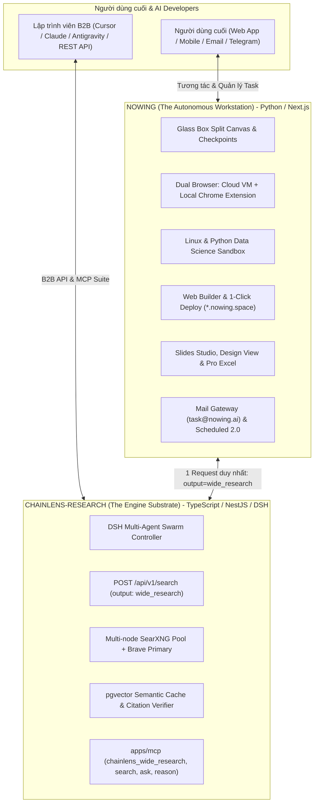

# 🚀 Executive Summary

Thị trường AI Agent toàn cầu đang chuyển dịch mạnh mẽ từ các chatbot đối thoại đơn thuần sang **Autonomous AI Workstations** (tiêu biểu là **Manus.im** và **Perplexity Computer**). Đây là các hệ thống có khả năng tự động lập kế hoạch, tương tác với môi trường ảo và trình duyệt thật, xử lý dữ liệu phức tạp và tự tay sản xuất các thành phẩm kỹ thuật số hoàn chỉnh (Web App, Slide thuyết trình, Báo cáo ma trận thị trường, Excel đa hàm).

Hệ sinh thái của chúng ta sở hữu hai mảnh ghép công nghệ hoàn hảo:
1. **`chainlens-research` (TypeScript / NestJS / DSH Swarm):** Hạ tầng Tìm kiếm & Động cơ Nghiên cứu Diện rộng Độc quyền (Multi-node SearXNG Pool, Brave Search fallback, pgvector Semantic Cache, Multi-Agent Swarm Orchestrator, Citation Verification).
2. **`nowing` (Python / FastAPI / LangGraph / Next.js):** Trạm Làm việc Tự hành Toàn diện (Glass Box Split Canvas, Full Browser Operator Extension, In-Sandbox Linux & Python Data Studio, Web App Builder `*.nowing.space`, Mail Gateway, Scheduled Tasks 2.0, PII Vault).

**Mục tiêu tối thượng:** Hợp nhất hai hệ thống thành một cỗ máy **"Manus-Killer"** sở hữu đầy đủ **25 phân hệ tính năng chi tiết của Manus.im**, với **chi phí vận hành rẻ hơn gấp 10 lần** và một **hệ sinh thái Developer mở (B2B API & MCP Suite)**.

---

# 🗺️ Ma trận Toàn diện 25 Phân hệ Tính năng (The 25 Feature Matrix)

```
┌──────────────────────────────────────────────────────────────────────────────────────────────────────────┐
│                                 THE COMPLETE MANUS.IM FEATURE MATRIX (25 MODULES)                        │
├──────────────────────────┬──────────────────────────┬──────────────────────────┬─────────────────────────┤
│ 1. WORKSTATION & UX      │ 2. VIRTUAL EXECUTION     │ 3. DELIVERABLES STUDIO   │ 4. CHANNELS & DEV ECO   │
├──────────────────────────┼──────────────────────────┼──────────────────────────┼─────────────────────────┤
│ • Glass Box Split Canvas │ • Cloud Browser (VM)     │ • Full-Stack Web Builder │ • Mail Manus Inbound    │
│ • Thought/Action Tree    │ • Browser Operator (Ext) │ • 1-Click manus.space    │ • Meeting Minutes STT   │
│ • Checkpoint Rollback    │ • Linux Sandbox & Shell  │ • Design View Mark Tool  │ • Stateful Scheduled 2.0│
│ • Human Live Takeover    │ • Python Data Studio     │ • Manus Slides (PPTX)    │ • Built-in Data Feeds   │
│ • Projects KnowledgeBase │ • Wide Research Swarm    │ • Pro Excel (.xlsx)      │ • Prebuilt MCP Client   │
│ • Multi-user Collab      │ • Fact/Citation Guard    │ • Multimedia & Video Gen │ • Custom MCP Registry   │
│ • Desktop Native App     │ • File System Manager    │ • PDF Table OCR/Extract  │ • REST API & Webhooks   │
│                          │                          │                          │ • Playbooks/Skills Hub  │
└──────────────────────────┴──────────────────────────┴──────────────────────────┴─────────────────────────┘
```

---

# 📋 Danh mục Chi tiết 25 Phân hệ & Phân công Trách nhiệm

### 🖥️ Nhóm 1: Giao diện Trạm Làm việc & Trải nghiệm (Workstation & UX)
1. **Glass Box Split Canvas (`nowing`):** Giao diện chia đôi: Bên trái là Chat + Thought Tree; Bên phải là Canvas đa năng hiển thị Live Browser / Live Terminal / File Explorer / Web Preview.
2. **Interactive Reasoning & Action Tree (`nowing`):** Hiển thị minh bạch từng bước Agent đang suy luận, gọi tool nào và kết quả với hiệu ứng Realtime Shimmer.
3. **Time-Travel Checkpoints & Branching (`nowing`):** Cho phép người dùng tua lại (Rollback) bất kỳ bước nào trong quá khứ và rẽ nhánh (Fork) để yêu cầu Agent thử hướng đi khác.
4. **Human-in-the-Loop Live Takeover (`nowing`):** Cho phép người dùng can thiệp trực tiếp bằng chuột/bàn phím vào Live Browser/Terminal (giải CAPTCHA, nhập 2FA, thanh toán) rồi trả quyền cho Agent.
5. **Projects Persistent Workspaces (`nowing`):** Không gian làm việc theo dự án chứa Master Instructions và Knowledge Base (PDF, DOCX, CSV). Hỗ trợ Pin, Drag-drop, Filter.
6. **Multi-User Collab (`nowing`):** Làm việc nhóm thời gian thực, hiển thị con trỏ chuột đồng nghiệp (Live presence) và gắn bình luận (Comments) trên từng artifact.
7. **Desktop Native App (`nowing`):** Ứng dụng Desktop macOS/Windows hỗ trợ phím tắt Cmd+K, kéo thả file cục bộ, background daemon.

### ⚡ Nhóm 2: Động cơ Thực thi Ảo & Tự hành (Execution & Sandboxing)
8. **Cloud Browser (`nowing`):** Headless Playwright trong Cloud VM sandbox để cào và tương tác với các website công cộng.
9. **Browser Operator Extension (`nowing`):** Chrome Extension kết nối Chrome DevTools Protocol, tận dụng session/cookies đã đăng nhập sẵn của user trên LinkedIn, Facebook Ads, Jira, Shopee.
10. **Interactive Linux Sandbox & Shell (`nowing`):** Linux container cô lập (bash, node, python3, git, curl, zip/unzip), cấp quyền cho Agent tự cài package và chạy script.
11. **In-Sandbox Python Data Science Studio (`nowing`):** Môi trường Python chuyên sâu với Pandas, NumPy, Matplotlib, Seaborn để phân tích số liệu và vẽ đồ thị.
12. **Wide Research Swarm (`chainlens`):** **DSH Multi-Agent Swarm Orchestrator** phân rã đề tài lớn thành $N$ subagents chạy song song để nghiên cứu đồng thời 50–100 đối tượng.
13. **Fact-Checking & Citation Verification (`chainlens`):** Đối chiếu từng atomic claim với nguồn gốc web thực tế, cam kết 100% trích dẫn có URL sống.
14. **Workspace File System Manager (`nowing`):** Quản lý cây thư mục ảo `/workspace`, hỗ trợ upload, nén/giải nén ZIP và export.

### 🎨 Nhóm 3: Xưởng Sản xuất Thành phẩm Kỹ thuật số (Deliverables Studio)
15. **Full-Stack Web App Builder (`nowing`):** Tự sinh mã nguồn ứng dụng web hoàn chỉnh (React / Next.js / Tailwind CSS / SQLite / Prisma / Mock API) từ ngôn ngữ tự nhiên.
16. **1-Click Instant Hosting `*.nowing.space` (`nowing`):** Tự động đóng gói container và publish web app lên subdomain live có HTTPS, hỗ trợ CNAME domain riêng.
17. **Design View & "Mark Tool" (`nowing`):** Giao diện chỉnh sửa trực quan — người dùng khoanh vùng UI trên web app để yêu cầu sửa giao diện bằng ngôn ngữ tự nhiên.
18. **Manus Slides Presentation Studio (`nowing`):** Tự động lập dàn ý, chọn theme, layout, viết Speaker Notes và xuất ra PPTX, PDF, hoặc Web Slide (Marp/HTML5).
19. **Professional Spreadsheet Formatter (`nowing`):** Xuất bảng tính Excel `.xlsx` chuyên nghiệp có nhiều tab, công thức (`SUM`, `VLOOKUP`), conditional formatting và freeze panes.
20. **Multimedia & Video Generation (`chainlens/nowing`):** Sinh ảnh minh họa, infographic và tạo video clip giới thiệu sản phẩm có voiceover AI (ElevenLabs TTS).
21. **Deep PDF Table OCR & Extraction (`nowing`):** Bóc tách bảng biểu phức tạp trong file PDF (báo cáo tài chính, hóa đơn) thành dữ liệu bảng JSON/CSV.

### 📨 Nhóm 4: Kênh Tiếp nhận & Hệ sinh thái Dev (Channels & Ecosystem)
22. **Mail Inbound Gateway (`nowing`):** Hộp thư bot `task@nowing.ai` nhận email forward đính kèm file, Agent tự chạy ngầm và gửi email phản hồi kèm kết quả.
23. **Meeting Minutes & Action Items (`nowing`):** Ghi âm cuộc họp $\rightarrow$ Whisper STT + Speaker Diarization $\rightarrow$ Tóm tắt quyết định $\rightarrow$ Sinh Action Items cho Agent chạy tiếp.
24. **Stateful Scheduled Tasks 2.0 (`nowing`):** Cron jobs định kỳ duy trì **Stateful Thread Memory** để làm báo cáo biến động (Delta Analysis) và gửi thông báo qua Telegram/Slack.
25. **Extensible Ecosystem & B2B API (`chainlens/nowing`):**
    * **`chainlens`:** Cung cấp B2B REST API và bộ MCP Tool (`chainlens_wide_research`, `chainlens_search`, `chainlens_ask`).
    * **`nowing`:** Cung cấp Prebuilt MCP Connectors (Google Drive, Notion, Gmail, GitHub) và REST API kích hoạt task từ bên ngoài.

---

# 🏛️ Phân định Trách nhiệm Kiến trúc Tuyệt đối



---

# 🚀 Lộ trình 4 Sprint Triển khai Toàn diện

```
┌────────────────────────────────────────────────────────────────────────────────────────┐
│                                 LỘ TRÌNH 4 SPRINT (8 TUẦN)                             │
├────────────────────────────┬─────────────────────────────┬─────────────────────────────┤
│ Giai đoạn                  │ Repo `chainlens-research`   │ Repo `nowing`               │
├────────────────────────────┼─────────────────────────────┼─────────────────────────────┤
│ SPRINT 1 (Tuần 1-2):       │ • Tích hợp DSH Swarm Engine │ • Tích hợp Wide Research    │
│ Wide Research, Swarm &     │ • Endpoint `wide_research`  │ • Linux & Python Sandbox    │
│ In-Sandbox Data Studio     │ • MCP Tool Wide Research    │ • OpenPyXL Pro Excel Export │
│                            │ • Zero-hop SearXNG Pipeline │ • Glass Box Split Canvas    │
├────────────────────────────┼─────────────────────────────┼─────────────────────────────┤
│ SPRINT 2 (Tuần 3-4):       │ • Swarm Rate-limit Guard    │ • Full Browser Operator Ext │
│ Browser Operator, Mail &   │ • Citation Fidelity Gate    │ • Mail Inbound Gateway      │
│ Checkpoint Takeover        │                             │ • Checkpoint Rollback/Fork  │
│                            │                             │ • Human Live Takeover (CDP) │
├────────────────────────────┼─────────────────────────────┼─────────────────────────────┤
│ SPRINT 3 (Tuần 5-6):       │ • Vertical Index Feeding    │ • Full-Stack Web App Builder│
│ Web App Builder &          │ • Swarm Matrix Cache Hits   │ • 1-Click `*.nowing.space`  │
│ Design View Studio         │                             │ • Design View (Mark Tool)   │
│                            │                             │ • Deep PDF Table OCR        │
├────────────────────────────┼─────────────────────────────┼─────────────────────────────┤
│ SPRINT 4 (Tuần 7-8):       │ • B2B Usage Metering        │ • Manus Slides Studio (PPTX)│
│ Creative Studio, Meeting   │ • Global MCP Registry       │ • Meeting Minutes STT Engine│
│ Minutes & Launch           │                             │ • Stateful Scheduled 2.0    │
│                            │                             │ • Projects Workspace Polish │
└────────────────────────────┴─────────────────────────────┴─────────────────────────────┘
```
