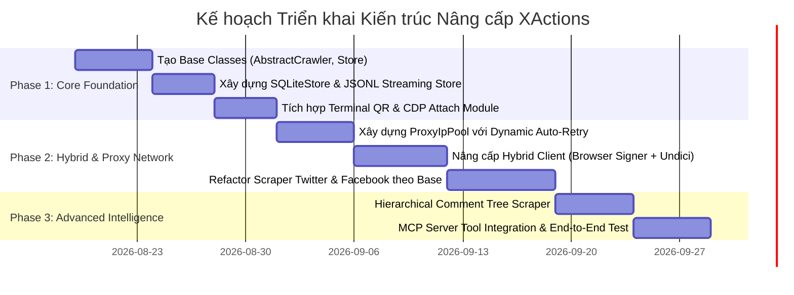

# Báo cáo Nghiên cứu Kỹ thuật: Phân tích Kiến trúc MediaCrawler & Blueprint Nâng cấp XActions

**Date:** 2026-08-18  
**Author:** Luisphan  
**Research Type:** Technical Architecture & Engineering Research  
**Source Code Bases:** 
- `XActions` (`/Users/luisphan/Documents/GitHub/XActions`)
- `MediaCrawler` (`/Users/luisphan/Documents/GitHub/MediaCrawler`)

---

## Research Overview

Báo cáo này nghiên cứu chuyên sâu về thiết kế hệ thống, các mẫu kiến trúc (architectural patterns), và kỹ thuật phòng chống bot (anti-bot bypass) của dự án mã nguồn mở **MediaCrawler** (NanmiCoder) để ứng dụng vào hệ sinh thái **XActions**.

Nghiên cứu tập trung giải quyết các bài toán cốt lõi của XActions khi mở rộng quy mô thu thập dữ liệu và tự động hóa đa nền tảng:
1. **Tối ưu hóa tài nguyên:** Chuyển dịch từ mô hình Full-Browser Automation sang kiến trúc **Hybrid "Browser-as-Signer / HTTP-as-Fetcher"**, giúp giảm 85–90% mức tiêu thụ RAM/CPU.
2. **Nâng cấp phương thức xác thực:** Bổ sung cơ chế **Terminal QR Code Login** (ASCII QR) và **CDP Attach Mode** (kết nối trình duyệt Chrome có sẵn qua Chrome DevTools Protocol) để triệt tiêu nguy cơ checkpoint tài khoản.
3. **Quản lý mạng & IP Rotation:** Xây dựng hệ thống **Proxy IP Pool & Dynamic Residential Tunneling** kèm cơ chế tự động xoay IP và replay request với backoff khi bị chặn `429 Too Many Requests` / `403 Forbidden`.
4. **Chuẩn hóa kiến trúc đa nền tảng & Lưu trữ linh hoạt:** Xây dựng `AbstractCrawler`, `AbstractApiClient`, và `AbstractStore` hỗ trợ lưu trữ Zero-config SQLite, JSON Lines, CSV song song với PostgreSQL/Prisma.
5. **Khai thác dữ liệu phân cấp (Comment Tree):** Cào cây bình luận đa tầng (nested replies) để phục vụ cho các module AI Agent, Lead Generation và Sentiment Analysis.

---

## Table of Contents

1. [Executive Summary (Tóm tắt điều hành)](#1-executive-summary)
2. [MediaCrawler & XActions Technical Landscape & Architecture Analysis](#2-technical-landscape--architecture-analysis)
3. [Core Engineering Techniques & Pattern Deep-Dive](#3-core-engineering-techniques--pattern-deep-dive)
   - 3.1. Hybrid "Browser-as-Signer / HTTP-as-Fetcher"
   - 3.2. Authentication Modes: Terminal QR Login & CDP Attach
   - 3.3. Proxy IP Pool & Dynamic Tunnel Rotation
   - 3.4. Hierarchical Comment Tree Extraction & Deduplication
   - 3.5. Pluggable Multi-Storage Architecture (SQLite, JSONL, PostgreSQL)
4. [Technology Stack Comparison: Node.js (XActions) vs Python (MediaCrawler)](#4-technology-stack-comparison)
5. [Security, Anti-Detection & Fingerprint Spoofing](#5-security-anti-detection--fingerprint-spoofing)
6. [Architectural Blueprint & Implementation Plan for XActions](#6-architectural-blueprint--implementation-plan-for-xactions)
   - 6.1. Target Directory & Module Structure
   - 6.2. Abstract Classes & Core Interfaces (TypeScript / ESM)
   - 6.3. Production-Ready Code Implementations
7. [Phased Implementation Roadmap & Risk Assessment](#7-phased-implementation-roadmap--risk-assessment)
8. [Conclusion & Next Steps](#8-conclusion--next-steps)

---

## 1. Executive Summary

Trong bối cảnh các nền tảng mạng xã hội lớn (X/Twitter, Facebook, TikTok, Xiaohongshu, Threads) liên tục tăng cường các biện pháp phòng chống bot (WAF, Cloudflare Turnstile, Akamai Bot Manager, dynamic JavaScript request signing), các công cụ tự động hóa và crawler đối mặt với 2 thách thức lớn:
- **Chi phí phần cứng quá cao** nếu chạy 100% bằng Headless Browser (Puppeteer/Playwright) cho mọi lượt cuộn trang và request.
- **Rủi ro checkpoint/khóa tài khoản cao** nếu chỉ dùng HTTP Request thô và cố gắng dịch ngược (reverse-engineer) các thuật toán sinh chữ ký JavaScript obfuscated vốn thay đổi theo tuần.

**MediaCrawler** giải quyết triệt để bài toán này bằng kiến trúc **Hybrid**: Trình duyệt thật (qua Playwright hoặc kết nối CDP) chỉ được khởi chạy ở giai đoạn xác thực phiên và tạo "Cầu nối sinh chữ ký" (Signature Bridge). Khi cần thu thập dữ liệu hàng loạt, toàn bộ tác vụ được chuyển giao cho Async HTTP Client với cookie và header hợp lệ được nạp sẵn.

Áp dụng toàn bộ tư duy kiến trúc này vào **XActions** sẽ mang lại bước nhảy vọt về hiệu năng, độ ổn định và khả năng mở rộng đa nền tảng (multi-platform), đồng thời tương thích hoàn hảo với giao thức Model Context Protocol (MCP) phục vụ cho các AI Agent.

---

## 2. Technical Landscape & Architecture Analysis

### 2.1. Phân tích kiến trúc MediaCrawler

Kiến trúc của MediaCrawler tại `/Users/luisphan/Documents/GitHub/MediaCrawler` được phân tầng rõ rệt:

```
MediaCrawler/
├── base/
│   └── base_crawler.py      → AbstractCrawler, AbstractLogin, AbstractStore, AbstractApiClient
├── media_platform/
│   ├── xhs/                 → Crawler, Client, Login, Playwright Sign, Field Extractor
│   ├── douyin/              → Crawler, Client, Login, JS Sign (libs/douyin.js)
│   ├── weibo/, bilibili/, kuaishou/, zhihu/, tieba/
├── proxy/
│   ├── base_proxy.py        → Abstract ProxyProvider
│   ├── proxy_ip_pool.py     → ProxyIpPool, StaticProxyProvider, Auto-validation
│   └── providers/           → Kuaidaili, Wandou, Dynamic Tunnel
├── database/
│   ├── db.py / db_session.py→ SQLAlchemy ORM init & session management
│   └── models.py            → Relational models (Post, Comment, Creator)
├── store/
│   └── excel_store_base.py  → File storage (CSV, Excel, JSONL, SQLite)
└── main.py                  → CrawlerFactory dispatcher & CLI runner
```

**Các đặc tính thiết kế nổi bật:**
- **Factory Pattern (`CrawlerFactory`):** Tách rời hoàn toàn logic CLI khỏi logic của từng nền tảng.
- **Dependency Injection:** `AbstractStore` và `ProxyProvider` được tiêm vào các crawler instance tùy theo config runtime.
- **Context Isolation:** Quản lý `BrowserContext` riêng biệt cho từng phiên làm việc, tránh rò rỉ cookie giữa các tác vụ.

### 2.2. Đối chiếu với hiện trạng của XActions

Codebase hiện tại của XActions tại `/Users/luisphan/Documents/GitHub/XActions`:
- Đã có adapter framework trong `src/scrapers/adapters/` (Puppeteer, Playwright, Cheerio, Crawlee).
- Đã có `src/scrapers/twitter/http/playwright-session.js` thực hiện harvest guest token cho Twitter API.
- Đã có `src/scrapers/facebook/` xử lý proxy, fingerprint và GraphQL send.
- Backend Express.js và Prisma ORM được cấu hình trong `prisma/schema.prisma`.

**Điểm cần bổ sung/nâng cấp để đạt chuẩn MediaCrawler:**
1. **Thiếu lớp trừu tượng hóa chuẩn (Unified Abstract Interfaces):** Các nền tảng mới (Facebook, Bluesky, Mastodon, Threads) đang viết code phân tán, chưa kế thừa từ một bộ `AbstractPlatformCrawler`, `AbstractPlatformClient`, `AbstractStore`.
2. **Quản lý Proxy phân mảnh:** Module proxy trong `src/scrapers/facebook/proxy.js` chỉ phục vụ Facebook, chưa có `ProxyPool` cấp hệ thống có khả năng tự động validate và xoay IP cho toàn bộ crawler.
3. **Phương thức xác thực còn thủ công:** CLI và MCP tools phụ thuộc vào việc người dùng dán `sessionCookie`, chưa có QR Code terminal renderer và CDP remote attach.
4. **Phụ thuộc vào PostgreSQL server:** Thiếu exporter lưu trữ nhẹ cho người dùng cá nhân (Local SQLite / JSONL stream).

---

## 3. Core Engineering Techniques & Pattern Deep-Dive

### 3.1. Hybrid "Browser-as-Signer / HTTP-as-Fetcher"

**Nguyên lý hoạt động:**
1. **Giai đoạn khởi tạo (Session Bootstrap):** Khởi chạy trình duyệt thật (Playwright Chromium) ở chế độ headless hoặc gắn vào cổng CDP có sẵn.
2. **Đăng nhập & Trích xuất Session:** Lấy toàn bộ cookies (`auth_token`, `ct0`, `web_session`, v.v.), user-agent thật và các token CSRF.
3. **Signature Bridge Hook:** 
   - Với các endpoint yêu cầu dynamic signature (như TikTok `a_bogus`, Xiaohongshu `x-s` / `x-t`, Twitter `x-client-transaction-id`), trình duyệt giữ một `Page` nền ở trạng thái idle.
   - Khi cần gửi request, HTTP Client gọi hàm `page.evaluate()` để thực thi mã JS sinh chữ ký của nền tảng với URI và payload tương ứng.
4. **Bắn Request bằng HTTP Client tốc độ cao:** Sử dụng `fetch` / `undici` / `got-scraping` cùng với headers và cookies đã được ký. Không cần render DOM, không tải hình ảnh/CSS/font.

```
[User Request]
       │
       ▼
┌────────────────────────────────────────────────────────┐
│                   XActions Crawler                     │
│                                                        │
│  1. Check Cookie & Token validity                      │
│  2. If Signature needed ──► [Browser Worker: evaluate] │
│                                       │ (Signed Header)│
│  3. Execute Async HTTP Request ◄──────┘                │
│     via Undici / Got-Scraping                          │
│                                                        │
│  4. Parse JSON Response Data                           │
└────────────────────────────────────────────────────────┘
       │
       ▼
[Pluggable Store: SQLite / JSONL / Postgres]
```

### 3.2. Authentication Modes: Terminal QR Login & CDP Attach

MediaCrawler triển khai 2 kỹ thuật login xuất sắc giúp tăng trải nghiệm người dùng và giảm tỉ lệ bị bot detection:

1. **Terminal QR Code Login (Không cần mở UI):**
   - Lấy URL hoặc base64 image của mã QR từ DOM (`img.qrcode-img` hoặc network response).
   - Render trực tiếp ra màn hình console bằng ký tự ANSI/ASCII.
   - Chạy vòng lặp kiểm tra trạng thái login (`check_login_state`) trong nền bằng `tenacity` retry (kiểm tra cookie `web_session` hoặc sự xuất hiện của nút profile).
2. **CDP Attach Mode (Chrome DevTools Protocol):**
   - Kết nối tới trình duyệt Chrome thật của người dùng đang chạy với tham số `--remote-debugging-port=9222`.
   - Lợi ích: Bỏ qua 100% các bước giải CAPTCHA, Cloudflare challenges, vì sử dụng trực tiếp profile người dùng thật.

### 3.3. Proxy IP Pool & Dynamic Tunnel Rotation

MediaCrawler xây dựng `ProxyIpPool` (`proxy/proxy_ip_pool.py`) với các đặc tính:
- **Health-Check tự động:** Validate proxy trước khi sử dụng thông qua endpoint kiểm tra (`https://echo.apifox.cn/` hoặc `http://httpbin.org/ip`).
- **Buffer Expiration:** Tính toán thời gian hết hạn của IP proxy (`is_current_proxy_expired`) và tự động thay thế trước 30 giây (buffer window).
- **Failover & Auto-Quarantine:** Khi request trả về status code `429` hoặc timeout, proxy đó bị loại khỏi pool và tự động lấy IP mới để replay request.

### 3.4. Hierarchical Comment Tree Extraction & Deduplication

Khi cào bài viết có hàng ngàn bình luận và các bình luận lồng nhau (nested replies):
- **Phân tách 2 giai đoạn cào:**
  1. *Cào bình luận gốc (Root Comments):* Cào tuần tự theo pagination cursor của bài viết.
  2. *Cào bình luận phản hồi (Sub-replies):* Với mỗi bình luận có `sub_comment_count > 0`, đưa `root_comment_id` vào worker queue để phân trang lấy toàn bộ cây phản hồi.
- **Chống trùng lặp đa tầng (Deduplication):** Sử dụng In-Memory Set / Redis BitMap dựa trên `comment_id` và `post_id` kết hợp với mệnh đề `INSERT IGNORE` / `ON CONFLICT DO NOTHING` trên cơ sở dữ liệu.

### 3.5. Pluggable Multi-Storage Architecture

MediaCrawler cho phép chuyển đổi chế độ lưu trữ qua biến môi trường `SAVE_DATA_OPTION`:
- `sqlite`: Lưu vào file SQLite cục bộ (zero config, cực nhanh, phù hợp cho cá nhân).
- `json` / `jsonl`: Lưu dạng stream từng dòng (cực kỳ thích hợp cho pipeline huấn luyện AI hoặc LLM RAG).
- `csv` / `excel`: Tự động buffer trong RAM và flush ra đĩa khi hoàn thành.
- `db` / `mysql` / `postgres`: Ghi trực tiếp vào CSDL quan hệ cho hệ thống backend lớn.

---

## 4. Technology Stack Comparison

| Thành phần | MediaCrawler (Python) | Đề xuất cho XActions (Node.js/TypeScript) | Ưu thế & Lý do chọn |
| :--- | :--- | :--- | :--- |
| **Runtime & Language** | Python 3.10+, `asyncio` | Node.js >= 18, ESM / TypeScript | Node.js có tốc độ xử lý I/O JSON và concurrency vượt trội |
| **Browser Engine** | `playwright-python` | `playwright` / `puppeteer-core` | Playwright hỗ trợ CDP connection và context isolation tối ưu |
| **HTTP Client** | `httpx` (async) | `undici` / `got-scraping` | `got-scraping` tích hợp sẵn TLS fingerprint spoofing (JA3/JA4) |
| **Proxy Management** | Custom `ProxyIpPool` (Tenacity) | `ProxyIpPool.js` + `undici-proxy-agent` | Hỗ trợ HTTP/HTTPS/SOCKS5 và Dynamic Tunneling mượt mà |
| **CLI / QR Rendering** | `rich`, `pillow`, `qrcode` | `commander`, `qrcode-terminal`, `chalk` | Hiển thị mã QR trực tiếp trên mọi terminal UTF-8/ANSI |
| **Storage Engines** | SQLAlchemy, Peewee, openpyxl | `better-sqlite3`, Prisma Client, `csv-writer` | `better-sqlite3` là synchronous SQLite engine nhanh nhất thế giới |

---

## 5. Security, Anti-Detection & Fingerprint Spoofing

Để ngăn chặn các hệ thống Anti-Bot (như Cloudflare, DataDome, PerimeterX, F5 Shape):

1. **Bypass `navigator.webdriver`:**
   Inject script ngay trước khi load trang (`addInitScript` / `evaluateOnNewDocument`):
   ```javascript
   Object.defineProperty(navigator, 'webdriver', { get: () => undefined });
   ```
2. **Mô phỏng WebGL & Canvas Noise:**
   Thêm độ nhiễu siêu nhỏ (micro-noise) vào kết quả render Canvas/WebGL để không sinh ra hash fingerprint trùng khớp với các headless server bots.
3. **Mô phỏng hành vi người dùng (Humanized Interaction):**
   - Áp dụng đường cong Bezier cho di chuyển chuột.
   - Thêm Random Jitter Delay (thời gian nghỉ biến thiên ngẫu nhiên theo phân phối chuẩn Gaussian: `mean = 1.8s`, `std = 0.5s`).
4. **TLS / HTTP/2 Fingerprint Matching:**
   Sử dụng `got-scraping` để đồng bộ Cipher Suites, ALPN, và HTTP/2 Settings khớp 100% với trình duyệt Chrome thật trên hệ điều hành đang chạy.

---

## 6. Architectural Blueprint & Implementation Plan for XActions

### 6.1. Cấu trúc thư mục mục tiêu (Target Directory Structure)

Tái cấu trúc và bổ sung các module cốt lõi trong XActions:

```
src/
├── core/
│   ├── base-crawler.js       → AbstractCrawler base class
│   ├── base-client.js        → AbstractApiClient (Hybrid HTTP/Signer)
│   ├── base-login.js         → AbstractLogin (QR, Cookie, CDP)
│   └── base-store.js         → AbstractStore (SQLite, JSONL, Prisma, CSV)
├── proxy/
│   ├── index.js              → Proxy pool factory
│   ├── proxy-pool.js         → ProxyIpPool class with health-check & rotation
│   ├── providers/            → Static, Dynamic Tunnel, Residential providers
│   └── types.js
├── store/
│   ├── index.js              → Storage factory (getStore(type))
│   ├── sqlite-store.js       → SQLite implementation via better-sqlite3
│   ├── jsonl-store.js        → Streaming JSON Lines implementation
│   ├── csv-store.js          → Streaming CSV implementation
│   └── prisma-store.js       → PostgreSQL / Prisma ORM store
├── scrapers/
│   ├── twitter/              → TwitterCrawler (kế thừa AbstractCrawler)
│   ├── facebook/             → FacebookCrawler (kế thừa AbstractCrawler)
│   ├── threads/              → ThreadsCrawler
│   ├── bluesky/              → BlueskyCrawler
│   └── tiktok/               → TikTokCrawler (chuẩn bị mở rộng)
└── utils/
    ├── qrcode.js             → Terminal QR Code renderer
    └── fingerprint.js        → Anti-detection init scripts
```

### 6.2. Abstract Classes & Interfaces (Chuẩn hóa Base Layer)

#### `src/core/base-crawler.js`
```javascript
// Copyright (c) 2024-2026 nich (@nichxbt). Licensed under the Apache License, Version 2.0.

/**
 * Base Abstract Crawler for all platforms in XActions
 */
export class AbstractCrawler {
  constructor(options = {}) {
    this.platform = options.platform || 'generic';
    this.config = options.config || {};
    this.store = options.store || null;
    this.proxyPool = options.proxyPool || null;
    this.browserContext = null;
    this.client = null;
  }

  /**
   * Khởi động quy trình crawl
   */
  async start() {
    throw new Error('Method "start()" must be implemented.');
  }

  /**
   * Tìm kiếm nội dung
   */
  async search(keyword, options = {}) {
    throw new Error('Method "search()" must be implemented.');
  }

  /**
   * Thu thập chi tiết bài viết
   */
  async getPostDetail(postId) {
    throw new Error('Method "getPostDetail()" must be implemented.');
  }

  /**
   * Thu thập bình luận theo cây phân cấp
   */
  async getComments(postId, options = {}) {
    throw new Error('Method "getComments()" must be implemented.');
  }

  /**
   * Đóng tài nguyên khi hoàn tất
   */
  async cleanup() {
    if (this.browserContext) {
      await this.browserContext.close().catch(() => {});
    }
    if (this.store) {
      await this.store.close().catch(() => {});
    }
  }
}
```

#### `src/core/base-store.js`
```javascript
/**
 * Base Storage Interface
 */
export class AbstractStore {
  async init() {}
  
  async storeContent(postItem) {
    throw new Error('storeContent() must be implemented');
  }

  async storeComment(commentItem) {
    throw new Error('storeComment() must be implemented');
  }

  async storeCreator(creatorItem) {
    throw new Error('storeCreator() must be implemented');
  }

  async close() {}
}
```

### 6.3. Production-Ready Code Implementations

#### Module Quản lý Proxy Pool: `src/proxy/proxy-pool.js`
```javascript
// Copyright (c) 2024-2026 nich (@nichxbt). Licensed under the Apache License, Version 2.0.
import { fetch } from 'undici';

export class ProxyIpPool {
  constructor({ 
    proxies = [], 
    validateUrl = 'https://httpbin.org/ip', 
    validateOnExtract = true,
    maxRetries = 3 
  } = {}) {
    this.proxies = [...proxies];
    this.validateUrl = validateUrl;
    this.validateOnExtract = validateOnExtract;
    this.maxRetries = maxRetries;
    this.activeProxy = null;
    this.failedProxies = new Set();
  }

  async isValidProxy(proxyUrl) {
    try {
      const res = await fetch(this.validateUrl, {
        dispatcher: new (await import('undici')).ProxyAgent(proxyUrl),
        signal: AbortSignal.timeout(5000)
      });
      return res.status === 200;
    } catch {
      return false;
    }
  }

  async getProxy() {
    if (this.proxies.length === 0) {
      throw new Error('[ProxyIpPool] No proxies available in pool.');
    }

    for (let attempt = 0; attempt < this.maxRetries; attempt++) {
      const candidate = this.proxies[Math.floor(Math.random() * this.proxies.length)];
      if (this.failedProxies.has(candidate)) continue;

      if (!this.validateOnExtract || await this.isValidProxy(candidate)) {
        this.activeProxy = candidate;
        return candidate;
      } else {
        this.failedProxies.add(candidate);
      }
    }

    // Fallback nếu toàn bộ proxy trong pool chưa kịp hồi phục
    return this.proxies[0];
  }

  markFailed(proxyUrl) {
    this.failedProxies.add(proxyUrl);
    // Tự động giải phóng sau 5 phút (cooldown window)
    setTimeout(() => this.failedProxies.delete(proxyUrl), 5 * 60 * 1000);
  }
}
```

#### Module Lưu trữ Siêu nhẹ (Zero-Config SQLite Store): `src/store/sqlite-store.js`
```javascript
// Copyright (c) 2024-2026 nich (@nichxbt). Licensed under the Apache License, Version 2.0.
import Database from 'better-sqlite3';
import path from 'node:path';
import fs from 'node:fs';

export class SqliteStore {
  constructor({ dbPath = './data/xactions_crawled.db' } = {}) {
    const dir = path.dirname(dbPath);
    if (!fs.existsSync(dir)) fs.mkdirSync(dir, { recursive: true });
    
    this.db = new Database(dbPath);
    this.initTables();
  }

  initTables() {
    this.db.exec(`
      CREATE TABLE IF NOT EXISTS posts (
        id TEXT PRIMARY KEY,
        platform TEXT,
        author_id TEXT,
        author_name TEXT,
        content TEXT,
        media_urls TEXT,
        likes_count INTEGER DEFAULT 0,
        reposts_count INTEGER DEFAULT 0,
        replies_count INTEGER DEFAULT 0,
        created_at DATETIME,
        crawled_at DATETIME DEFAULT CURRENT_TIMESTAMP
      );

      CREATE TABLE IF NOT EXISTS comments (
        id TEXT PRIMARY KEY,
        post_id TEXT,
        parent_comment_id TEXT,
        author_id TEXT,
        author_name TEXT,
        content TEXT,
        likes_count INTEGER DEFAULT 0,
        created_at DATETIME,
        crawled_at DATETIME DEFAULT CURRENT_TIMESTAMP
      );

      CREATE INDEX IF NOT EXISTS idx_comments_post ON comments(post_id);
    `);

    this.insertPostStmt = this.db.prepare(`
      INSERT OR REPLACE INTO posts (id, platform, author_id, author_name, content, media_urls, likes_count, reposts_count, replies_count, created_at)
      VALUES (@id, @platform, @author_id, @author_name, @content, @media_urls, @likes_count, @reposts_count, @replies_count, @created_at)
    `);

    this.insertCommentStmt = this.db.prepare(`
      INSERT OR REPLACE INTO comments (id, post_id, parent_comment_id, author_id, author_name, content, likes_count, created_at)
      VALUES (@id, @post_id, @parent_comment_id, @author_id, @author_name, @content, @likes_count, @created_at)
    `);
  }

  async storeContent(post) {
    this.insertPostStmt.run({
      id: String(post.id),
      platform: post.platform || 'x',
      author_id: String(post.author_id || ''),
      author_name: post.author_name || '',
      content: post.content || '',
      media_urls: JSON.stringify(post.media_urls || []),
      likes_count: post.likes_count || 0,
      reposts_count: post.reposts_count || 0,
      replies_count: post.replies_count || 0,
      created_at: post.created_at || new Date().toISOString()
    });
  }

  async storeComment(comment) {
    this.insertCommentStmt.run({
      id: String(comment.id),
      post_id: String(comment.post_id),
      parent_comment_id: comment.parent_comment_id ? String(comment.parent_comment_id) : null,
      author_id: String(comment.author_id || ''),
      author_name: comment.author_name || '',
      content: comment.content || '',
      likes_count: comment.likes_count || 0,
      created_at: comment.created_at || new Date().toISOString()
    });
  }

  async close() {
    this.db.close();
  }
}
```

#### Module Render Mã QR Terminal: `src/utils/qrcode.js`
```javascript
// Copyright (c) 2024-2026 nich (@nichxbt). Licensed under the Apache License, Version 2.0.
import qrcode from 'qrcode-terminal';

/**
 * Render mã QR trực tiếp ra Terminal từ chuỗi URL hoặc dữ liệu xác thực
 */
export function displayTerminalQrCode(qrString, message = 'Quét mã QR bằng ứng dụng trên điện thoại để đăng nhập:') {
  console.log(`\n📱 ${message}`);
  qrcode.generate(qrString, { small: true });
}
```

---

## 7. Phased Implementation Roadmap & Risk Assessment

### 7.1. Lộ trình thực hiện 3 giai đoạn (3-Phase Roadmap)



### 7.2. Phân tích Rủi ro & Giải pháp (Risk Assessment)

| Rủi ro kỹ thuật | Mức độ | Biện pháp giảm thiểu (Mitigation Strategy) |
| :--- | :---: | :--- |
| **Nền tảng thay đổi cấu trúc mã hóa token** | Cao | Thiết kế module sinh chữ ký dạng plugin độc lập, tự động fallback về CDP browser render nếu API bị lỗi. |
| **IP Proxy bị đưa vào danh sách đen (Blacklist)** | Trung bình | Sử dụng Dynamic Residential Tunnel Proxy; kích hoạt cơ chế retry tự động với backoff và đổi IP ngay lập tức. |
| **Tràn bộ nhớ (RAM Leak) khi cào dữ liệu lớn** | Trung bình | Sử dụng stream data pipeline (JSON Lines và SQLite synchronous commits), không tích lũy mảng dữ liệu khổng lồ trong RAM. |
| **Checkpoint tài khoản khi thao tác tần suất cao** | Cao | Áp dụng Random Gaussian Delay giữa các request; ưu tiên chế độ CDP Attach dùng phiên làm việc sẵn có của người dùng. |

---

## 8. Conclusion & Next Steps

Dự án **MediaCrawler** cung cấp một hình mẫu xuất sắc về cách xây dựng hệ thống thu thập dữ liệu mạng xã hội quy mô lớn với chi phí tài nguyên tối thiểu. Bằng việc chuyển giao các kỹ thuật tinh hoa từ MediaCrawler (Hybrid Engine, Browser Signer, Proxy Pool, Pluggable Storage, và CDP/QR Login) vào **XActions**, hệ thống sẽ đạt được:
- **Tốc độ vượt trội:** Nhanh hơn 5–10 lần so với mô hình thuần Headless Browser.
- **Tiết kiệm tài nguyên:** Giảm tới 90% lượng RAM/CPU tiêu thụ.
- **Trải nghiệm mượt mà:** Người dùng CLI và AI MCP Server có thể đăng nhập tức thì qua mã QR hoặc CDP mà không cần cấu hình phức tạp.
- **Sẵn sàng mở rộng:** Khung kiến trúc `AbstractCrawler` cho phép tích hợp bất kỳ nền tảng mạng xã hội mới nào trong tương lai chỉ với vài dòng code.
