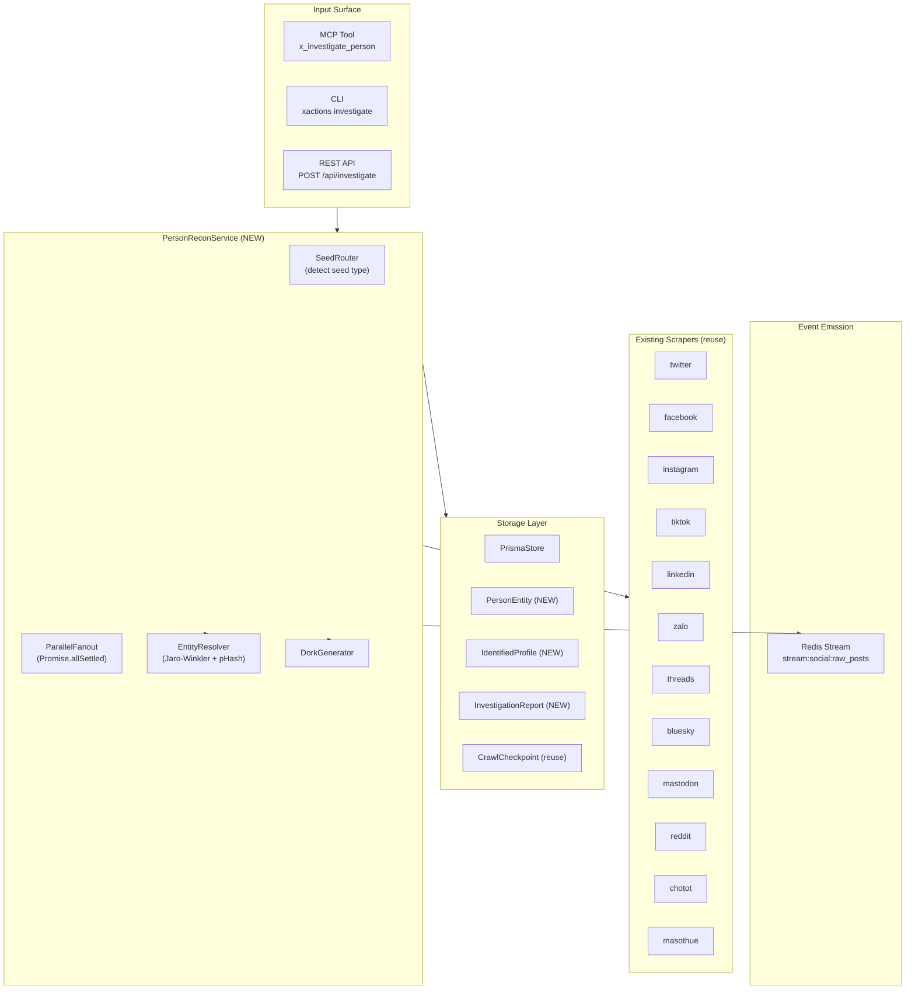

# Proposal: Unified Person OSINT (Investigate Person)

## 1. Executive Summary

XActions đã có hạ tầng scraping đa nền tảng mạnh mẽ (Twitter, Facebook, Instagram, TikTok, LinkedIn, Zalo, Threads, Bluesky, Mastodon, Reddit, Chợ Tốt, Mã Số Thuế…) nhưng các crawler hiện hoạt động **siloed** — mỗi nền tảng trả về profile/post độc lập, chưa có cơ chế **"điều tra danh tính tổng hợp"** (nhận 1 định danh → quét đồng thời nhiều nền tảng → hợp nhất thành hồ sơ duy nhất).

Mr.Holmes (repo `Mr.Holmes`) đã giải quyết vấn đề này qua 3 module chính trong `Core/engine/`:

1. **`EntityResolver`** — gom nhiều `ProfileEntity` thành 1 "Golden Record" bằng Jaro-Winkler similarity (tên, threshold 0.85) + pHash correlation (avatar, Hamming ≤ 10)
2. **`StagedProfiler` / `RecursiveProfiler`** — BFS 4-pha qua plugins (identity expansion → clue extraction → deep enrichment → breach recon)
3. **`DorkGenerator`** — sinh Google/Yandex dorks cho person investigation

**Proposal này đề xuất port có chọn lọc** các khả năng trên sang XActions bằng Node.js native, **không copy code Python**, tận dụng tối đa các crawler sẵn có của XActions. Kết quả: một **Unified Person Reconnaissance Service** expose qua MCP tool `x_investigate_person` + CLI `xactions investigate`, có khả năng:

- Nhận input: `username` / `email` / `phone` / `full_name` / `profile_url`
- Fan-out song song tới các crawler phù hợp
- Merge kết quả thành 1 entity với confidence score
- Persist vào PostgreSQL với Prisma model mới `PersonEntity` / `IdentifiedProfile` / `InvestigationReport`
- Emit Thin Event lên Redis Stream cho Nowing consumer
- Trả về JSON envelope 3 lớp chuẩn XActions

---

## 2. Vấn đề & Bối cảnh

### 2.1. Gap hiện tại trong XActions

| Điểm | Hiện trạng | Hệ quả |
|---|---|---|
| **Cross-platform identity search** | Không có — mỗi `scrape()` call chỉ hit 1 platform | Muốn tìm "Nguyễn Văn A có tài khoản trên mạng nào?" phải gọi N tool riêng lẻ |
| **Entity resolution** | Không có — `Post`/`Comment` lưu theo `authorId`/`authorName` phân mảnh | Cùng 1 người trên Twitter + Facebook + LinkedIn = 3 record riêng biệt, không link được |
| **Person OSINT workflow** | Không có — không có tool nào nhận "seed" (email/phone/name) và tự expand | Operator/AI phải manual orchestrate nhiều call |
| **Dork generation** | Không có — không sinh Google/Yandex dorks để tìm dấu vết ngoài platform | Bỏ sót kênh OSINT quan trọng |

### 2.2. Tại sao không copy nguyên code Mr.Holmes

- **Ngôn ngữ khác**: Python ↔ Node.js — port trực tiếp là rewrite, không phải copy
- **Code legacy đã deprecated**: `Core/Searcher_person.py` có `DeprecationWarning`, dùng Nitter (đã chết 2024), Picuki, Urlebird — dễ vỡ
- **Execution model khác**: Mr.Holmes dùng interactive `input()` + file-based reports; XActions cần async service + Prisma + MCP envelope
- **Hạ tầng khác**: XActions có proxy pool, signer pool, adaptive governor, checkpoint system — không cần mang theo proxy/HTTP layer của Mr.Holmes

→ **Port ý tưởng kiến trúc + data model + algorithm**, không port code.

### 2.3. Use case mục tiêu

- **OSINT investigators** điều tra danh tính cá nhân/doanh nghiệp VN
- **Journalists** verify identity trước khi dẫn nguồn
- **Due diligence** kiểm tra đối tác — cross-ref LinkedIn + Chợ Tốt + Mã Số Thuế + social
- **Nowing AI Lead Hub** enrich lead bằng cross-platform profile

---

## 3. So sánh 2 Approach

| Tiêu chí | **A. Port native vào XActions** ✅ | **B. Mr.Holmes expose MCP, XActions gọi** |
|---|---|---|
| Deployment | XActions độc lập | Phải chạy cả 2 service |
| Latency | In-process call | +1 network hop + Python startup |
| Data consistency | Cùng Prisma/PostgreSQL | Split DB — phải sync tay |
| Maintenance | 1 codebase | 2 codebases, 2 runtimes |
| Bug surface | Giới hạn ở module mới | Mọi bug ở Mr.Holmes engine ảnh hưởng XActions |
| Cost | Rewrite 1 lần | Ongoing sync + versioning |

**Khuyến nghị: A — port native.** XActions đã có đủ hạ tầng (scrapers, proxy, signer, Prisma, MCP) — chỉ thiếu orchestration + entity resolution layer. Porting vào giữ single source of truth, leverage sẵn infra.

---

## 4. Thiết kế Tổng thể

### 4.1. Architecture Overview



### 4.2. Module Layout (proposed)

```
src/osint/
├── index.js                      # Public exports
├── PersonReconService.js         # Main orchestrator
├── SeedRouter.js                 # Detect seed type → pick platforms
├── EntityResolver.js             # Merge logic (Jaro-Winkler + pHash)
├── DorkGenerator.js              # Google/Yandex dork templates
├── models/
│   ├── ProfileEntity.js          # Schema + merge() method
│   ├── SourcedField.js           # {value, source, confidence}
│   └── index.js
├── adapters/
│   ├── ScraperAdapter.js         # Wrap scrape() → normalize to ProfileEntity
│   └── index.js
└── data/
    ├── platformCapabilities.js   # Which platforms support which seed type
    └── dorkTemplates.js          # Google/Yandex dork templates (ported)

src/mcp/tools/
└── investigatePerson.js          # MCP tool registration

src/cli/commands/
└── investigate.js                # CLI command

api/routes/
└── investigate.js                # REST endpoint

prisma/schema.prisma              # Add 3 models
tests/osint/
├── entityResolver.test.js
├── seedRouter.test.js
├── dorkGenerator.test.js
└── personReconService.test.js
```

---

## 5. Component Design

### 5.1. SeedRouter — Detect Seed Type → Route Platforms

```javascript
// src/osint/SeedRouter.js

/**
 * Detect seed type and select applicable platforms.
 * Mirrors Mr.Holmes stage_router._STAGE_MAP + Phase B clue routing.
 */

export const SeedType = {
  USERNAME: 'USERNAME',
  EMAIL: 'EMAIL',
  PHONE: 'PHONE',
  NAME: 'NAME',
  DOMAIN: 'DOMAIN',
  PROFILE_URL: 'PROFILE_URL',
};

/**
 * Platform capability matrix — which platforms can consume which seed type.
 * Derived from each platform's descriptor mapAction + requiresAuth flags.
 */
const PLATFORM_CAPABILITIES = {
  // USERNAME seed — platforms with real `profile`/`user`/`search` actions
  USERNAME: [
    'twitter',    // twitter.profile  (no-auth, GraphQL UserByScreenName)
    'facebook',   // facebook.profile (no-auth via docId, or authCookie)
    'instagram',  // instagram.user   (requiresAuth — sessionid)
    'threads',    // threads.profile  (LSD token)
    'bluesky',    // bluesky.profile  (no-auth, AT Protocol)
    'mastodon',   // mastodon.profile (no-auth, REST)
    'reddit',     // reddit.user      (no-auth, public JSON)
    'tiktok',     // tiktok.search    (browser-signer, no profile action)
    'linkedin',   // linkedin.lead_profile (requiresAuth, CDP)
  ],
  // EMAIL seed — only platforms that accept email as lookup key
  EMAIL:    [
    'facebook',   // facebook.search type:'people' (no-auth via docId)
    'masothue',   // masothue.search (representative email if published)
    'github',     // github search users by email
  ],
  // PHONE seed — VN-heavy
  PHONE:    [
    'chotot',     // chotot.get_phone (RSA decrypt listing phone)
    'masothue',   // masothue.search (phone in business registry)
    'facebook',   // facebook.search type:'people'
    'zalo',       // zalo.oa_detail (requires OA accessToken — usually skip)
  ],
  // NAME seed — multi-word real name
  NAME:     [
    'linkedin',   // linkedin.search_jobs + lead_profile (requiresAuth)
    'facebook',   // facebook.search type:'people'
    'masothue',   // masothue.search (representativeName field)
    'topcv',      // topcv.search_jobs (HR/recruiter name)
    'vietnamworks',
  ],
  // DOMAIN seed — business registry lookup
  DOMAIN:   [
    'masothue',   // masothue.search by domain
  ],
  // PROFILE_URL seed — deep-scrape a specific URL
  PROFILE_URL: [
    'twitter', 'facebook', 'instagram', 'threads', 'bluesky',
    'mastodon', 'reddit', 'linkedin',
  ],
};

/**
 * Platforms that require auth and should be SKIPPED unless accountId present.
 * Derived from each crawler's requiresAuth flag (see ARCHITECTURE-SPINE AD-3).
 */
const AUTH_REQUIRED_PLATFORMS = new Set(['instagram', 'linkedin', 'zalo']);

export class SeedRouter {
  /**
   * @param {string} seed
   * @returns {{ seedType: SeedType, normalizedSeed: string, platforms: string[] }}
   */
  route(seed) {
    const trimmed = seed.trim();
    const seedType = this.#detectType(trimmed);
    const platforms = PLATFORM_CAPABILITIES[seedType] ?? [];
    return { seedType, normalizedSeed: trimmed, platforms };
  }

  #detectType(seed) {
    if (/^https?:\/\//.test(seed)) return SeedType.PROFILE_URL;
    if (/^[\w.+-]+@[\w.-]+\.[a-zA-Z]{2,}$/.test(seed)) return SeedType.EMAIL;
    if (/^\+?\d[\d\s\-().]{7,}$/.test(seed)) return SeedType.PHONE;
    if (/^[a-zA-Z0-9_.-]{3,30}$/.test(seed)) return SeedType.USERNAME;
    if (/^[a-zA-Z0-9-]+(\.[a-zA-Z0-9-]+)+$/.test(seed)) return SeedType.DOMAIN;
    return SeedType.NAME;  // fallback — multi-word strings
  }
}
```

### 5.2. ScraperAdapter — Normalize Crawler Output → ProfileEntity

Mỗi platform trả shape khác nhau (`profile`, `user`, `lead`, `oa_detail`…). Adapter này normalize về `ProfileEntity` chuẩn:

```javascript
// src/osint/adapters/ScraperAdapter.js

/**
 * Wraps dispatchScrape() and normalizes any platform output
 * into a ProfileEntity-compatible shape.
 */
export class ScraperAdapter {
  /**
   * @param {string} platform
   * @param {string} seedType
   * @param {string} seed
   * @param {object} options  // { proxy, accountId, limit, ... }
   * @returns {Promise<ProfileEntity|null>}
   */
  async fetch(platform, seedType, seed, options = {}) {
    const action = this.#pickAction(platform, seedType);
    if (!action) return null;

    try {
      const raw = await dispatchScrape(platform, action, {
        [this.#argKey(platform, action)]: seed,
        ...options,
      });
      return this.#normalize(platform, raw, seedType, seed);
    } catch (err) {
      // Swallow per-platform errors — caller uses Promise.allSettled
      return { error: err.message, platform, isError: true };
    }
  }

  #pickAction(platform, seedType) {
    // Per-platform action mapping — verified against descriptor.js files
    // (see /tmp/agent1_report.md §1.2 for source citations)
    const MAP = {
      twitter:   { USERNAME: 'profile',       PROFILE_URL: 'profile' },
      facebook:  { USERNAME: 'profile',       NAME: 'search',
                   EMAIL: 'search',           PHONE: 'search',
                   PROFILE_URL: 'profile' },
      instagram: { USERNAME: 'user',          PROFILE_URL: 'user' },
      threads:   { USERNAME: 'profile',       PROFILE_URL: 'profile' },
      bluesky:   { USERNAME: 'profile',       PROFILE_URL: 'profile' },
      mastodon:  { USERNAME: 'profile',       PROFILE_URL: 'profile' },
      reddit:    { USERNAME: 'user',          PROFILE_URL: 'user' },
      tiktok:    { USERNAME: 'search',        PROFILE_URL: 'search' },
      linkedin:  { NAME: 'lead_profile',      PROFILE_URL: 'lead_profile',
                   USERNAME: 'lead_profile' },
      zalo:      { PHONE: 'oa_detail' },
      chotot:    { PHONE: 'search_listings' },  // then call get_phone per listing
      masothue:  { NAME: 'search',            EMAIL: 'search',
                   DOMAIN: 'search',          PHONE: 'search' },
      topcv:     { NAME: 'search_jobs' },
      vietnamworks: { NAME: 'search_jobs' },
    };
    return MAP[platform]?.[seedType] ?? null;
  }

  #argKey(platform, action) {
    // Different platforms use different arg names — keep a small map
    const KEYS = {
      'twitter:profile':   'username',
      'facebook:profile':  'username',
      'facebook:search':   'query',
      'instagram:user':    'username',
      'linkedin:lead_profile': 'profileUrl',
      'linkedin:search_jobs': 'query',
      'chotot:search':     'query',
      'masothue:search':   'query',
      'whois:lookup':      'domain',
    };
    return KEYS[`${platform}:${action}`] ?? 'username';
  }

  #normalize(platform, raw, seedType, seed) {
    // Extract the most person-shaped field from the raw result.
    // Each platform returns different envelope keys — handle common ones.
    const candidate =
      raw?.profile ?? raw?.user ?? raw?.lead ?? raw?.data?.[0] ?? raw;

    if (!candidate || candidate.isError) return null;

    return new ProfileEntity({
      seed,
      seedType,
      realNames: candidate.name
        ? [{ value: candidate.name, source: platform, confidence: 0.9 }]
        : [],
      usernames: candidate.username
        ? [{ value: candidate.username, source: platform, confidence: 0.95 }]
        : [],
      avatars: candidate.avatar || candidate.authorAvatar
        ? [{ value: candidate.avatar ?? candidate.authorAvatar, source: platform, confidence: 0.85 }]
        : [],
      bios: candidate.bio
        ? [{ value: candidate.bio, source: platform, confidence: 0.7 }]
        : [],
      platforms: {
        [platform]: candidate.profileUrl ?? candidate.authorUrl ?? candidate.url ?? '',
      },
      // … other fields populated as available
      confidence: 0.7,  // base — re-computed by EntityResolver after merge
      sources: [platform],
    });
  }
}
```

### 5.3. EntityResolver — Merge thành Golden Record

Port logic từ `Core/engine/entity_resolver.py` (đã extract chi tiết ở subagent 2):

```javascript
// src/osint/EntityResolver.js

import natural from 'natural';   // JaroWinklerDistance
import { pHash } from './phash.js';  // sharp + DCT — see §5.4

const NAME_SIMILARITY_THRESHOLD = 0.85;
const NAME_CONFIDENCE_BOOST = 0.1;
const PHASH_THRESHOLD = 10;            // Hamming distance ≤ 10
const PHASH_CONFIDENCE_BOOST = 0.15;
const LOW_CONFIDENCE_THRESHOLD = 0.5;
const LOW_CONFIDENCE_FLAG = '⚠ LOW_CONFIDENCE';
const MIN_INDEPENDENT_SOURCES = 2;     // FR23 merge gate

export class EntityResolver {
  /**
   * @param {ProfileEntity[]} entities
   * @returns {Promise<ProfileEntity>} merged golden record
   */
  async resolve(entities) {
    if (!entities?.length) return new ProfileEntity({ seed: '', seedType: 'UNKNOWN' });
    if (entities.length === 1) return entities[0];

    // Merge gate — need ≥2 independent sources
    const allSources = new Set();
    for (const e of entities) {
      for (const f of this.#allFields(e)) {
        if (f.source !== LOW_CONFIDENCE_FLAG) allSources.add(f.source);
      }
    }
    if (allSources.size < MIN_INDEPENDENT_SOURCES) return entities[0];

    // Dedup real_names by Jaro-Winkler BEFORE sequential merge
    const allNames = entities.flatMap(e => e.realNames);
    const dedupedNames = this.#dedupNamesBySimilarity(allNames);

    // Sequential merge
    let merged = entities[0];
    for (const other of entities.slice(1)) merged = merged.merge(other);
    merged.realNames = dedupedNames;

    // Avatar pHash correlation
    merged = await this.#applyAvatarPHash(merged);

    // Recompute overall confidence
    const allFields = this.#allFields(merged);
    merged.confidence = allFields.length
      ? allFields.reduce((s, f) => s + f.confidence, 0) / allFields.length
      : 0;

    if (merged.confidence < LOW_CONFIDENCE_THRESHOLD) {
      merged.sources.push(LOW_CONFIDENCE_FLAG);
    }
    return merged;
  }

  #dedupNamesBySimilarity(names) {
    const out = [];
    for (const candidate of names) {
      const idx = out.findIndex(existing =>
        natural.JaroWinklerDistance(
          candidate.value.toLowerCase(),
          existing.value.toLowerCase()
        ) >= NAME_SIMILARITY_THRESHOLD
      );
      if (idx === -1) {
        out.push(candidate);
      } else if (candidate.confidence >= out[idx].confidence) {
        out[idx] = {
          ...candidate,
          confidence: Math.min(1.0, candidate.confidence + NAME_CONFIDENCE_BOOST),
        };
      }
    }
    return out;
  }

  async #applyAvatarPHash(merged) {
    const avatars = merged.avatars;
    if (avatars.length < 2) return merged;

    // Fetch + hash each avatar, then compute pairwise Hamming
    const hashes = await Promise.allSettled(
      avatars.map(a => this.#fetchAndHash(a.value))
    );
    const boosted = new Set();
    for (let i = 0; i < hashes.length; i++) {
      for (let j = i + 1; j < hashes.length; j++) {
        if (hashes[i].status !== 'fulfilled' || hashes[j].status !== 'fulfilled') continue;
        if (hammingDistance(hashes[i].value, hashes[j].value) <= PHASH_THRESHOLD) {
          boosted.add(i); boosted.add(j);
        }
      }
    }
    merged.avatars = avatars.map((a, i) =>
      boosted.has(i)
        ? { ...a, confidence: Math.min(1.0, a.confidence + PHASH_CONFIDENCE_BOOST) }
        : a
    );
    return merged;
  }

  async #fetchAndHash(url) {
    // SSRF protection: resolve DNS, reject private/loopback IPs before fetch
    const safeUrl = await assertSafeUrl(url);   // see §6.2
    const buf = await fetchBuffer(safeUrl, { timeout: 10_000, maxBytes: 5 * 1024 * 1024 });
    return pHash(buf);   // sharp → grayscale 32x32 → DCT → 64-bit hex
  }

  #allFields(entity) {
    return [
      ...entity.realNames, ...entity.emails, ...entity.phones,
      ...entity.usernames, ...entity.locations, ...entity.avatars,
      ...entity.bios,
    ];
  }
}

function hammingDistance(h1, h2) {
  // h1, h2 are 64-bit hex strings — count differing bits
  let xor = BigInt('0x' + h1) ^ BigInt('0x' + h2);
  let count = 0;
  while (xor) { count += Number(xor & 1n); xor >>= 1n; }
  return count;
}
```

### 5.4. pHash helper (new utility)

```javascript
// src/osint/phash.js
import sharp from 'sharp';

/**
 * Compute 64-bit perceptual hash via DCT of 32x32 grayscale.
 * Substitute for Python imagehash.phash.
 */
export async function pHash(imageBuffer) {
  const { data } = await sharp(imageBuffer)
    .resize(32, 32, { fit: 'fill' })
    .grayscale()
    .raw()
    .toBuffer({ resolveWithObject: true });

  // Apply 2D DCT — use `dct` npm package or implement naïve DCT-II
  const coeffs = dct2d(data, 32, 32);

  // Take top-left 8x8 low-freq block, compute median, threshold to 64 bits
  const bits = coeffs.slice(0, 8).flatMap(row => row.slice(0, 8));
  const median = computeMedian(bits);
  let hash = 0n;
  for (const b of bits) hash = (hash << 1n) | (b > median ? 1n : 0n);
  return hash.toString(16).padStart(16, '0');
}
```

### 5.5. ProfileEntity + SourcedField

```javascript
// src/osint/models/SourcedField.js
export class SourcedField {
  constructor({ value, source, confidence = 0.5 }) {
    this.value = String(value);
    this.source = String(source);
    this.confidence = Math.max(0, Math.min(1, confidence));
  }
}

// src/osint/models/ProfileEntity.js
export class ProfileEntity {
  constructor({
    seed, seedType,
    realNames = [], emails = [], phones = [], usernames = [],
    locations = [], avatars = [], bios = [],
    platforms = {}, breachSources = [], activeHours = {},
    confidence = 0, sources = [],
  }) {
    this.seed = seed;
    this.seedType = seedType;
    this.realNames = realNames.map(f => f instanceof SourcedField ? f : new SourcedField(f));
    // ... same for other list fields
    this.platforms = platforms;
    this.breachSources = breachSources;
    this.activeHours = activeHours;
    this.confidence = confidence;
    this.sources = sources;
  }

  /**
   * Merge another ProfileEntity into this one (mutates self, returns self).
   * Mirrors Python ProfileEntity.merge() at Core/models/profile_entity.py:98-146.
   */
  merge(other) {
    for (const fname of ['realNames','emails','phones','usernames','locations','avatars','bios']) {
      this[fname] = dedupByValue([...this[fname], ...other[fname]]);
    }
    for (const [k, v] of Object.entries(other.platforms)) {
      this.platforms[k] ??= v;   // first-seen wins
    }
    this.breachSources = dedupStrings([...this.breachSources, ...other.breachSources]);
    this.activeHours = { ...other.activeHours, ...this.activeHours };
    this.sources = dedupStrings([...this.sources, ...other.sources]);
    return this;
  }

  toJSON() {
    return {
      seed: this.seed, seed_type: this.seedType,
      platforms: this.platforms,
      breach_sources: this.breachSources,
      active_hours: this.activeHours,
      confidence: this.confidence,
      sources: this.sources,
      real_names: this.realNames, emails: this.emails,
      phones: this.phones, usernames: this.usernames,
      locations: this.locations, avatars: this.avatars, bios: this.bios,
    };
  }
}
```

### 5.6. DorkGenerator

Port templates từ `Site_lists/Username/Google_dorks.txt`, `Site_lists/Phone/Fingerprints.txt`, `Core/engine/dork_generator.py`:

```javascript
// src/osint/DorkGenerator.js

const GOOGLE_TEMPLATES = {
  general: [
    'inurl:("%s")',
    'intext:("%s")',
    'intext:("%s") filetype:txt OR filetype:csv OR filetype:pdf OR filetype:doc',
  ],
  email: [
    'intext:"%s" (Email OR E-mail OR email OR e-mail)',
    'intext:"%s" (Email OR E-mail) filetype:txt OR filetype:csv OR filetype:pdf',
  ],
  password: [
    'intext:"%s" (Password OR password OR PASSWORD)',
    'intext:"%s" (Password OR password) filetype:txt OR filetype:csv OR filetype:log',
  ],
  image: [
    'intext:("%s") &tbm=isch',
  ],
  video: [
    'site:youtube.com OR site:tiktok.com OR site:facebook.com intext:("%s") &tbm=vid',
  ],
  linkedin:  ['site:linkedin.com intext:"%s"'],
  instagram: ['site:instagram.com intext:"%s"'],
  twitter:   ['site:twitter.com intext:"%s"'],
  facebook:  ['site:facebook.com intext:"%s"'],
  github:    ['site:github.com intext:"%s"'],
};

const YANDEX_TEMPLATES = {
  general:  ['%s'],
  email:    ['%s + (!Email|!email|!E-mail|!e-mail)'],
  password: ['%s + (!Password|!password|!PASSWORD)'],
  linkedin: ['site:linkedin.com + "%s"'],
};

export class DorkGenerator {
  /**
   * @param {string} target — seed value
   * @param {'google'|'yandex'} engine
   * @param {object} options — { categories: ['general','email','linkedin',...] }
   * @returns {{ engine, target, dorks: string[] }}
   */
  generate(target, engine = 'google', options = {}) {
    const phrase = target.replace(/ /g, '+');
    const templates = engine === 'yandex' ? YANDEX_TEMPLATES : GOOGLE_TEMPLATES;
    const categories = options.categories ?? Object.keys(templates);
    const dorks = [];
    for (const cat of categories) {
      for (const tpl of templates[cat] ?? []) {
        dorks.push(tpl.replace('%s', phrase));
      }
    }
    return { engine, target, dorks };
  }
}
```

### 5.7. PersonReconService — Main Orchestrator

```javascript
// src/osint/PersonReconService.js

import pLimit from 'p-limit';
import { SeedRouter } from './SeedRouter.js';
import { ScraperAdapter } from './adapters/ScraperAdapter.js';
import { EntityResolver } from './EntityResolver.js';
import { DorkGenerator } from './DorkGenerator.js';

const MAX_PARALLEL = 5;   // matches Mr.Holmes _SEMAPHORE_LIMIT
const PER_PLATFORM_TIMEOUT_MS = 30_000;

export class PersonReconService {
  constructor({ store, redisPublisher, governor, proxyPool }) {
    this.router = new SeedRouter();
    this.adapter = new ScraperAdapter();
    this.resolver = new EntityResolver();
    this.dorkGen = new DorkGenerator();
    this.store = store;
    this.redisPublisher = redisPublisher;
    this.governor = governor;
    this.proxyPool = proxyPool;
  }

  /**
   * Main entrypoint — investigate a person from any seed.
   *
   * @param {object} args
   * @param {string} args.seed — username / email / phone / name / url
   * @param {string[]} [args.platforms] — override platform list
   * @param {boolean} [args.includeDorks=true]
   * @param {boolean} [args.persist=true]
   * @param {string} [args.investigationId] — link related runs
   * @returns {Promise<InvestigationReport>}
   */
  async investigate({ seed, platforms, includeDorks = true, persist = true, investigationId }) {
    const startedAt = Date.now();
    const { seedType, normalizedSeed, platforms: routedPlatforms } = this.router.route(seed);
    const requested = platforms ?? routedPlatforms;

    // Skip auth-required platforms when no account is available
    const hasAccount = Boolean(options?.accountId ?? this.defaultAccountId);
    const targetPlatforms = hasAccount
      ? requested
      : requested.filter(p => !AUTH_REQUIRED_PLATFORMS.has(p));
    const skippedForAuth = requested.filter(p =>
      !hasAccount && AUTH_REQUIRED_PLATFORMS.has(p)
    );

    // 1. Fan-out parallel scrape (Promise.allSettled — one platform's failure
    //    doesn't kill the whole investigation)
    const limit = pLimit(MAX_PARALLEL);
    const results = await Promise.allSettled(
      targetPlatforms.map(p =>
        limit(() =>
          withTimeout(
            this.adapter.fetch(p, seedType, normalizedSeed, {
              proxyPool: this.proxyPool,
              governor: this.governor,
            }),
            PER_PLATFORM_TIMEOUT_MS
          )
        )
      )
    );

    // 2. Collect successful ProfileEntity results
    const entities = results
      .filter(r => r.status === 'fulfilled' && r.value && !r.value.isError)
      .map(r => r.value);
    const failures = results
      .map((r, i) => ({ platform: targetPlatforms[i], reason: r.reason?.message ?? r.value?.error }))
      .filter(f => f.reason)
      .concat(skippedForAuth.map(p => ({ platform: p, reason: 'requires_auth' })));

    // 3. Resolve into Golden Record
    const golden = await this.resolver.resolve(entities);

    // 4. Generate dorks
    const dorks = includeDorks ? {
      google: this.dorkGen.generate(normalizedSeed, 'google'),
      yandex: this.dorkGen.generate(normalizedSeed, 'yandex'),
    } : null;

    // 5. Persist
    const report = {
      id: investigationId ?? generateInvestigationId(),
      queryTarget: normalizedSeed,
      queryType: seedType,
      status: failures.length === targetPlatforms.length ? 'failed'
              : failures.length > 0 ? 'partial' : 'completed',
      startedAt: new Date(startedAt),
      completedAt: new Date(),
      durationMs: Date.now() - startedAt,
      platformsChecked: targetPlatforms,
      platformsSucceeded: entities.map(e => e.sources[0]),
      platformsFailed: failures,
      matchesFound: entities.length,
      goldenRecord: golden.toJSON(),
      dorks,
      rawResults: entities.map(e => e.toJSON()),
    };
    if (persist && this.store) {
      await this.#persist(report);
    }

    // 6. Emit Thin Event to Redis Stream (Nowing consumer)
    if (this.redisPublisher) {
      await this.redisPublisher.xadd('stream:social:raw_posts', '*', {
        id: report.id,
        platform: 'osint',
        externalId: normalizedSeed,
        category: 'person_investigation',
        authorId: golden.usernames[0]?.value ?? normalizedSeed,
        crawledAt: report.completedAt.toISOString(),
        storageRef: `person_entity:${report.id}`,
      });
    }

    return report;
  }

  async #persist(report) {
    // Insert PersonEntity + IdentifiedProfile[] + InvestigationReport
    // in one Prisma transaction — see §6.1 schema
  }
}
```

---

## 6. Data Layer — Prisma Schema Extensions

### 6.1. Proposed New Models

```prisma
// prisma/schema.prisma — append to existing

model PersonEntity {
  id              String    @id @default(cuid())
  canonicalName   String?   // best-guess real name (highest-confidence SourcedField)
  primaryEmail    String?   // highest-confidence email — enables dedup by email
  primaryPhone    String?   // highest-confidence phone
  taxCode         String?   // VN business tax code (masothue match)
  seed            String    // original input
  seedType        String    // 'USERNAME' | 'EMAIL' | 'PHONE' | 'NAME' | 'DOMAIN' | 'PROFILE_URL'
  confidence      Float     @default(0)
  riskScore       Float     @default(0)  // OSINT risk flag
  tags            String[]  // e.g. ['director','bds_broker','recruiter']
  goldenRecord    Json      // full ProfileEntity.toJSON()
  sources         String[]  // platforms that contributed
  metadata        Json?     // addresses, education, misc enrichment

  profiles        IdentifiedProfile[]
  reports         InvestigationReport[]

  firstSeenAt     DateTime  @default(now())
  lastSeenAt      DateTime  @updatedAt

  @@index([seed, seedType])
  @@index([confidence])
  @@index([canonicalName])
  @@index([primaryEmail])
  @@index([primaryPhone])
  @@index([taxCode])
}

model IdentifiedProfile {
  id              String    @id @default(cuid())
  personEntityId  String
  platform        String    // 'twitter' | 'facebook' | 'instagram' | 'linkedin' | 'zalo' | 'chotot' | 'masothue' | ...
  externalId      String?   // platform-native ID if known
  username        String?
  displayName     String?
  profileUrl      String?
  avatarUrl       String?
  bio             String?   @db.Text
  followersCount  Int       @default(0)
  followingCount  Int       @default(0)
  confidence      Float     @default(0.5)
  matchRule       String?   // 'exact_phone' | 'exact_email' | 'username_match' | 'fuzzy_name' | 'avatar_phash'
  sourceMethod    String    // 'profile' | 'search' | 'lookup' | 'dork'
  rawProfile      Json?     // snapshot of ProfileItem returned by crawler

  personEntity    PersonEntity @relation(fields: [personEntityId], references: [id], onDelete: Cascade)

  crawledAt       DateTime  @default(now())
  updatedAt       DateTime  @updatedAt

  @@unique([platform, externalId])   // reuse namespaced pattern from Post
  @@index([personEntityId])
  @@index([username])
  @@index([platform, username])
}

model InvestigationReport {
  id              String    @id @default(cuid())
  personEntityId  String?
  queryTarget     String    // original input (seed)
  queryType       String    // 'USERNAME' | 'EMAIL' | 'PHONE' | 'NAME' | 'DOMAIN' | 'PROFILE_URL'
  status          String    @default("pending")  // 'pending' | 'running' | 'completed' | 'partial' | 'failed'
  durationMs      Int       @default(0)
  platformsChecked   String[]   // all platforms queried
  platformsSucceeded String[]   // returned valid entity
  platformsFailed    Json       // [{platform, reason}]
  matchesFound    Int       @default(0)
  goldenRecord    Json?     // merged ProfileEntity
  graphSnapshot   Json?     // nodes/edges for mindmap export
  summaryMarkdown String?   @db.Text  // AI-generated summary
  dorks           Json?
  rawResults      Json?

  personEntity    PersonEntity? @relation(fields: [personEntityId], references: [id], onDelete: SetNull)

  createdAt       DateTime  @default(now())
  updatedAt       DateTime  @updatedAt

  @@index([queryTarget])
  @@index([createdAt(sort: Desc)])
  @@index([status])
}
```

**Design notes:**
- `PersonEntity.goldenRecord` lưu full JSON — không normalize từng field thành column vì schema linh hoạt
- `IdentifiedProfile` follow cùng `@@unique([platform, externalId])` pattern của `Post` (AD-4)
- `InvestigationReport` lưu raw audit trail — cần cho reproducibility
- Retention: `InvestigationReport` và `IdentifiedProfile` follow cùng 30-day policy (AD-10) — `PersonEntity` có thể vĩnh viễn (Nowing owns long-term)

### 6.2. SSRF protection helper

```javascript
// src/osint/utils/urlSafety.js
import dns from 'node:dns/promises';
import ipaddr from 'ipaddr.js';

export async function assertSafeUrl(url) {
  const u = new URL(url);
  if (!['http:', 'https:'].includes(u.protocol)) {
    throw new Error(`Unsafe protocol: ${u.protocol}`);
  }
  const { address } = await dns.lookup(u.hostname);
  const ip = ipaddr.parse(address);
  if (ip.range() === 'private' || ip.range() === 'loopback' || ip.range() === 'linkLocal') {
    throw new Error(`SSRF blocked: ${u.hostname} resolves to ${ip.range()} IP`);
  }
  return url;
}
```

---

## 7. Surface Integrations

### 7.1. MCP Tool

```javascript
// src/mcp/tools/investigatePerson.js — register in TOOLS array

{
  name: 'x_investigate_person',
  description:
    'Unified person OSINT investigation. Accepts username, email, phone, name, or profile URL; ' +
    'queries matching platforms in parallel; merges results into a golden record with confidence.',
  inputSchema: {
    type: 'object',
    properties: {
      seed: {
        type: 'string',
        description: 'Username, email, phone, full name, domain, or profile URL to investigate.',
      },
      platforms: {
        type: 'array',
        items: { type: 'string' },
        description: 'Optional platform whitelist. Default: auto-routed based on seed type.',
      },
      includeDorks: { type: 'boolean', default: true },
      persist:      { type: 'boolean', default: true },
      investigationId: { type: 'string', description: 'Link multiple runs to one investigation.' },
    },
    required: ['seed'],
  },
},

// In handler dispatch:
case 'x_investigate_person': {
  const service = await getPersonReconService();  // lazy singleton w/ store+redis+governor
  const report = await service.investigate(args);
  return wrapToolResult('x_investigate_person', report, startedAt, { args });
}
```

**Output envelope (3-layer chuẩn):**

```json
{
  "success": true,
  "platform": "osint",
  "meta": {
    "tool": "x_investigate_person",
    "durationMs": 4821,
    "totalRecords": 7
  },
  "data": [{
    "id": "inv_01HF...",
    "seed": "torvalds",
    "seedType": "USERNAME",
    "goldenRecord": {
      "confidence": 0.83,
      "sources": ["twitter", "github", "mastodon"],
      "real_names": [{"value":"Linus Torvalds","source":"github","confidence":0.95}],
      "usernames": [{"value":"torvalds","source":"twitter","confidence":0.95}],
      "platforms": {
        "github": "https://github.com/torvalds",
        "twitter": "https://x.com/torvalds"
      }
    },
    "dorks": { "google": {"dorks": [...]}, "yandex": {...} }
  }],
  "summary": {
    "count": 1,
    "hasMore": false,
    "sampleIds": ["torvalds"]
  }
}
```

### 7.2. CLI Command

```javascript
// src/cli/commands/investigate.js

program
  .command('investigate <seed>')
  .description('Unified person OSINT investigation')
  .option('-p, --platforms <list>', 'comma-separated platform whitelist')
  .option('--no-dorks', 'skip dork generation')
  .option('--no-persist', 'skip DB write')
  .option('-f, --format <fmt>', 'json|markdown|csv', 'json')
  .option('-o, --output <path>', 'write report to file')
  .action(async (seed, opts) => {
    const service = await getPersonReconService();
    const report = await service.investigate({
      seed,
      platforms: opts.platforms?.split(','),
      includeDorks: opts.dorks !== false,
      persist: opts.persist !== false,
    });
    // render via format
  });
```

### 7.3. REST API

```javascript
// api/routes/investigate.js

router.post('/api/investigate', auth, async (req, res) => {
  const { seed, platforms, includeDorks } = req.body;
  const service = await getPersonReconService();
  const report = await service.investigate({ seed, platforms, includeDorks });
  res.json(report);
});

router.get('/api/investigate/:id', auth, async (req, res) => {
  const report = await prisma.investigationReport.findUnique({
    where: { id: req.params.id },
    include: { personEntity: { include: { profiles: true } } },
  });
  if (!report) return res.status(404).json({ error: 'not found' });
  res.json(report);
});
```

---

## 8. Architectural Decision Records (ADs)

### AD-PR-1 — Reuse Existing Scraper Layer, Don't Create New Crawlers
* **Binds:** `src/osint/adapters/ScraperAdapter.js`, `src/scrapers/**`
* **Rule:** Person recon MUST go through existing `dispatchScrape(platform, action, args)` — không tạo HTTP client / proxy / signer riêng. Mọi auth, proxy rotation, retry, governor đều inherit từ AD-3, AD-11, AD-13.

### AD-PR-2 — Fan-out via `Promise.allSettled` + `p-limit`
* **Binds:** `src/osint/PersonReconService.js`
* **Rule:** Không dùng `Promise.all` (1 platform fail → all fail). Dùng `allSettled` + `p-limit(5)` để throttle concurrency, giới hạn timeout per platform 30s.

### AD-PR-3 — Entity Resolution Runs In-Process (No External Service)
* **Binds:** `src/osint/EntityResolver.js`
* **Rule:** Merge gate ≥ 2 sources (FR23) là hard rule — không merge khi chỉ có 1 nguồn để tránh gộp nhầm. Jaro-Winkler 0.85 + pHash Hamming ≤ 10 là ngưỡng cố định — không expose qua config cho đến khi có benchmark.

### AD-PR-4 — Investigation Persistence Follows Existing AD-4 Conventions
* **Binds:** `prisma/schema.prisma`, `src/store/**`
* **Rule:** `IdentifiedProfile` dùng `@@unique([platform, externalId])` như `Post`. `metadata Json?` có GIN index qua raw migration. Batch insert theo lô 500 (AD-4 rule 4).

### AD-PR-5 — Dork Generation Không Tự Hit Google/Yandex
* **Binds:** `src/osint/DorkGenerator.js`
* **Rule:** `generate()` trả về URL template string — không fetch tự động. Caller (AI agent qua MCP, hoặc operator) quyết định có execute dork hay không. Tránh vi phạm ToS Google/Yandex bằng cách giữ XActions ở vai trò "dork generator" chứ không phải "dork executor".

### AD-PR-6 — SSRF Guard on Avatar Fetch
* **Binds:** `src/osint/utils/urlSafety.js`, `src/osint/EntityResolver.js`
* **Rule:** Mọi URL avatar phải qua `assertSafeUrl()` trước khi fetch — chặn private IP, loopback, link-local. Max 5MB, timeout 10s. Port từ `Core/engine/entity_resolver.py:80-94`.

### AD-PR-7 — Emit Thin Event for Nowing Consumer
* **Binds:** `src/osint/PersonReconService.js`, Redis Stream
* **Rule:** Sau khi hoàn tất investigation, phát Thin Event `{id, platform:'osint', externalId:seed, category:'person_investigation', authorId, crawledAt, storageRef}` vào `stream:social:raw_posts` theo AD-7 rule 3. Nowing NLP pipeline chịu trách nhiệm enrich thêm — XActions chỉ làm collect + resolve.

### AD-PR-8 — Confidence Flagging, Không Phải Rejection
* **Binds:** `src/osint/EntityResolver.js`
* **Rule:** Khi `merged.confidence < 0.5`, không loại bỏ record — chỉ push `'⚠ LOW_CONFIDENCE'` vào `sources`. Để caller (Nowing, AI agent, human) tự quyết có trust kết quả không.

---

## 9. Migration & Rollout Plan

### Phase 1 — Foundation (Week 1)
- [ ] `prisma migrate` — add 3 models (PersonEntity, IdentifiedProfile, InvestigationReport)
- [ ] `src/osint/models/` — SourcedField, ProfileEntity + `merge()` + `toJSON()`
- [ ] `src/osint/utils/urlSafety.js` — SSRF guard
- [ ] Unit tests: merge logic, dedup, confidence calc

### Phase 2 — Core Engine (Week 2)
- [ ] `src/osint/SeedRouter.js` + tests
- [ ] `src/osint/adapters/ScraperAdapter.js` + tests (mock `dispatchScrape`)
- [ ] `src/osint/EntityResolver.js` + Jaro-Winkler + tests (fixtures from Mr.Holmes)
- [ ] `src/osint/phash.js` + sharp-based pHash + tests
- [ ] `src/osint/DorkGenerator.js` + tests

### Phase 3 — Orchestrator + Surfaces (Week 3)
- [ ] `src/osint/PersonReconService.js` — fan-out + persist + emit
- [ ] MCP tool `x_investigate_person` + register in `TOOLS` array
- [ ] CLI command `xactions investigate`
- [ ] REST endpoint `POST /api/investigate` + `GET /api/investigate/:id`
- [ ] Integration test: end-to-end investigate on `username` seed

### Phase 4 — Hardening (Week 4)
- [ ] VN-specific platform coverage validation (Zalo, Chợ Tốt, Mã Số Thuế)
- [ ] Performance benchmark: 5-platform parallel investigation < 15s
- [ ] Load test: 100 concurrent `x_investigate_person` calls
- [ ] Dashboard tile "Recent Investigations" (optional)
- [ ] Docs: `docs/osint-investigation.md` + SKILL `skills/investigate-person/SKILL.md`

### Rollback Plan
- Feature flag `XACTIONS_OSINT_ENABLED=false` disables `x_investigate_person` + `/api/investigate` — graceful degradation to existing tool set.
- Schema migration is additive only — rollback = `DROP TABLE` 3 new tables.

---

## 10. Risks & Mitigations

| Risk | Impact | Mitigation |
|---|---|---|
| **False positive merges** — Jaro-Winkler 0.85 still merges different people (e.g., "Nguyen Van A" vs "Nguyen Van An") | High — wrong identity | Merge gate ≥ 2 sources + LOW_CONFIDENCE flag + expose `rawEntities` để caller verify |
| **Avatar pHash cost** — fetch + hash mỗi avatar tăng latency | Medium | Cache pHash per URL in Redis (TTL 24h); skip pHash khi chỉ có 1 avatar |
| **Platform rate limits** — fan-out hit nhiều platforms đồng thời | Medium | Inherit AD-13 governor + per-platform `p-limit` |
| **Schema sprawl** — 3 new tables add maintenance surface | Low | Additive only; retention policy same as AD-10 |
| **Nowing consumer contract** — Thin Event shape phải match AD-7 | Medium | Reuse `xadd` format; add integration test với Nowing adapter |
| **Auth-required platforms** — LinkedIn, Facebook cần account | Medium | Route `requiresAuth=true` platforms only khi `accountId` available; else skip + log in `platformsFailed` |
| **Auth-required platform skip list** — Instagram, LinkedIn, Zalo luôn cần auth | Medium | `AUTH_REQUIRED_PLATFORMS` set; nếu không có `accountId` → skip platform và log reason `'requires_auth'` vào `platformsFailed` |
| **Per-platform output shape divergence** — mỗi crawler trả `{profile}`/`{user}`/`{lead}` khác nhau | Medium | `ScraperAdapter.#normalize()` handles common envelope keys; fall back to first record in `data`/`items` |
| **TikTok không có `profile` action** | Low | Map `USERNAME` → `search` action; extract author từ top video |
| **Zalo chỉ hỗ trợ OA lookup** — không tra cứu user private | Low | `PHONE` seed chỉ match Zalo OA nếu seed trùng OA hotline; đa số skip Zalo |
| **Chợ Tốt `get_phone` cần `listId`** — không nhận phone trực tiếp | Medium | `PHONE` seed → `search_listings` theo khu vực → `get_phone` từng listing (expensive); OR dùng `PHONE` seed chỉ cho masothue/facebook |

---

## 11. Open Questions

1. **Name-search coverage** — `NAME` seed type hiện chỉ route tới `linkedin`, `facebook`, `masothue`, `topcv`, `vietnamworks`. Có nên thêm Google/SearxNG-style dork executor vào XActions, hay giữ AD-PR-5 (generator only)?
2. **Phone → Identity direction** — Chợ Tốt `get_phone` hiện extract phone từ listing. Để hỗ trợ `PHONE` seed đầy đủ cần reverse-lookup (phone → name). Có sẵn API nào trong XActions hiện tại không, hay cần thêm crawler mới (Truecaller-style)?
3. **GitHub crawler** — Mr.Holmes dùng GitHub API để enrich person. XActions chưa có `src/scrapers/code/github/`. Có nên thêm vào Epic scope, hay dùng direct `fetch('https://api.github.com/users/{u}')` không cần full crawler?
4. ~~**LinkedIn `lead_profile` auth**~~ — **Resolved:** skip + log `platformsFailed: [{platform: 'linkedin', reason: 'requires_auth'}]` khi không có account. Xem `AUTH_REQUIRED_PLATFORMS` trong `SeedRouter.js` + phần Risks.

---

## 12. Effort Estimate

| Phase | Effort (dev-days) | Lane (per FEATURE_INTAKE.md) |
|---|---|---|
| Phase 1 — Foundation | 2 | Normal |
| Phase 2 — Core Engine | 3-4 | Normal |
| Phase 3 — Orchestrator + Surfaces | 3 | Normal (touches MCP + Prisma + API) |
| Phase 4 — Hardening | 2-3 | Normal |
| **Total** | **10-12 dev-days** | **Normal lane, ~2 tuần** |

**Risk flags:** Public contracts (new MCP tool + REST endpoint), Data model (3 new Prisma tables), External systems (gọi nhiều platforms). → 3 flags → **Normal lane with stronger validation** per `FEATURE_INTAKE.md`.

---

## 13. Success Metrics

- **Coverage:** `x_investigate_person` returns ≥ 3 platforms' data for a typical `username` seed
- **Latency:** p95 ≤ 15s for 5-platform parallel investigation
- **Accuracy:** Entity resolution merges ≥ 80% of true-positive cross-platform profiles correctly (measured on a fixture set of 20 known individuals)
- **Reliability:** Per-platform failure rate ≤ 10% doesn't fail whole investigation (allSettled works)
- **Adoption:** Nowing AI Lead Hub calls `x_investigate_person` at least once per lead enrichment cycle

---

## 14. References

- Mr.Holmes engine source (Python):
  - `Core/engine/entity_resolver.py:151-216` — merge algorithm
  - `Core/engine/autonomous_agent.py:345-566` — 4-phase pipeline
  - `Core/models/profile_entity.py:63-160` — ProfileEntity schema
  - `Core/engine/dork_generator.py` — dork templates
  - `.devin/skills/osint-investigate-person/SKILL.md` — 5-phase playbook
- XActions architecture:
  - `_bmad-output/planning-artifacts/architecture/xactions-hybrid-scraping-spine/ARCHITECTURE-SPINE.md` — ADs 1-23
  - `prisma/schema.prisma` — Post/Comment/CrawlCheckpoint models
  - `src/mcp/envelope.js` — 3-layer envelope
  - `src/scrapers/index.js` — `scrape()` dispatcher
  - `src/scrapers/social/*/descriptor.js` — per-platform action maps

